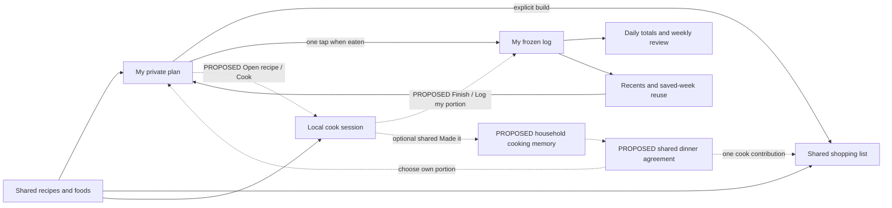

# Hearth — Make the household return daily

**Phase 2 product and UX review · 30 September 2026**

**Source baseline:** `39694cbf2b51ef693ed83ec79354a333b7f79fbd`

**Decision standard:** both partners log in Hearth instead of MacrosFirst for two consecutive weeks.

**Status:** product assessment and recommendations, not implementation approval. No application changes, production actions or paid API tests were made for this review.

## A. Executive summary

**Hearth is already capable enough to attempt the replacement trial; its biggest product gap is continuity between useful tools.** Logging, recipe capture, cooking, food maintenance and shopping each do substantial work. The tracker receives a daily payoff, the planner a weekly payoff, and the less-engaged partner mainly an occasional shopping task. The next investment should let both people answer “what are we eating, what do we need, and what do I do next?” without repeating selection or exposing private nutrition. Keep the warm visual identity and the careful data semantics. The review contains **232 inventory entries, 97 current-experience recommendations across 20 areas, and seven clearly future proposals**; the ranking below identifies the important subset rather than treating every item as the next release.

### A.1 The ten changes most likely to earn daily return

These ranks are design judgments from source, simulated use and researched references, not measured retention effects. Each link leads to a full recommendation with current evidence, a concrete flow, effort, priority and AI cost.

| Rank | Change and why it matters | Primary recommendations |
|---|---|---|
| **1** | **Make routine logging continuously useful.** Keep one-tap planned meals and two-tap recents; surface favorites, show the grams/ounces entered, make future dates default to planning, retain goals across weeks and show consumed totals even without targets. This directly serves the MacrosFirst replacement bar. | [UX-039](#ux-039), [UX-040](#ux-040), [UX-041](#ux-041), [UX-052](#ux-052), [UX-053](#ux-053) |
| **2** | **Connect choosing, planning, cooking and logging.** Put Plan/Shop on recipe detail, open Cook from a planned recipe and let Finish offer Log my portion using the correct existing plan/snapshot. Preserve a separate one-tap log control and never log the partner automatically. | [UX-001](#ux-001), [UX-051](#ux-051), [UX-017](#ux-017) |
| **3** | **Give the couple one shared dinner agreement.** An opt-in household dinner event should record cook quantity and participation, while individual diaries stay private. Show meal names in Week; after that record exists, surface Tonight through the section registry. This is new shared scope and a proposed change to static Home, not a missing permission on private plans. | [UX-046](#ux-046), [UX-045](#ux-045), [UX-074](#ux-074), [UX-076](#ux-076) |
| **4** | **Make shopping feel like one dependable trip.** Show the remaining checklist, distinguish bought from already at home, explain Need − Have = Buy, review fallback cart quantities and close the trip. Add visible receiving/pending state; bounded active-list receiving explicitly revisits the refresh-on-open decision. | [UX-057](#ux-057), [UX-058](#ux-058), [UX-059](#ux-059), [UX-060](#ux-060), [UX-065](#ux-065) |
| **5** | **Finish capture once, with recovery.** Keep barcode → label → review in one task, preserve interrupted incoming material and resolve missing ingredient nutrition in place. Existing import and editor drafts are strengths; extend their continuity to the raw capture stage. | [UX-011](#ux-011), [UX-013](#ux-013), [UX-014](#ux-014), [UX-023](#ux-023) |
| **6** | **Make homemade nutrition understandable.** Show per-serving and whole-dish bases plus a calculation receipt. Then add optional measured cooked yield so different bowls can be logged by actual weight. Preserve unknowns and estimates; this does not require a leftover inventory or an AI guess about water loss. | [UX-010](#ux-010), [UX-015](#ux-015), [UX-008](#ux-008), [UX-009](#ux-009) |
| **7** | **Let joining produce a shared success.** A recognizable invitation, clear “ours/mine” labels and one optional first useful task reduce the chance that one partner becomes the operator. A first-use checklist would reconsider deferred N12; it is a proposal to approve deliberately. | [UX-073](#ux-073), [UX-074](#ux-074), [UX-072](#ux-072), [UX-079](#ux-079) |
| **8** | **Return value from accumulated use.** Search previous meals, distinguish partial from complete logging, offer a modest month view and reuse explicitly recorded cooking history. Weekly averages already exist; build on them without streak shame or treating an empty day as zero intake. | [UX-050](#ux-050), [UX-054](#ux-054), [UX-055](#ux-055), [UX-002](#ux-002) |
| **9** | **Make ownership usable outside Hearth.** State exactly what JSON contains, add readable CSV/recipe/photo exports and design migration around actual available files or frequent meals. Tested restore and household exit remain explicit reconsiderations of deferred N09/N10, not implied approval. | [UX-083](#ux-083), [UX-084](#ux-084), [UX-086](#ux-086), [UX-085](#ux-085), [UX-093](#ux-093) |
| **10** | **Put useful content before large-screen chrome.** Reflow Today/Week at enlarged text, preserve the grocery viewport and verify whole VoiceOver/keyboard tasks. Keep the cream/cocoa palette, warm dark mode and generous cooking type; density should remove decoration, not nutrition confidence or readable ingredients. | [UX-087](#ux-087), [UX-058](#ux-058), [UX-089](#ux-089), [UX-088](#ux-088), [UX-005](#ux-005) |

### A.2 Preserve the parts that already earn trust

Retain URL/photo/text import and ten-image intake; one-tap planned logging and recents; raw food g/oz input and remembered units; snapshot-safe correction and Move; multi-day planning, copy day, saved weeks and weekly averages. Keep ingredient memory, reviewed defaults, repair queues, food reuse/merge and menu provenance/reimport. Shopping already supports partial on-hand subtraction, source-preserving rebuilds, targeted Undo, package rounding and mapped Walmart cart links. Cooking already has an awake screen, step amounts, timers and resume. Food/recipe editor drafts already recover work. Private logs, shared libraries, local saving, nullable minor nutrients and frozen history are product advantages, not infrastructure to hide or replace.

Most recommendations cost **no Claude calls**. Keep AI focused on messy recipe/label/menu input and deliberate adaptation. The existing ceiling, reservations and fail-closed guard are already built; [UX-037](#ux-037) makes the allowance understandable. Repository defaults are $25 per month, a 75% warning and a 50% stop for decorative icons; the deployed override and provider bill were not inspected. Opt-in sketches in [UX-038](#ux-038) would change the current deliberate automatic-art policy. Nest remains a real household utility, HA has unfinished adopted scope, and Fitness/Health remain future rooms; none should displace the food trial.

### A.3 Recommended waves and the household trial

| Wave | Concrete product outcome | Boundary |
|---|---|---|
| **First: connect the current tools** | Clear planning/logging intent, persistent useful totals/goals, recipe ↔ plan/cook handoffs, capture recovery, readable quantities, shopping hierarchy and exact export promises. Include usual-order logging [UX-029](#ux-029), timer flexibility [UX-019](#ux-019) and honest menu coverage [UX-031](#ux-031) where they affect actual meals. | Select small coherent changes; preserve existing fast paths and frozen history. Do not wait for all 97 recommendations before using the app. N12 remains a separate reconsideration even if useful here. |
| **Next: make the two-person routine explicit** | Shared dinner [UX-046](#ux-046), then the optional daily surface [UX-076](#ux-076); active-list confidence, reviewed staples, history/trends and measured cooked yield. Reconsider verified restore [UX-085](#ux-085) and household exit [UX-093](#ux-093) as explicit ownership decisions. | Keep personal nutrition private. Approve the shared record, Home summary and receiving behavior as explicit product/spec changes; restore and exit require reconsidering N09/N10. Complete the adopted HA user loop after critical food work. |
| **Later: reconsider scope from actual friction** | One-off macros/multi-item logging, save-optional assembled restaurant meals, app lock, use-soon/batches and known-price estimates. | Prior deferrals remain decisions to revisit explicitly, regardless of a recommendation's priority. Future modules stay in F. Durable recipe versions stay Later. |

Run the **two-week replacement trial on the current usable build and repeat relevant tasks after selected improvements**, using both partners' actual recurring foods, dinners and stores. Record observations locally and voluntarily; nothing here requires a telemetry service. Trial evidence should decide which Next/Later work is worth its ongoing maintenance.

| Observe | Practical measure / acceptance question |
|---|---|
| Replacement itself | Did **both people** log in Hearth instead of MacrosFirst for 14 consecutive days? Record any return to the old app and the task that caused it. This review has not established that result. |
| Everyday effort | Use the same recent food, weighed food, planned dinner, customized restaurant meal and unplanned meal. Count actions, corrections and assistance; measure real time only during the trial. Preserve the existing one-action planned log and two-action recent route. |
| Shared usefulness | Can each person independently find tonight's agreed dinner and the current list? Count external “what's for dinner?” and “did milk arrive?” messages, including poor-signal cases. Source analysis is not evidence that this passed on two phones. |
| Capture and trust | Record actual barcode/label/import hits, corrections, abandoned captures and ambiguous portions. Verify past logs remain recognizable after a shared food edit; no model accuracy rate is assumed. |
| Return and ownership | On day 10, is repetition easier than day 2? Can each person explain shared versus private data and open their export outside Hearth? Restore capability remains a separate, uncompleted scope decision. |
| Real-device inclusion | Complete add/check/Undo, log/correct and timer tasks with enlarged text, VoiceOver and keyboard where supported. The synthetic gallery shows layout choices, not native accessibility certification or alert delivery. |

## B. Feature inventory

This is a map of the present product, including narrow implementations and reachable placeholders. **Functional** means a connected flow exists in inspected source; **basic** means usable but limited; **stub** means a promised view, data field or foundation without its intended user flow. **Polished** would require stronger daily-use evidence than this review has, so none is awarded on code or test results alone. Mixed areas are split or conservatively rated; qualifications in the row remain important. Inventory numbers identify capabilities, not proposed work.

The review followed source inventory → lifecycle/persona simulation → loop mapping → current public benchmarks → detailed feedback → gap/future/QoL synthesis. The three source inventories collectively cover all **259 non-generated application Dart files**, corresponding domain/data/server/native code, relevant specifications and supporting test contracts. Generated files and binaries were enumerated; not every body of the 324 Dart test files was re-read. Current code determines what exists; [the specification](docs/HEARTH_SPEC.md) determines intended choices. The [September 10 review](docs/HEARTH_PRODUCT_UX_REVIEW_2026-09-10.md) and [progress record](docs/UX_REVIEW_PROGRESS.md) provide history, not current implementation authority.

Baseline verification recorded for this review: formatting checked **588 files, 0 changes**; static analysis **exit 0**; full Flutter suite **3,878 passed, 86 skipped, exit 0**. The existing synthetic gallery produced **64 passed, exit 0** using `HEARTH_RENDER=1 HEARTH_RENDER_DIR=/tmp/hearth-phase2-ux-gallery flutter test test/render --tags render`. These checks establish their particular automated contracts. They do not establish real-phone speed, two-phone delivery, external-service accuracy, signed installation, native accessibility or household retention.

### B.1 Platforms, ownership and integration reach

The supported target set is **iOS, macOS and Windows**; Android branches in plugins do not make Android a v1 supported product. Flutter/Riverpod presents the app, Drift holds local state, and Supabase Auth/Postgres/private Storage handles accounts and synced records. Nutrition and shopping services sit behind adapters. iOS has camera/barcode capture and incoming share; desktop uses file selection/typed barcode. PDF rendering is supported by the adapter across the target platforms. Timer notifications are initialized for iOS/macOS; Windows foreground timers exist but background delivery is not established by the current adapter. Windows recovery-link registration and live cross-device email recovery remain unverified.

Recipes, foods, cookbooks, ingredient memory, menu provenance and shopping are shared household work. Plans, logs, targets, favorites, food profile and saved weeks are private to the individual. Household membership does not grant access to the partner's diary or Home Assistant account. Device preferences, editor drafts, cooking state and transient capture have distinct lifetimes; these are mapped below. Global menu foods are readable catalogue records, not household-editable ownership. See [scope definitions](lib/data/sync/sync_scope.dart#L31), [local tables](lib/data/local/tables.dart), [platform adapters](lib/data/adapters/platform_kitchen_devices.dart) and [section destinations](lib/app/shell/destinations.dart).

### B.2 Home, section shell and navigation

| ID | What the person can do | Ownership and connections | Status | Screen/file evidence and qualifications |
|---|---|---|---|---|
| INV-001 | Launch Home: Hearth masthead, “Everything the house keeps track of,” settings button, four section cards | Device navigation; connects Food/Nutrition, Fitness, Health, House | basic | Static launcher, no actual dinner, list, recent food or household activity content. [lib/features/home/home_screen.dart:25](lib/features/home/home_screen.dart#L25), [lib/features/home/home_screen.dart:54](lib/features/home/home_screen.dart#L54), [lib/features/home/home_screen.dart:69](lib/features/home/home_screen.dart#L69), [lib/features/home/home_screen.dart:106](lib/features/home/home_screen.dart#L106). |
| INV-002 | Nutrition card and four bottom destinations: Recipes, Plan, Shopping, Foods | Household library/list with personal Plan inside one section | functional | [lib/app/shell/destinations.dart:44](lib/app/shell/destinations.dart#L44); all feature routes are real. The food, planning and shopping surfaces are detailed in B.5–B.12. |
| INV-003 | Fitness card: Today, Workouts, History | Device shell only; no training data type/store in reviewed schema | stub | Destinations exist, each builds `UnbuiltScreen`; specific route copy says Not built yet. [lib/app/shell/destinations.dart:85](lib/app/shell/destinations.dart#L85), [lib/app/shell/destinations.dart:154](lib/app/shell/destinations.dart#L154); [lib/app/shell/unbuilt_screen.dart:43](lib/app/shell/unbuilt_screen.dart#L43). |
| INV-004 | Health card: Numbers, Appointments | Device shell only; no health measurements/appointments models in reviewed schema | stub | [lib/app/shell/destinations.dart:113](lib/app/shell/destinations.dart#L113), [lib/app/shell/destinations.dart:168](lib/app/shell/destinations.dart#L168). |
| INV-005 | House card: Thermostat and Devices | Nest shared by household; HA separate per signed-in context/device | basic | [lib/app/shell/destinations.dart:133](lib/app/shell/destinations.dart#L133). See B.16 for separate Nest and HA capabilities. |
| INV-006 | All four cards look navigable; footer names Fitness and Health as still being built | Future scope is publicly visible from first launch | basic | Home loops over `builtSections` (all have registered destinations), while footer tests `isFurnished`. [lib/features/home/home_screen.dart:69](lib/features/home/home_screen.dart#L69), [lib/features/home/home_screen.dart:238](lib/features/home/home_screen.dart#L238); [lib/app/shell/sections.dart:53](lib/app/shell/sections.dart#L53), [lib/app/shell/sections.dart:69](lib/app/shell/sections.dart#L69), [lib/app/shell/sections.dart:121](lib/app/shell/sections.dart#L121). Current render confirms. |
| INV-007 | Mobile section shell: Home escape, small current-section label, Settings; persistent labeled destination bar | Current section only; detail/editor routes use root navigator | functional | [lib/app/shell/app_shell.dart:69](lib/app/shell/app_shell.dart#L69), [lib/app/shell/app_shell.dart:139](lib/app/shell/app_shell.dart#L139), [lib/app/shell/app_shell.dart:371](lib/app/shell/app_shell.dart#L371); [lib/app/router.dart:46](lib/app/router.dart#L46). |
| INV-008 | Desktop section shell changes to sidebar at 840 logical pixels; constrained reading column | Device layout; menu labels match mobile tabs | functional | [lib/app/shell/app_shell.dart:36](lib/app/shell/app_shell.dart#L36), [lib/app/shell/app_shell.dart:120](lib/app/shell/app_shell.dart#L120), [lib/app/shell/app_shell.dart:208](lib/app/shell/app_shell.dart#L208); [lib/app/widgets/reading_column.dart:7](lib/app/widgets/reading_column.dart#L7). Sidebar is scrollable at short/large-type windows. |
| INV-009 | Back from a section returns Home; Home section card remembers the last destination used in that section | In-session navigation, not a household preference | functional | [lib/app/shell/app_shell.dart:52](lib/app/shell/app_shell.dart#L52); [lib/features/home/home_screen.dart:143](lib/features/home/home_screen.dart#L143); [lib/app/providers.dart:903](lib/app/providers.dart#L903). IndexedStack keeps section tabs while present; exiting a section can discard scroll position. |
| INV-010 | Settings reachable from Home and any section, aliases/unknown routes return safely | Root navigation | functional | [lib/app/router.dart:63](lib/app/router.dart#L63), [lib/app/router.dart:89](lib/app/router.dart#L89), [lib/app/router.dart:129](lib/app/router.dart#L129), [lib/app/router.dart:267](lib/app/router.dart#L267); [lib/app/shell/app_shell.dart:256](lib/app/shell/app_shell.dart#L256). No global search/command palette in this shell. |
| INV-011 | Choose next-launch screen: Home, Today, Nutrition, House | Device-only preference; stored before next frame/launch | functional | Default Home, Today resolves `/plan`, sections start at first destination; unknown stored value falls back Home. [lib/app/shell/launch_target.dart:30](lib/app/shell/launch_target.dart#L30), [lib/app/shell/launch_target.dart:47](lib/app/shell/launch_target.dart#L47), [lib/app/shell/launch_target.dart:66](lib/app/shell/launch_target.dart#L66), [lib/app/shell/launch_target.dart:102](lib/app/shell/launch_target.dart#L102); [lib/app/bootstrap.dart:61](lib/app/bootstrap.dart#L61); [lib/features/account/settings_screen.dart:389](lib/features/account/settings_screen.dart#L389), [lib/features/account/settings_screen.dart:493](lib/features/account/settings_screen.dart#L493). Fitness/Health are excluded from chooser. |
| INV-012 | Timer bar visible above section content and on Home | Device-only cook timers; links back into recipes | functional | [lib/app/shell/app_shell.dart:94](lib/app/shell/app_shell.dart#L94); [lib/features/home/home_screen.dart:54](lib/features/home/home_screen.dart#L54); [lib/app/cook_timers.dart:43](lib/app/cook_timers.dart#L43). This inventory does not assert that the same bar appears on Settings or every root detail screen. |

### B.3 Accounts, joining and personal preferences

| ID | What the person can do | Ownership and connections | Status | Screen/file evidence and qualifications |
|---|---|---|---|---|
| INV-013 | Configured build shows loading account, sign-in or routed app | Account access to private records and shared household | functional | [lib/main.dart:86](lib/main.dart#L86), [lib/main.dart:105](lib/main.dart#L105), [lib/main.dart:119](lib/main.dart#L119), [lib/main.dart:125](lib/main.dart#L125). Unconfigured build permits local use; that is a development/configuration branch, not an advertised anonymous onboarding flow. |
| INV-014 | Sign in with email/password, autofill hints and inline status | Individual Supabase account | functional | [lib/features/account/sign_in_screen.dart:34](lib/features/account/sign_in_screen.dart#L34), [lib/features/account/sign_in_screen.dart:143](lib/features/account/sign_in_screen.dart#L143), [lib/features/account/sign_in_screen.dart:253](lib/features/account/sign_in_screen.dart#L253). No social sign-in, passkey or biometric account entry appears in this screen. |
| INV-015 | Toggle to Create account; enter email/password; submit; confirmation-email notice | Creates individual profile and automatic solo household | basic | [lib/features/account/sign_in_screen.dart:54](lib/features/account/sign_in_screen.dart#L54), [lib/features/account/sign_in_screen.dart:167](lib/features/account/sign_in_screen.dart#L167), [lib/features/account/sign_in_screen.dart:206](lib/features/account/sign_in_screen.dart#L206); database auto-creates solo household [supabase/migrations/20260827190000_identity.sql:109](supabase/migrations/20260827190000_identity.sql#L109). Form advertises 12 characters, upper/lower/digit; no confirmation field or password visibility toggle on this first form. |
| INV-016 | Email verification state says check email then sign in | External email round trip | basic | [lib/features/account/sign_in_screen.dart:54](lib/features/account/sign_in_screen.dart#L54). No resend confirmation control in the inspected form. Hosting email/redirect behavior was not exercised. |
| INV-017 | Forgot password on sign-in; reset-password action under Account | Email-based recovery | basic | [lib/features/account/sign_in_screen.dart:80](lib/features/account/sign_in_screen.dart#L80); [lib/features/account/settings_screen.dart:563](lib/features/account/settings_screen.dart#L563). Request copy still says browser/app cannot set it, while code below now supports new-password entry. Request copy and implemented recovery flow have drifted; live activation remains unverified. |
| INV-018 | Recovery event gates the entire app to New password; two password fields, Save, success Continue, Not now | Individual account; deliberately prevents access until recovery flow completed/exited | functional | [lib/data/auth/supabase_auth_gateway.dart:37](lib/data/auth/supabase_auth_gateway.dart#L37), [lib/data/auth/supabase_auth_gateway.dart:207](lib/data/auth/supabase_auth_gateway.dart#L207); [lib/main.dart:105](lib/main.dart#L105); [lib/features/account/new_password_screen.dart:53](lib/features/account/new_password_screen.dart#L53), [lib/features/account/new_password_screen.dart:132](lib/features/account/new_password_screen.dart#L132), [lib/features/account/new_password_screen.dart:170](lib/features/account/new_password_screen.dart#L170), [lib/features/account/new_password_screen.dart:222](lib/features/account/new_password_screen.dart#L222). Native/hosted recovery activation remains unverified; old docs call out deployment work. |
| INV-019 | First signed-in destination defaults to Home; household linking/targets/profile are optional later settings | Separate personal and household setup | basic | No mandatory onboarding wizard/checklist/goal/unit selection gate between auth and router in [lib/main.dart:125](lib/main.dart#L125) or [lib/app/router.dart:63](lib/app/router.dart#L63). Explicit onboarding checklist was previously deferred (N12). |
| INV-020 | Settings index rows Account, Cook together, Appearance, Opens on, Syncing, Your data; Sign out | Six separate small pages; avoids one long settings form | functional | [lib/features/account/settings_screen.dart:93](lib/features/account/settings_screen.dart#L93), [lib/features/account/settings_screen.dart:185](lib/features/account/settings_screen.dart#L185). Index subtitles show account or This device only, code or Not sharing yet, theme, next-launch target and sync state. |
| INV-021 | Account page shows email and Food profile link; reset password for email account | Private settings | basic | [lib/features/account/settings_screen.dart:214](lib/features/account/settings_screen.dart#L214). No display-name editor, change-email action, profile photo, per-person household role, unit chooser, account deletion or permission dashboard appears in inspected screens. These are absence observations, not prescriptions. |
| INV-022 | Cook together explains merging both libraries, including earlier recipes/foods; show eight-character share code, copy to clipboard | Household shared library/list merge; personal logs/plans stay private | functional | [lib/features/account/settings_screen.dart:299](lib/features/account/settings_screen.dart#L299), [lib/features/account/settings_screen.dart:311](lib/features/account/settings_screen.dart#L311), [lib/features/account/settings_screen.dart:670](lib/features/account/settings_screen.dart#L670), [lib/features/account/settings_screen.dart:683](lib/features/account/settings_screen.dart#L683). Code alphabet omits ambiguous characters; [supabase/migrations/20260827190000_identity.sql:21](supabase/migrations/20260827190000_identity.sql#L21). |
| INV-023 | Type partner's share code and tap Join; inline busy/error/success | Calls household join RPC then refreshes identity/cache | functional | [lib/features/account/settings_screen.dart:325](lib/features/account/settings_screen.dart#L325), [lib/features/account/settings_screen.dart:353](lib/features/account/settings_screen.dart#L353); [lib/data/auth/supabase_auth_gateway.dart:271](lib/data/auth/supabase_auth_gateway.dart#L271). No recipient/name preview, membership list, accept/decline invitation, code expiry/rotation, invite link or share sheet. The code is join authority, not a social invitation model. |
| INV-024 | Solo household exists before partner joins; household name defaults Our household | Shared tables keyed household ID; owner field in schema | functional | [supabase/migrations/20260827190000_identity.sql:49](supabase/migrations/20260827190000_identity.sql#L49), [supabase/migrations/20260827190000_identity.sql:109](supabase/migrations/20260827190000_identity.sql#L109). Profile includes display_name and imperial/metric preference, but this UI does not expose editing them. |
| INV-025 | Join carries old recipes, foods, collections and remembered matches into destination; keeps private plans/logs | Retroactive shared visibility | functional | Original [supabase/migrations/20260827190500_household_join.sql:41](supabase/migrations/20260827190500_household_join.sql#L41); latest join logic at [supabase/migrations/20260902120000_shopping_range_and_amounts.sql:98](supabase/migrations/20260902120000_shopping_range_and_amounts.sql#L98) carries lists only when target has no same date range. Settings discloses library merge. Conflicting match/list selection and source ownership are not presented in a pre-join preview. No unlink/leave UI/API in reviewed auth surface. |
| INV-026 | Sign out via confirmation; copy says recipes stay in household | Session exits; local rows/outbox retained but scoped; checkpoints explicitly cleared | functional | [lib/features/account/settings_screen.dart:45](lib/features/account/settings_screen.dart#L45), [lib/features/account/settings_screen.dart:81](lib/features/account/settings_screen.dart#L81); [lib/data/auth/supabase_auth_gateway.dart:232](lib/data/auth/supabase_auth_gateway.dart#L232). No separate “remove this device's downloaded data” action. |
| INV-027 | Theme picker: Follow the device, Light, Dark; optimistic select with failed-write rollback | Device preference | functional | [lib/app/theme/theme_choice.dart:13](lib/app/theme/theme_choice.dart#L13); [lib/features/account/settings_screen.dart:369](lib/features/account/settings_screen.dart#L369), [lib/features/account/settings_screen.dart:441](lib/features/account/settings_screen.dart#L441); persisted pre-bootstrap. |
| INV-028 | Food profile form: allergies, dislikes, dietary preferences, preferred meal types, calorie-per-meal target, protein-per-meal target | Private user profile; fed into recipe AI; weekly macro targets elsewhere | basic | [lib/features/account/food_profile_screen.dart:13](lib/features/account/food_profile_screen.dart#L13), [lib/features/account/food_profile_screen.dart:120](lib/features/account/food_profile_screen.dart#L120), [lib/features/account/food_profile_screen.dart:140](lib/features/account/food_profile_screen.dart#L140), [lib/features/account/food_profile_screen.dart:169](lib/features/account/food_profile_screen.dart#L169); [lib/domain/models/food_profile.dart:13](lib/domain/models/food_profile.dart#L13); [lib/data/repositories/food_profile_repository.dart:48](lib/data/repositories/food_profile_repository.dart#L48). Static optional fields rather than a conversational questionnaire. |
| INV-029 | Save/Cancel food profile, multiline comma/list input and optional numbers | Explicit update; profile synced between same user's devices | basic | [lib/features/account/food_profile_screen.dart:113](lib/features/account/food_profile_screen.dart#L113), [lib/features/account/food_profile_screen.dart:183](lib/features/account/food_profile_screen.dart#L183); [lib/data/local/food_profile_store.dart:16](lib/data/local/food_profile_store.dart#L16). This form is not wrapped in the common draft/unsaved-work guard. No learned-signal review or per-partner combined cooking preference UI. |
| INV-030 | Cached account context enables continuity when profile refresh unavailable | Device cache tied to authenticated user; session in OS secure storage | functional | [lib/data/auth/account_cache.dart:19](lib/data/auth/account_cache.dart#L19), [lib/data/auth/account_cache.dart:41](lib/data/auth/account_cache.dart#L41); [lib/data/auth/secure_session_storage.dart:18](lib/data/auth/secure_session_storage.dart#L18). Does not establish a user-facing app lock or encrypted content database; no lock UI/plugin found. |

### B.4 Offline work, export, native intake and common interactions

| ID | What the person can do | Ownership and connections | Status | Screen/file evidence and qualifications |
|---|---|---|---|---|
| INV-031 | Read cached library/plan/list and save local edits without waiting for a network round trip | Device Drift cache plus queued shared/personal writes | functional | [lib/data/local/hearth_database.dart:18](lib/data/local/hearth_database.dart#L18); [lib/data/local/pending_write_store.dart:71](lib/data/local/pending_write_store.dart#L71); [lib/data/sync/sync_engine.dart:87](lib/data/sync/sync_engine.dart#L87). AI, remote search, new uncached images and external store links still need their service. |
| INV-032 | Automatic sync at sign-in/session availability, own changes, photo work and app resume | Household updates and same-user private records | functional | [lib/app/sync_controller.dart:42](lib/app/sync_controller.dart#L42), [lib/app/sync_controller.dart:54](lib/app/sync_controller.dart#L54), [lib/app/sync_controller.dart:61](lib/app/sync_controller.dart#L61), [lib/app/sync_controller.dart:68](lib/app/sync_controller.dart#L68). No Supabase Realtime subscription for household lists/recipes or steady idle poll in these paths. |
| INV-033 | Widening retry when outstanding work exists; failed rows retained, limited attempts; manual retry stuck changes | Data protection/recovery | functional | [lib/app/sync_controller.dart:140](lib/app/sync_controller.dart#L140); pending-write retry gaps 2 s/30 s/5 m/30 m/2 h and cap of 6 [lib/data/local/pending_write_store.dart:114](lib/data/local/pending_write_store.dart#L114), [lib/data/local/pending_write_store.dart:132](lib/data/local/pending_write_store.dart#L132), [lib/data/local/pending_write_store.dart:268](lib/data/local/pending_write_store.dart#L268). Automatic sync timer is not a guarantee of immediate partner activity delivery when a foreground idle device has no work. |
| INV-034 | Whole-record newer remote wins except unsent local work; scope checkpoints per user/household/project | Shared edits plus private data separation | functional | [lib/data/sync/sync_engine.dart:230](lib/data/sync/sync_engine.dart#L230); [lib/data/sync/sync_scope.dart:31](lib/data/sync/sync_scope.dart#L31); [lib/data/sync/sync_checkpoints.dart:13](lib/data/sync/sync_checkpoints.dart#L13). No user-facing field-level conflict picker/history in this shell. |
| INV-035 | Settings Syncing summary and detail; last full pass, queued/stuck counts, offline/failure language | Device status; affects confidence in shared list freshness | functional | [lib/features/account/settings_screen.dart:185](lib/features/account/settings_screen.dart#L185), [lib/features/account/settings_screen.dart:711](lib/features/account/settings_screen.dart#L711), [lib/features/account/settings_screen.dart:774](lib/features/account/settings_screen.dart#L774), [lib/features/account/settings_screen.dart:781](lib/features/account/settings_screen.dart#L781), [lib/features/account/settings_screen.dart:794](lib/features/account/settings_screen.dart#L794). Ordinary Home/shell doesn't surface this same status or partner-presence/last-edited indicator. |
| INV-036 | Sync now; Try stuck changes again; version/schema support info | Explicit recovery/support affordances | functional | [lib/features/account/settings_screen.dart:781](lib/features/account/settings_screen.dart#L781), [lib/features/account/settings_screen.dart:794](lib/features/account/settings_screen.dart#L794); [lib/core/build_info.dart:7](lib/core/build_info.dart#L7). This is a count-level recovery screen, not a per-record problem inbox. |
| INV-037 | Private recipe photo upload/download queue | Shared recipe metadata + household protected storage + device bytes | functional | [lib/data/sync/photo_sync.dart:58](lib/data/sync/photo_sync.dart#L58) budgets 3 uploads/10 downloads per pass; [lib/data/remote/supabase_photo_storage.dart:23](lib/data/remote/supabase_photo_storage.dart#L23); [lib/data/remote/photo_storage.dart:42](lib/data/remote/photo_storage.dart#L42). New phone/uncached offline photo availability depends on download completion. |
| INV-038 | Your data page: Export my data; Gathering it up; native file share/save for JSON | Export contains current user + current household data available locally | functional | [lib/features/account/settings_screen.dart:410](lib/features/account/settings_screen.dart#L410), [lib/features/account/settings_screen.dart:922](lib/features/account/settings_screen.dart#L922); [lib/data/adapters/data_export.dart:49](lib/data/adapters/data_export.dart#L49), [lib/data/adapters/data_export.dart:83](lib/data/adapters/data_export.dart#L83); [lib/data/adapters/share_plus_file_share.dart:16](lib/data/adapters/share_plus_file_share.dart#L16). No Claude cost. |
| INV-039 | Export recipes and foods, incl soft-deleted definitions; current user's days/logs/templates/favorites/targets/profile; shared collections/memberships/matches/shopping | Complete enough to be useful outside original app; privacy-bound export | functional | [lib/data/adapters/data_export.dart:115](lib/data/adapters/data_export.dart#L115), [lib/data/adapters/data_export.dart:129](lib/data/adapters/data_export.dart#L129), [lib/data/adapters/data_export.dart:150](lib/data/adapters/data_export.dart#L150), [lib/data/adapters/data_export.dart:173](lib/data/adapters/data_export.dart#L173), [lib/data/adapters/data_export.dart:344](lib/data/adapters/data_export.dart#L344). Includes only referenced global catalog foods, not entire public catalog. |
| INV-040 | Export follows referenced foods/recipes; freezes logged snapshot values; includes source/food amounts | Makes old records understandable if library changed/deleted | functional | [lib/data/adapters/data_export.dart:189](lib/data/adapters/data_export.dart#L189), [lib/data/adapters/data_export.dart:201](lib/data/adapters/data_export.dart#L201), [lib/data/adapters/data_export.dart:225](lib/data/adapters/data_export.dart#L225), [lib/data/adapters/data_export.dart:430](lib/data/adapters/data_export.dart#L430). Snapshot content and private diary behavior are detailed in B.9 and B.17. |
| INV-041 | Export manifest counts, missing references and unsent-write count; version 2/date filename | Trust and portability metadata | functional | [lib/data/adapters/data_export.dart:65](lib/data/adapters/data_export.dart#L65), [lib/data/adapters/data_export.dart:361](lib/data/adapters/data_export.dart#L361), [lib/data/adapters/data_export.dart:392](lib/data/adapters/data_export.dart#L392), [lib/data/adapters/data_export.dart:396](lib/data/adapters/data_export.dart#L396). `complete` means no pending writes/missing local references, not independently verified server/cloud backup completeness. |
| INV-042 | Export exclusions explicitly name photos, unreferenced global catalog and partner private records | Protects privacy but limits “everything” claim | basic | [lib/data/adapters/data_export.dart:382](lib/data/adapters/data_export.dart#L382); visible page admits photos excluded [lib/features/account/settings_screen.dart:410](lib/features/account/settings_screen.dart#L410); index still says Export everything [lib/features/account/settings_screen.dart:151](lib/features/account/settings_screen.dart#L151). Device prefs/house connection state/drafts/timers/menu-import provenance and a restore workflow are not exported as standalone types. No CSV/full archive/backups or existing MacrosFirst import UI found. |
| INV-043 | Native iOS Share Sheet receives one URL/webpage, text, or up to 10 images into recipe import draft | Input from web/Photos to recipe review; no silent save | functional | [ios/ShareExtension/Info.plist:32](ios/ShareExtension/Info.plist#L32), [ios/ShareExtension/ShareViewController.swift:22](ios/ShareExtension/ShareViewController.swift#L22), [ios/ShareExtension/ShareViewController.swift:66](ios/ShareExtension/ShareViewController.swift#L66); [lib/data/adapters/platform_shared_content.dart:31](lib/data/adapters/platform_shared_content.dart#L31); [lib/main.dart:137](lib/main.dart#L137). macOS/Windows use NoSharedContent adapter; do not claim OS share intake parity. |
| INV-044 | Shared payload persists in iOS app-group inbox until drained; Hearth scheme opens host | Device handoff | functional | [ios/Runner/SharedContentChannel.swift:45](ios/Runner/SharedContentChannel.swift#L45); [ios/Runner/AppDelegate.swift:23](ios/Runner/AppDelegate.swift#L23). Error/permission handoffs not manually exercised. |
| INV-045 | Photo library/camera permission text; macOS camera and selected-file entitlements | Recipe images/barcode feature paths | basic | [ios/Runner/Info.plist:83](ios/Runner/Info.plist#L83); [macos/Runner/Info.plist:25](macos/Runner/Info.plist#L25); [macos/Runner/Release.entitlements:10](macos/Runner/Release.entitlements#L10). Actual OS denial/regrant behavior belongs to live-device testing. |
| INV-046 | Cook timers persist, pause, resume/dismiss; schedule native notification and can keep display awake | Device private cooking work, no partner timer coordination | functional | [lib/app/cook_timers.dart:43](lib/app/cook_timers.dart#L43), [lib/app/cook_timers.dart:61](lib/app/cook_timers.dart#L61), [lib/app/cook_timers.dart:71](lib/app/cook_timers.dart#L71); [lib/data/adapters/platform_kitchen_devices.dart:9](lib/data/adapters/platform_kitchen_devices.dart#L9), [lib/data/adapters/platform_kitchen_devices.dart:33](lib/data/adapters/platform_kitchen_devices.dart#L33), [lib/data/adapters/platform_kitchen_devices.dart:53](lib/data/adapters/platform_kitchen_devices.dart#L53), [lib/data/adapters/platform_kitchen_devices.dart:84](lib/data/adapters/platform_kitchen_devices.dart#L84). Permission requested when needed; no regular meal/shopping/household reminder UI or push delivery in these adapters. |
| INV-047 | Undo snackbar after reversible changes | Common cross-feature interaction | functional | Six-second window; action hides previous snackbar; [lib/app/widgets/undo_snackbar.dart:9](lib/app/widgets/undo_snackbar.dart#L9), [lib/app/widgets/undo_snackbar.dart:24](lib/app/widgets/undo_snackbar.dart#L24), [lib/app/widgets/undo_snackbar.dart:34](lib/app/widgets/undo_snackbar.dart#L34). Exact feature use varies; the per-screen rows above specify where Undo is offered. |
| INV-048 | Swipe to reveal Delete, then explicit delete; custom accessibility delete action | Reusable recipe/list affordance | functional | [lib/app/widgets/swipe_to_delete.dart:32](lib/app/widgets/swipe_to_delete.dart#L32), [lib/app/widgets/swipe_to_delete.dart:79](lib/app/widgets/swipe_to_delete.dart#L79), [lib/app/widgets/swipe_to_delete.dart:130](lib/app/widgets/swipe_to_delete.dart#L130); swipe alone does not commit. |
| INV-049 | Unsaved-work guard, Discard/Keep editing; restore local draft with stale-change warning | Recipe/food edits where applied; local drafts separate from synced records | functional | [lib/app/widgets/unsaved_work_guard.dart:44](lib/app/widgets/unsaved_work_guard.dart#L44), [lib/app/widgets/unsaved_work_guard.dart:84](lib/app/widgets/unsaved_work_guard.dart#L84). No generic conflict diff; not used on every form. |
| INV-050 | App alerts/sheets, busy buttons, inline messages and readable constraint widths share SettingsKit/common primitives | Warm and consistent error/loading/control styling | functional | [lib/features/account/settings_kit.dart:1](lib/features/account/settings_kit.dart#L1); [lib/app/widgets/centred_message.dart:12](lib/app/widgets/centred_message.dart#L12); [lib/app/widgets/reading_column.dart:7](lib/app/widgets/reading_column.dart#L7). Presence of primitives is not proof every asynchronous path has ideal feedback. |

### B.5 Recipes, authoring, capture and cooking

| ID | Surface | What the person can do / connections | Ownership | Status | Evidence |
|---|---|---|---|---|---|
| INV-051 | Recipe library | Browse cached recipes; text search title/tags/cuisine/ingredient names with AND words and accent/case normalisation; pin favourites above selected sort; recent/A–Z/calories/protein sorting. Rows connect to detail, swipe soft-delete/Undo, favourite toggles. | Shared recipes; personal favourites | functional | [lib/features/recipes/recipe_library_screen.dart:42,377,634](lib/features/recipes/recipe_library_screen.dart#L42); [lib/domain/recipes/recipe_query.dart:31,217,235,322](lib/domain/recipes/recipe_query.dart#L31) |
| INV-052 | Recipe filters | Quick favourites/eaten-out chips, optional filter sheet, active removable chips, Clear filters; under 30 minutes/one hour, ≥30 g protein, ≤600 kcal, tags/cuisines/cookbooks derived from library. Nutrition-incomplete recipes are excluded by numeric filters and explanation is shown. | Device/session filter view; shared metadata | functional | [lib/features/recipes/recipe_filters_sheet.dart:39,137,169](lib/features/recipes/recipe_filters_sheet.dart#L39); [lib/features/recipes/recipe_library_screen.dart:285,326](lib/features/recipes/recipe_library_screen.dart#L285); [lib/domain/recipes/recipe_query.dart](lib/domain/recipes/recipe_query.dart) |
| INV-053 | Recipe creation entry | Add recipe offers manual recipe, recipe import, AI conversation and restaurant meal; All four options remain present; unavailable AI is explained after entering its screen. At larger text the add action docks rather than remaining a floating button. | Shared saved result; transient entry | functional | [lib/features/recipes/add_recipe_sheet.dart:96](lib/features/recipes/add_recipe_sheet.dart#L96); [lib/features/recipes/recipe_library_screen.dart:71,75](lib/features/recipes/recipe_library_screen.dart#L71) |
| INV-054 | Cookbooks | Create free-named collection and immediately add current recipe; multiple membership checkboxes; collection counts and Done. No rename/delete/reorder control observed in this sheet. | Household/shared | basic | [lib/features/recipes/collections_sheet.dart:43,90,117,138,172](lib/features/recipes/collections_sheet.dart#L43) |
| INV-055 | Recipe detail | Hero photograph or themed sketch, title, yield/time/cuisine, notes; per-serving macro and minor-nutrient totals, approximation and missing-coverage explanation; favourite, cookbook, duplicate and edit actions. | Shared recipe content; personal favourite | functional | [lib/features/recipes/recipe_detail_screen.dart:69,71,75,83,90,215,238,245,251,258,266,278](lib/features/recipes/recipe_detail_screen.dart#L69) |
| INV-056 | Recipe scaling and reading | Servings ±1, ½×/2×/3× shortcuts and reset; grouped/combined ingredients; formatted quantities, preparation and optional wording; directions include relevant ingredient amounts. Eaten-out recipes do not scale/cook. Detail has no Plan/Shop/Share action and no whole-recipe nutrition toggle. | Transient displayed scale | basic | [lib/features/recipes/scale_control.dart](lib/features/recipes/scale_control.dart); [lib/features/recipes/recipe_detail_screen.dart:117,149,285,302,316,503,519,524](lib/features/recipes/recipe_detail_screen.dart#L117); [lib/features/recipes/step_amounts.dart:81](lib/features/recipes/step_amounts.dart#L81) |
| INV-057 | Manual recipe editor | Required title and yield (default four); prep/cook minutes; pasted/free-text ingredients parsed into structured preview; typed directions parsed into numbered steps/timers; add/name/reorder/remove component sections; cuisine, comma-separated tags, notes, restaurant-kind toggle. Save permits empty ingredients/directions. | Shared published recipe; private/device editor draft | functional | [lib/features/recipes/recipe_editor_screen.dart:559,600,679,878,991,1010,1053,1074,1092](lib/features/recipes/recipe_editor_screen.dart#L559); [lib/features/recipes/recipe_draft.dart:250,317,402](lib/features/recipes/recipe_draft.dart#L250) |
| INV-058 | Recipe nutrition editing | Trusted remembered/default matches may apply; ingredient picker shows current match, relevant defaults/local/external foods, source and servings. Explicit batch Find nutrition; direct add-serving/read-label/choose-food/scan/unmatch/seasoning repairs. Live per-serving totals and parsed-step preview. Optional/no-match ingredients intentionally excluded from totals. | Shared food definitions and matching memory | functional | [lib/features/recipes/recipe_editor_screen.dart:209,244,271,286,324,335,341,389,476,1053,1064](lib/features/recipes/recipe_editor_screen.dart#L209); [lib/domain/recipes/macro_calculator.dart](lib/domain/recipes/macro_calculator.dart) |
| INV-059 | Recipe draft protection | Unsaved-work navigation guard; debounced two-second local editor draft; Restore/Discard prompt and source-changed warning; published shared recipe written only on Save. Successful save clears draft. Imported/copy baseline counts as initially unchanged. | User/device-local until saved | functional | [lib/features/recipes/recipe_editor_screen.dart:624,679,869,1171,1196](lib/features/recipes/recipe_editor_screen.dart#L624); [lib/data/local/editor_draft_store.dart](lib/data/local/editor_draft_store.dart) |
| INV-060 | Recipe duplication | Opens independent editable copy titled “(copy)”, new ingredient/step IDs; carries recipe fields/matches/sketch, not a new photo copy. | Shared when saved | functional | [lib/features/recipes/recipe_detail_screen.dart:83](lib/features/recipes/recipe_detail_screen.dart#L83); [lib/features/recipes/recipe_draft.dart:458](lib/features/recipes/recipe_draft.dart#L458) |
| INV-061 | Photo attachment | Saved recipes: take/choose photo, replace/remove, local immediate display and queued household upload; retry-exhausted sharing error. New unsaved recipe asks to save before adding photo. Photo writes happen from the attachment control. | Household photo; local cache/outbox | functional | [lib/features/recipes/recipe_photo.dart](lib/features/recipes/recipe_photo.dart); [lib/features/recipes/recipe_editor_screen.dart:923](lib/features/recipes/recipe_editor_screen.dart#L923); [lib/data/adapters/image_picker_photos.dart](lib/data/adapters/image_picker_photos.dart) |
| INV-062 | Recipe sketch | Automatically draw a monochrome warm/rustic SVG after first save or meaningful title change without delaying Save; explicit Draw now/another and Remove for existing recipes; theme-coloured, decorative, validated and ≤4 KB. Failures on background drawing do not block saving. | Shared recipe column; AI, | functional | [lib/features/recipes/recipe_icon_controller.dart](lib/features/recipes/recipe_icon_controller.dart); [lib/features/recipes/recipe_icon.dart](lib/features/recipes/recipe_icon.dart); [lib/features/recipes/recipe_editor_screen.dart:679](lib/features/recipes/recipe_editor_screen.dart#L679); [lib/domain/recipes/sketch_icon.dart](lib/domain/recipes/sketch_icon.dart) |
| INV-063 | Recipe capture/import | Up to **10** photos (5 MB each), camera or multi-pick, remove thumbnails, URL, shared/pasted text and extra instructions; Read recipe → editable review → Save. Errors retain in-memory inputs and allow retry. Successful extraction clears source image list before editor review; no durable capture draft observed. | Transient capture, shared saved recipe; AI, | basic | [lib/features/recipes/recipe_import_controller.dart:137,142,199,237,272](lib/features/recipes/recipe_import_controller.dart#L137); [lib/features/recipes/recipe_import_screen.dart:69,286](lib/features/recipes/recipe_import_screen.dart#L69); [lib/data/adapters/edge_function_recipe_ai.dart](lib/data/adapters/edge_function_recipe_ai.dart) |
| INV-064 | AI recipe conversation | Opening examples, free-text chat, personal food-profile prompt context, full text turn history, recipe card preview, Read it and save → editor, Start over; failure preserves current conversation. No durable chat history observed. | Private profile/conversation input; shared saved recipe; AI, | basic | [lib/features/recipes/recipe_chat_controller.dart](lib/features/recipes/recipe_chat_controller.dart); [lib/features/recipes/recipe_chat_screen.dart:183,271](lib/features/recipes/recipe_chat_screen.dart#L183) |
| INV-065 | AI recipe revision | “Ask for a change” inside editor sends current full recipe and private profile, displays response, applies reviewed draft content and retains one-level Undo; retry and near-budget warning. Keeps recipe identity/kind/notes/matching decisions across revision. | Private transient revision, shared on Save; AI, | functional | [lib/features/recipes/recipe_editor_screen.dart:1132,1265,1283,1346,1385](lib/features/recipes/recipe_editor_screen.dart#L1132); [lib/features/recipes/recipe_revise_controller.dart](lib/features/recipes/recipe_revise_controller.dart); [lib/features/recipes/recipe_draft.dart:597](lib/features/recipes/recipe_draft.dart#L597) |
| INV-066 | Batch nutrition match review | Reviews proposed ingredient candidates with certainty/source/applied nutrition; ambiguous suggestions unchecked; use accepted results creates local shared foods as necessary. AI fallback estimates are clearly a distinct source. Unmatched rows instruct manual matching but do not themselves provide an inline manual-food form. | Shared foods and recipe matches after explicit use/save | basic | [lib/features/recipes/match_review_screen.dart:78,103,149,245,279,472](lib/features/recipes/match_review_screen.dart#L78); [lib/features/recipes/match_review_controller.dart](lib/features/recipes/match_review_controller.dart) |
| INV-067 | Cook along | Opens scaled recipe snapshot; keep screen awake; 24 pt reading, step-specific ingredient amounts; focus-step/all-steps switch; next/back, mark-done, full ingredient sheet; phone/large-text adjustments; Finish exits. No recipe-completion/log action on Finish. | Local/device cooking activity | functional | [lib/features/recipes/cook_along_screen.dart:65,119,197,267,303,317,335,346,721,761,783,813](lib/features/recipes/cook_along_screen.dart#L65); [lib/features/recipes/cook_instruction_blocks.dart](lib/features/recipes/cook_instruction_blocks.dart) |
| INV-068 | Cook progress | Saves current step and checked step IDs for 24 hours; restore or reset progress; reset confirms and clears active timers. Session entry uses a snapshot so editing elsewhere does not change the open cook session. Persisted resume stores progress, not the full old recipe. | Local/device, no partner co-cooking state | functional | [lib/features/recipes/cook_along_screen.dart:90,128,142](lib/features/recipes/cook_along_screen.dart#L90); [lib/data/local/cook_session_store.dart:29](lib/data/local/cook_session_store.dart#L29); [lib/domain/cooking/cook_session.dart](lib/domain/cooking/cook_session.dart) |
| INV-069 | Timers | Parsed step timers, several concurrent timers, start permission request, pause/resume/stop/dismiss, overdue ringing live-region state, timer tray and app-wide nearest-timer bar with +N sheet. Absolute deadline survives background/restart; expired timers >12 h omitted on restore. No add-time/custom timer control observed. | Local/device; iOS/macOS notifications | functional | [lib/features/recipes/cook_along_screen.dart:162,326,1000](lib/features/recipes/cook_along_screen.dart#L162); [lib/features/recipes/timer_bar.dart](lib/features/recipes/timer_bar.dart); [lib/data/local/cook_timer_store.dart:22](lib/data/local/cook_timer_store.dart#L22); [lib/data/adapters/platform_kitchen_devices.dart](lib/data/adapters/platform_kitchen_devices.dart) |

### B.6 Foods, barcodes, packages and matching

| ID | Surface | What the person can do / connections | Ownership | Status | Evidence |
|---|---|---|---|---|---|
| INV-070 | Foods library | Cached household/global foods; remembered Your foods / Restaurant menus scope; search, default/needs-attention/barcode/source/store filters, sorting; tap to edit; swipe delete/Undo; long-press multiselect with batch delete/Undo. “Your” is ordinary household foods, not private personal food data. | Household/global definitions; device scope | functional | [lib/features/foods/food_library_screen.dart:110,151,192,256,336](lib/features/foods/food_library_screen.dart#L110); [lib/features/foods/food_filter_bar.dart](lib/features/foods/food_filter_bar.dart); [lib/features/foods/food_scope.dart](lib/features/foods/food_scope.dart) |
| INV-071 | Add food and external search | Labelled Add food menu: scan, read label when AI available, enter manually. Search after ≥3 characters and 350 ms; Elsewhere results with source/confidence/basis and review editor before save; Show more 20→40→60 results. Source/network failures collapse to empty results at this UI layer. | Shared saved library; network lookup | basic | [lib/features/foods/add_food_sheet.dart](lib/features/foods/add_food_sheet.dart); [lib/features/foods/food_search_controller.dart](lib/features/foods/food_search_controller.dart); [lib/features/foods/external_food_results.dart](lib/features/foods/external_food_results.dart) |
| INV-072 | Ingredient food picker | Draggable 75%-height search sheet; current match pinned, default candidates/relevant library/external suggestions; scanned food returns into matching; unmatch/mark-seasoning; selected food can be edited. Restaurant modifiers only explicitly allowed for eaten-out context. No direct blank-manual-food button observed in picker. | Shared matching memory/library | functional | [lib/features/foods/food_picker.dart](lib/features/foods/food_picker.dart) |
| INV-073 | Barcode scan and miss | iOS/Android camera EAN/UPC scanning, haptic, torch/focus, manual barcode input; desktop typed code. Local library first, then OFF, then USDA. Invalid, missing, found and produce-PLU states; miss offers label or manual creation seeded with barcode and retry. External result reviews/saves before use; saved library item can be used directly in picker. | Shared food definition; device camera/network lookup | functional | [lib/features/foods/barcode_scan_screen.dart:649,665,758,883](lib/features/foods/barcode_scan_screen.dart#L649); [lib/features/foods/barcode_lookup_controller.dart](lib/features/foods/barcode_lookup_controller.dart); [lib/data/adapters/nutrition_lookup.dart](lib/data/adapters/nutrition_lookup.dart) |
| INV-074 | Produce PLU | Identifies local produce-code name/organic indicator, then searches sources and asks user to choose closest nutrition; manual entry retains produce name/code. Not a promise that every produce code has nutrition. | Local catalogue plus network | functional | [lib/features/foods/barcode_scan_screen.dart:758](lib/features/foods/barcode_scan_screen.dart#L758); [lib/domain/foods/produce_plu.dart](lib/domain/foods/produce_plu.dart) |
| INV-075 | Food editor | Name, brand/restaurant, store/menu section; restaurant and signed-modifier toggles; known-zero confirmation; default-for-matching; several serving amounts/units with four macros and optional nullable fiber/sodium/cholesterol; live validation. Food-specific weight display Automatic/Ounces/oz-lb. No visible manual barcode-edit field observed. | Household/shared | functional | [lib/features/foods/food_editor_screen.dart](lib/features/foods/food_editor_screen.dart); [lib/features/foods/food_draft.dart](lib/features/foods/food_draft.dart) |
| INV-076 | Food saving/reuse | Two-second durable local draft, restore/discard + stale-source warning, dirty guard; duplicate suggestions show up to three matching foods by barcode/name; Use existing (new food), Save anyway or Go back. Saved caller context returns selected food to logging/matching. | User/device draft; shared saved definition | functional | [lib/features/foods/food_editor_screen.dart](lib/features/foods/food_editor_screen.dart); [lib/features/foods/food_draft.dart](lib/features/foods/food_draft.dart) |
| INV-077 | Nutrition/package photo pair | Separate Nutrition Facts back and Package size front slots, choose/take/replace/remove, one Read photos action, review in food editor, retry preserved on failure; no manual transcription required when reading works. Front-only input explicitly cannot claim panel nutrients. Existing matching serving values are not silently overwritten; conflicts explain manual correction. | Transient photos, shared reviewed food fields; AI, | functional | [lib/features/foods/read_label_sheet.dart](lib/features/foods/read_label_sheet.dart); [lib/features/foods/label_scan_controller.dart](lib/features/foods/label_scan_controller.dart); [lib/data/adapters/label_reader.dart](lib/data/adapters/label_reader.dart); [lib/features/foods/food_draft.dart:650](lib/features/foods/food_draft.dart#L650) |
| INV-078 | Package quantity and conversion | Editable package amount, servings/package, chosen volume nutrition serving, approximate toggle; explicit relationship preview and Use/Confirm; prepared/drained/unknown basis must be acknowledged. Reviewed mass-pack→volume-serving relationship is invalidated visibly when basis changes; own density takes precedence. Missing relationship does not use universal density. | Shared food/package metadata | functional | [lib/features/foods/food_editor_screen.dart](lib/features/foods/food_editor_screen.dart); [lib/domain/models/package_nutrition.dart](lib/domain/models/package_nutrition.dart); [lib/domain/recipes/macro_calculator.dart](lib/domain/recipes/macro_calculator.dart); [lib/features/foods/food_draft.dart:1498](lib/features/foods/food_draft.dart#L1498) |
| INV-079 | Walmart food mapping | Save canonical item URL or ID; read a screenshot only when complete URL visible; extracted result reviewed, existing-link conflict asks Keep/Use. Link and package size then feed shopping purchase-count/URL handoff. Not an actual cart API. | Shared food data; screenshot AI optional | functional | [lib/features/foods/walmart_link_field.dart](lib/features/foods/walmart_link_field.dart); [lib/features/foods/read_walmart_link_sheet.dart](lib/features/foods/read_walmart_link_sheet.dart); [lib/features/foods/walmart_link_controller.dart](lib/features/foods/walmart_link_controller.dart); [lib/domain/shopping/walmart_product.dart](lib/domain/shopping/walmart_product.dart) |
| INV-080 | Pack sizes queue | Foods More → Foods without a pack size; ranks shopping, recipe and library needs; batch free barcode lookups, individual barcode, package-photo AI or type it; preview proposed quantities, certainty checkbox, Save selected; no macro overwrite. | Household maintenance | functional | [lib/features/foods/food_library_screen.dart:357,375](lib/features/foods/food_library_screen.dart#L357); [lib/features/foods/pack_size_screen.dart](lib/features/foods/pack_size_screen.dart); [lib/features/foods/pack_fill_controller.dart](lib/features/foods/pack_fill_controller.dart) |
| INV-081 | Seasoning/no-match rules | Library of known and user-marked wording with switches; user marks recipe wording from ingredient picker; applies shared remembered exemption in future recipes; deliberately excluded nutrition and optionally shopping. No free-text add on maintenance screen itself. | Household/shared | functional | [lib/features/foods/seasonings_screen.dart](lib/features/foods/seasonings_screen.dart); [lib/features/recipes/recipe_editor_screen.dart:389](lib/features/recipes/recipe_editor_screen.dart#L389); [lib/domain/foods/no_match_rule.dart](lib/domain/foods/no_match_rule.dart) |

### B.7 Restaurants, menu maintenance and shared nutrition facts

| ID | Surface | What the person can do / connections | Ownership | Status | Evidence |
|---|---|---|---|---|---|
| INV-082 | Restaurant builder | Alphabetic restaurant chooser, source/date/count, Add restaurant, menu item name search and section chips. Select components, ½–4 portions, published modifiers and explicit ordinary-item deductions, reject net-negative totals; retain picks through filters; selected count + current known calories, selected-items sheet, review meal. | Shared catalogue/recipes; transient order | functional | [lib/features/recipes/eat_out_screen.dart](lib/features/recipes/eat_out_screen.dart); [lib/domain/foods/restaurant_menu.dart](lib/domain/foods/restaurant_menu.dart); [lib/features/recipes/recipe_draft.dart:421](lib/features/recipes/recipe_draft.dart#L421) |
| INV-083 | Usual orders | Top three existing eaten-out recipes for restaurant, personal-favourite-first then recent library order; selecting opens existing recipe detail. Current action does **not** pass the restaurant entry’s LoggingIntent onward or directly log an order. | Shared recipes, personal ordering | basic | [lib/features/recipes/eat_out_screen.dart:283](lib/features/recipes/eat_out_screen.dart#L283); [lib/domain/foods/restaurant_menu.dart:111](lib/domain/foods/restaurant_menu.dart#L111) |
| INV-084 | Restaurant meal save/log | Review meal opens normal recipe editor with serving one, restaurant note and component matches; title remains required; from planning/logging entry retains date/slot on new meal and can save + log frozen nutrients. Standalone orders create reusable shared recipes. | Shared recipe; personal plan/log | functional | [lib/features/recipes/recipe_draft.dart:421](lib/features/recipes/recipe_draft.dart#L421); [lib/features/recipes/recipe_editor_screen.dart:737](lib/features/recipes/recipe_editor_screen.dart#L737); [lib/features/recipes/recipe_editor_args.dart](lib/features/recipes/recipe_editor_args.dart) |
| INV-085 | Menu import | Paste structured table without AI; screenshots or rendered PDF batches of six with read/retry/next controls, unread/failed page tracking, selected-page preservation and accumulated uncertainties. Review usable/skipped rows and Save N; optional source URL/text/date. Name, section order, portion and macros/minors preserved. | Shared foods and provenance; AI for images/PDF | functional | [lib/features/foods/menu_import_screen.dart:154](lib/features/foods/menu_import_screen.dart#L154); [lib/domain/foods/menu_import.dart](lib/domain/foods/menu_import.dart); [lib/domain/foods/pdf_batches.dart](lib/domain/foods/pdf_batches.dart); [lib/data/adapters/edge_function_menu_reader.dart](lib/data/adapters/edge_function_menu_reader.dart) |
| INV-086 | Menu maintenance/reimport | Provenance records last import/source/document date/count; stable IDs support retry without duplicating successful rows. Reimport previews new/changed/unchanged/reportioned/missing items; user elects retirement. Historical logged snapshots remain separate. Current menu UI has provenance text, not an automatic stale-menu reminder. | Household/shared | functional | [lib/data/repositories/menu_import_repository.dart](lib/data/repositories/menu_import_repository.dart); [lib/domain/foods/menu_provenance.dart](lib/domain/foods/menu_provenance.dart); [lib/domain/foods/menu_reimport.dart](lib/domain/foods/menu_reimport.dart); [lib/features/foods/menu_import_screen.dart](lib/features/foods/menu_import_screen.dart) |
| INV-087 | Core nutrition data | Several servings, required four macros, nullable minors, source, barcode/brand/store, default/zero/modifier flags, package basis, optional density/mass display, soft-delete. Calculation chooses direct serving, own density, reviewed package relation, known common density, then explicit unknown. Optional/no-match omitted, signed restaurant components supported; incomplete facts remain detectable. | Shared definitions; private frozen history in B.9 | functional | [lib/domain/models/food.dart](lib/domain/models/food.dart); [lib/domain/models/macros.dart](lib/domain/models/macros.dart); [lib/domain/models/package_nutrition.dart](lib/domain/models/package_nutrition.dart); [lib/domain/recipes/macro_calculator.dart](lib/domain/recipes/macro_calculator.dart) |
| INV-088 | External source coverage | OFF barcode/search with reference/per-serving data, label-pack parsing, nullable minors and confidence; USDA server proxy handles barcode/food search and reference + household measures, preferring appropriate generic results; local definitions override external barcode nutrition. Provider failures become empty/missing rather than a provider-specific UI state. | Online query into shared review/import | basic | [lib/data/adapters/open_food_facts_source.dart](lib/data/adapters/open_food_facts_source.dart); [lib/data/adapters/usda_nutrition_source.dart](lib/data/adapters/usda_nutrition_source.dart); [lib/data/adapters/library_nutrition_source.dart](lib/data/adapters/library_nutrition_source.dart); [lib/data/adapters/nutrition_lookup.dart](lib/data/adapters/nutrition_lookup.dart) |
| INV-089 | Recipe provenance model | Recipe model has manual/imported/AI-generated enum, but current RecipeDraft does not carry source through its conversion; no source-URL field on Recipe observed. Imported result is editable but source attribution is not a surfaced recipe feature. | Shared model, | basic | [lib/domain/models/recipe.dart](lib/domain/models/recipe.dart); [lib/features/recipes/recipe_draft.dart:317,483](lib/features/recipes/recipe_draft.dart#L317); [lib/features/recipes/ai_recipe_mapper.dart](lib/features/recipes/ai_recipe_mapper.dart) |

### B.8 Personal Day, Week, reuse and targets

| ID | What the person can do | Connections | Ownership | Status | Evidence |
|---|---|---|---|---|---|
| INV-090 | Plan opens in Day mode; Day/Week segmented control changes the working view while preserving the selected date. | Today startup route; day/week providers. | Personal date/view state. | functional | [lib/features/plan/plan_screen.dart:11](lib/features/plan/plan_screen.dart#L11), [lib/features/plan/plan_screen.dart:36](lib/features/plan/plan_screen.dart#L36) |
| INV-091 | Day header names Today/Yesterday/Tomorrow or weekday, shows an unambiguous date, moves backward/forward one day, returns to Today, and exposes Copy day. | Logging destination, historical corrections, targets for selected week. | Personal. | functional | [lib/features/plan/day_screen.dart:102](lib/features/plan/day_screen.dart#L102), [lib/features/plan/day_screen.dart:161](lib/features/plan/day_screen.dart#L161); [lib/domain/planning/day_format.dart:1](lib/domain/planning/day_format.dart#L1) |
| INV-092 | Compact daily summary shows calories consumed/target and left/over, P/C/F consumed/targets, and fibre/sodium/cholesterol totals. Unknown is a dash; partially known values have a ≥ qualifier. Details expands to macro rings and minor bars. | Frozen logged totals, nutrient coverage, weekly targets. | Personal nutrition; compact/expanded display preference is device local. | functional | [lib/features/plan/day_screen.dart:197](lib/features/plan/day_screen.dart#L197), [lib/features/plan/day_screen.dart:304](lib/features/plan/day_screen.dart#L304); [lib/domain/planning/day_progress.dart:1](lib/domain/planning/day_progress.dart#L1); [lib/domain/planning/nutrient_coverage.dart:1](lib/domain/planning/nutrient_coverage.dart#L1) |
| INV-093 | Summary is a visible shortcut to weekly target editing; when no targets exist for the exact week, a Set targets prompt replaces the daily summary. | Weekly targets. | Personal. | basic | [lib/features/plan/day_screen.dart:208](lib/features/plan/day_screen.dart#L208), [lib/features/plan/day_screen.dart:240](lib/features/plan/day_screen.dart#L240); [lib/data/local/plan_store.dart:206](lib/data/local/plan_store.dart#L206) |
| INV-094 | Four fixed meal slots: Breakfast, Lunch, Dinner, Snacks. Each has an Add control and slot calories; empty slots say Nothing yet. A day can contain arbitrary foods and recipes in each slot. Slot kcal includes planned and eaten entries, while the daily eaten summary counts only logged entries. | Library, recents, restaurant logging, plans/logs. | Personal. | functional | [lib/features/plan/day_screen.dart:471](lib/features/plan/day_screen.dart#L471), [lib/features/plan/day_screen.dart:485](lib/features/plan/day_screen.dart#L485), [lib/features/plan/day_screen.dart:503](lib/features/plan/day_screen.dart#L503); [lib/domain/planning/meal_plan.dart:1](lib/domain/planning/meal_plan.dart#L1) |
| INV-095 | Tap an existing meal row to mark it eaten or return it to planned. The unchanged planned meal is a one-action log. | Resolves live nutrition on first log; creates/deletes frozen snapshot as appropriate; refreshes recents. | Personal. | functional | [lib/features/plan/day_screen.dart:549](lib/features/plan/day_screen.dart#L549), [lib/features/plan/day_screen.dart:758](lib/features/plan/day_screen.dart#L758); [lib/data/repositories/plan_repository.dart:177](lib/data/repositories/plan_repository.dart#L177) |
| INV-096 | Visible More and long-press menus offer Edit portion, Move…, Plan this again…, Remove. Swipe reveals an explicit Delete control; swipe deletion supports targeted exact Undo. | Corrections, reuse, error recovery. | Personal. | functional | [lib/features/plan/day_screen.dart:590](lib/features/plan/day_screen.dart#L590), [lib/features/plan/day_screen.dart:739](lib/features/plan/day_screen.dart#L739) |
| INV-097 | Edit portion opens the logging confirmation. A logged entry rescales its original frozen nutrient basis, retaining its recorded source/time; a planned entry uses current library data. | Raw amounts, named servings, immutable history. | Personal. | functional | [lib/features/plan/log_sheet.dart:281](lib/features/plan/log_sheet.dart#L281), [lib/features/plan/log_sheet.dart:417](lib/features/plan/log_sheet.dart#L417), [lib/features/plan/log_sheet.dart:933](lib/features/plan/log_sheet.dart#L933); [lib/data/repositories/plan_repository.dart:218](lib/data/repositories/plan_repository.dart#L218) |
| INV-098 | Move chooses one date and meal slot; destination strip spans previous/current/next week. Moving preserves entry identity and frozen snapshot; log attribution moves to chosen calendar day, retaining local time. | Historical corrections; intentional date/slot destination. | Personal. | functional | [lib/features/plan/day_screen.dart:684](lib/features/plan/day_screen.dart#L684); [lib/features/plan/day_picker_sheet.dart:98](lib/features/plan/day_picker_sheet.dart#L98), [lib/features/plan/day_picker_sheet.dart:169](lib/features/plan/day_picker_sheet.dart#L169); [lib/data/repositories/plan_repository.dart:346](lib/data/repositories/plan_repository.dart#L346) |
| INV-099 | Plan this again chooses a date/slot and creates a new planned entry with the current reference, portion, and selected serving. It does not copy an eaten snapshot into a future log. | Repeat meals; current nutrition at future log time. | Personal. | functional | [lib/features/plan/day_screen.dart:653](lib/features/plan/day_screen.dart#L653); [lib/data/repositories/plan_repository.dart:382](lib/data/repositories/plan_repository.dart#L382) |
| INV-100 | Copy day selects multiple destination days in a two-week strip. Existing destination content stays; every copied entry is planned, including originally eaten entries. Confirmation snackbar gives copied-day count. | Batch planning; repeat weekdays. | Personal. | functional | [lib/features/plan/day_screen.dart:161](lib/features/plan/day_screen.dart#L161); [lib/features/plan/day_picker_sheet.dart:105](lib/features/plan/day_picker_sheet.dart#L105); [lib/data/repositories/plan_repository.dart:513](lib/data/repositories/plan_repository.dart#L513) |
| INV-101 | Week is Monday-first with seven compact rows, selected-day highlighting, previous/next week and Today. Rows show kcal and protein with logged/planned/unlogged status; a planned projection appears only when no eaten entries exist for that day. | Daily detail, targets, frozen totals/live plans. | Personal. | functional | [lib/features/plan/week_screen.dart:59](lib/features/plan/week_screen.dart#L59), [lib/features/plan/week_screen.dart:260](lib/features/plan/week_screen.dart#L260), [lib/features/plan/week_screen.dart:291](lib/features/plan/week_screen.dart#L291); [lib/domain/planning/week.dart:1](lib/domain/planning/week.dart#L1) |
| INV-102 | Tapping a week row expands its macro rings/minor bars and an Open this day action; meal names and breakfast/lunch/dinner allocations are not shown in the seven-day list. | Day diary. | Personal. | basic | [lib/features/plan/week_screen.dart:451](lib/features/plan/week_screen.dart#L451), [lib/features/plan/week_screen.dart:490](lib/features/plan/week_screen.dart#L490) |
| INV-103 | Weekly average includes only days containing at least one eaten entry; untouched or plan-only days are excluded. Shows logged-day count and number not logged out of seven. | Weekly target comparison; frozen coverage-aware totals. | Personal. | basic | [lib/features/plan/week_screen.dart:663](lib/features/plan/week_screen.dart#L663); [lib/domain/planning/week_summary.dart:52](lib/domain/planning/week_summary.dart#L52) |
| INV-104 | Save this week in Week's More menu opens a naming sheet. Saves weekday/slot/source/portion for every existing entry, including eaten ones; the template model does not carry a selected food-serving ID. Saved weeks are private and synced. | Reusable week patterns, food/recipe references. | Personal. | functional | [lib/features/plan/week_screen.dart:570](lib/features/plan/week_screen.dart#L570); [lib/features/plan/week_template_sheet.dart:44](lib/features/plan/week_template_sheet.dart#L44); [lib/domain/planning/week_template.dart:14](lib/domain/planning/week_template.dart#L14), [lib/domain/planning/week_template.dart:99](lib/domain/planning/week_template.dart#L99) |
| INV-105 | Use a saved week shows name and meal count in alphabetical order. Tapping applies it additively as planned entries to the selected week; immediate count snackbar. A trash action forgets a template. No preview, selective application, rename, or content editor in this sheet. | Weekly reuse. | Personal. | basic | [lib/features/plan/week_template_sheet.dart:83](lib/features/plan/week_template_sheet.dart#L83); [lib/data/repositories/plan_repository.dart:539](lib/data/repositories/plan_repository.dart#L539) |
| INV-106 | Weekly targets sheet permits manual kcal/P/C/F targets and optional fibre/sodium/cholesterol targets. Blank macro fields save zero; blank minor fields use app defaults (28 g, 2300 mg, 300 mg). No goal calculation from body statistics. | Daily and weekly displays. | Personal, keyed to Monday-starting week. | functional | [lib/features/plan/macro_targets_sheet.dart:68](lib/features/plan/macro_targets_sheet.dart#L68), [lib/features/plan/macro_targets_sheet.dart:136](lib/features/plan/macro_targets_sheet.dart#L136); [lib/domain/planning/day_progress.dart:8](lib/domain/planning/day_progress.dart#L8) |
| INV-107 | Targets are retrieved for the selected exact week; the store does not carry the previous week's target record forward. | New-week setup. | Personal. | basic | [lib/data/local/plan_store.dart:206](lib/data/local/plan_store.dart#L206) |
| INV-108 | A meal-plan day has a nullable notes column, but the inspected planner provides no day-note entry/view. | Potential contextual diary annotation only. | Personal model. | stub | [supabase/migrations/20260827190300_planning.sql:10](supabase/migrations/20260827190300_planning.sql#L10); [lib/features/plan/day_screen.dart:471](lib/features/plan/day_screen.dart#L471) |

### B.9 Logging, actual units and frozen history

| ID | What the person can do | Connections | Ownership | Status | Evidence |
|---|---|---|---|---|---|
| INV-109 | Add in a meal slot opens a draggable, scrollable mixed recipe/food picker. A selected item changes to a confirmation sheet with visible date/slot, nutrients, portions, and Log it/Plan only. | Local library; external food search. | Personal destination; shared sources. | functional | [lib/features/plan/log_sheet.dart:1004](lib/features/plan/log_sheet.dart#L1004), [lib/features/plan/log_sheet.dart:1179](lib/features/plan/log_sheet.dart#L1179), [lib/features/plan/log_sheet.dart:807](lib/features/plan/log_sheet.dart#L807) |
| INV-110 | Empty search surfaces up to eight distinct recent foods/recipes taken from the last sixty eaten entries. Recency is the order; remembered portion and source are shown. No Favorites section or food/recipe scope chips in this picker. | Log history; library. | Personal. | functional | [lib/features/plan/log_sheet.dart:1024](lib/features/plan/log_sheet.dart#L1024), [lib/features/plan/log_sheet.dart:1122](lib/features/plan/log_sheet.dart#L1122); [lib/data/local/plan_store.dart:125](lib/data/local/plan_store.dart#L125); [lib/domain/planning/recent_log.dart:67](lib/domain/planning/recent_log.dart#L67) |
| INV-111 | Tapping a recent row immediately logs its last-used portion to the selected date/slot and closes. It uses current source nutrition for the new event, not the old snapshot. A missing serving prompts reselection rather than silently substituting another. | Repeat logging, selected serving. | Personal. | functional | [lib/features/plan/log_sheet.dart:516](lib/features/plan/log_sheet.dart#L516), [lib/features/plan/log_sheet.dart:1517](lib/features/plan/log_sheet.dart#L1517) |
| INV-112 | Search filters local recipes/foods immediately and invokes the external food-search controller with debounce. External selection enters the existing review/save pathway before logging. | Open Food Facts/USDA adapters; shared library. | Search session personal; saved foods household. | functional | [lib/features/plan/log_sheet.dart:108](lib/features/plan/log_sheet.dart#L108), [lib/features/plan/log_sheet.dart:1100](lib/features/plan/log_sheet.dart#L1100), [lib/features/plan/log_sheet.dart:1138](lib/features/plan/log_sheet.dart#L1138) |
| INV-113 | Portion confirmation supports fractions/decimals, keyboard amount entry, and ± controls. Recipe portions are servings; food portions can use named saved servings or compatible raw units. | Exact serving conversion; macro preview. | Personal entry. | functional | [lib/features/plan/log_sheet.dart:807](lib/features/plan/log_sheet.dart#L807), [lib/features/plan/log_sheet.dart:1286](lib/features/plan/log_sheet.dart#L1286); [lib/domain/parsing/amount_parser.dart:1](lib/domain/parsing/amount_parser.dart#L1) |
| INV-114 | Raw food amounts include g/oz for mass and mL/fl oz for volume when the known nutrition basis permits conversion. Cross-kind conversion needs explicit density/package equivalence. Count-only foods do not invent mass. | Food servings, package nutrition, accuracy. | Personal interaction over shared food data. | functional | [lib/domain/planning/portion_unit.dart:183](lib/domain/planning/portion_unit.dart#L183); [lib/features/plan/log_sheet.dart:907](lib/features/plan/log_sheet.dart#L907) |
| INV-115 | Chosen portion unit is remembered per food and per existing entry on this device; switching units preserves canonical quantity. Confirmation explains raw-to-serving equivalence. Logged day rows still principally say N servings rather than presenting the remembered raw amount. | Logging speed, food details. | Device preference; personal log. | functional | [lib/features/plan/log_sheet.dart:200](lib/features/plan/log_sheet.dart#L200), [lib/features/plan/log_sheet.dart:263](lib/features/plan/log_sheet.dart#L263), [lib/features/plan/log_sheet.dart:861](lib/features/plan/log_sheet.dart#L861), [lib/features/plan/log_sheet.dart:1245](lib/features/plan/log_sheet.dart#L1245); [lib/features/plan/day_screen.dart:850](lib/features/plan/day_screen.dart#L850) |
| INV-116 | New-entry confirmation makes Log it primary and Plan only secondary, even for a future date. An existing entry offers Update or Log it according to its state. | Plan/eaten intent. | Personal. | basic | [lib/features/plan/log_sheet.dart:914](lib/features/plan/log_sheet.dart#L914), [lib/features/plan/log_sheet.dart:933](lib/features/plan/log_sheet.dart#L933), [lib/features/plan/log_sheet.dart:978](lib/features/plan/log_sheet.dart#L978) |
| INV-117 | Add to several days selects multiple days in the current/next two weeks and assigns planned entries to the same meal slot; original source/portion is reused. | Meal prep planning; day picker. | Personal. | functional | [lib/features/plan/log_sheet.dart:617](lib/features/plan/log_sheet.dart#L617), [lib/features/plan/log_sheet.dart:914](lib/features/plan/log_sheet.dart#L914); [lib/data/repositories/plan_repository.dart:485](lib/data/repositories/plan_repository.dart#L485) |
| INV-118 | Eating out entry opens the restaurant meal builder and carries the original date/slot/logging intent through Save and log. | Restaurant foods/recipes, custom orders. | Personal destination; household recipe source. | functional | [lib/features/plan/log_sheet.dart:1064](lib/features/plan/log_sheet.dart#L1064); [lib/features/plan/logging_intent.dart:1](lib/features/plan/logging_intent.dart#L1) |
| INV-119 | Frozen log snapshot holds all seven supported nutrients, portion, capture time, label, missing/partial nutrient coverage, and approximate-package information. Unknown payload fields survive mapping. Source edits/deletion do not rewrite prior eaten nutrition. | Recipe/food ownership, exports, past corrections. | Personal. | functional | [lib/domain/planning/meal_plan.dart:37](lib/domain/planning/meal_plan.dart#L37); [lib/data/mappers/plan_mapper.dart:47](lib/data/mappers/plan_mapper.dart#L47); [lib/features/plan/entry_resolver.dart:73](lib/features/plan/entry_resolver.dart#L73) |
| INV-120 | Planned nutrition resolves current foods/recipe ingredients; missing live source is labelled removed/no longer in library, while a frozen logged snapshot remains readable. | Soft deletion, library repair. | Personal entry/shared reference. | functional | [lib/features/plan/entry_resolver.dart:73](lib/features/plan/entry_resolver.dart#L73), [lib/features/plan/entry_resolver.dart:111](lib/features/plan/entry_resolver.dart#L111); [lib/features/plan/day_screen.dart:852](lib/features/plan/day_screen.dart#L852) |

### B.10 Building the shared shopping list

| ID | What the person can do | Connections | Ownership | Status | Evidence |
|---|---|---|---|---|---|
| INV-121 | Shopping opens the most recently updated household list. Populated view leads with item count, in-basket count, store-grouped rows and Manage list; empty view offers Add to list and Build from plan. | Household shared list/local cache. | Household. | functional | [lib/features/shopping/shopping_screen.dart:43](lib/features/shopping/shopping_screen.dart#L43), [lib/features/shopping/shopping_screen.dart:149](lib/features/shopping/shopping_screen.dart#L149), [lib/features/shopping/shopping_screen.dart:853](lib/features/shopping/shopping_screen.dart#L853); [lib/data/local/shopping_store.dart:40](lib/data/local/shopping_store.dart#L40) |
| INV-122 | Add to list accepts recipes, foods, or free text in one searchable sheet. Empty search shows six recently edited recipes; searched results include up to eight recipes and eight foods plus Add as a plain item. | Shared recipe/food library; household chores/other shopping can use plain items. | Household outcome; local query. | functional | [lib/features/shopping/add_to_list_sheet.dart:97](lib/features/shopping/add_to_list_sheet.dart#L97), [lib/features/shopping/add_to_list_sheet.dart:188](lib/features/shopping/add_to_list_sheet.dart#L188) |
| INV-123 | Recipe quantity defaults to its whole yield, clamped between 0.5 and 99 servings; food defaults to one default serving. After selection, ±0.5 controls adjust amount before explicit Add. This sheet has no typed quantity input. | Recipe ingredient expansion, food default serving. | Household. | basic | [lib/features/shopping/add_to_list_sheet.dart:148](lib/features/shopping/add_to_list_sheet.dart#L148), [lib/features/shopping/add_to_list_sheet.dart:210](lib/features/shopping/add_to_list_sheet.dart#L210), [lib/features/shopping/add_to_list_sheet.dart:319](lib/features/shopping/add_to_list_sheet.dart#L319) |
| INV-124 | Plain-item addition supports unquantified names; an existing matching item produces an already-on-list notice. Quantity can be set later through the amount sheet. | Non-food shopping/staples, AI operations. | Household. | functional | [lib/features/shopping/shopping_screen.dart:385](lib/features/shopping/shopping_screen.dart#L385); [lib/data/repositories/shopping_repository.dart:370](lib/data/repositories/shopping_repository.dart#L370) |
| INV-125 | Direct recipe addition scales and combines its non-optional ingredients, records the recipe/serving contribution, and sums repeated additions of the same recipe into the same source. | Recipe yield, ingredient-food matching, store tags, quantities. | Household. | functional | [lib/data/repositories/shopping_repository.dart:189](lib/data/repositories/shopping_repository.dart#L189), [lib/data/repositories/shopping_repository.dart:307](lib/data/repositories/shopping_repository.dart#L307); [lib/domain/shopping/shopping_list_builder.dart:141](lib/domain/shopping/shopping_list_builder.dart#L141) |
| INV-126 | Direct food addition uses its default serving as a quantity, records food/serving provenance, and carries its store tag. | Household foods, package size, density. | Household. | functional | [lib/data/repositories/shopping_repository.dart:238](lib/data/repositories/shopping_repository.dart#L238) |
| INV-127 | Manage list exposes Sources grouped by recipe, food, and plan, with name, servings, and affected-line count. Take off removes that source across the list while respecting unrelated/direct contributions and user decisions. | Reviewable provenance, additive list building. | Household. | functional | [lib/features/shopping/shopping_screen.dart:507](lib/features/shopping/shopping_screen.dart#L507), [lib/features/shopping/shopping_screen.dart:631](lib/features/shopping/shopping_screen.dart#L631); [lib/domain/shopping/shopping_sources.dart:1](lib/domain/shopping/shopping_sources.dart#L1); [lib/data/repositories/shopping_repository.dart:282](lib/data/repositories/shopping_repository.dart#L282) |
| INV-128 | Build from plan defaults to seven days starting today. Date-range picker supports up to 60 days back / 180 days forward; inclusive chosen dates persist with the list. The user can include/exclude seasonings, initially excluded. | Current signed-in user's private plan, shared list, ingredient rules. | Personal input becomes household shopping needs. | functional | [lib/features/shopping/shopping_screen.dart:81](lib/features/shopping/shopping_screen.dart#L81), [lib/features/shopping/shopping_screen.dart:556](lib/features/shopping/shopping_screen.dart#L556); [lib/app/providers.dart:470](lib/app/providers.dart#L470) |
| INV-129 | Plan builder ignores already-eaten entries and recipes marked eaten out. Rebuild replaces the plan contribution while preserving direct recipe/food additions, manual lines, checks, quantity edits, on-hand and order. | Plan→shop loop; trustworthy manual control. | Household list, caller's personal plans. | functional | [lib/domain/shopping/shopping_list_builder.dart:46](lib/domain/shopping/shopping_list_builder.dart#L46); [lib/domain/shopping/shopping_list_merge.dart:29](lib/domain/shopping/shopping_list_merge.dart#L29); [lib/data/repositories/shopping_repository.dart:126](lib/data/repositories/shopping_repository.dart#L126) |
| INV-130 | Contributions identify direct recipe, direct food, or a single plan source. The plan contribution has no partner/user key, so separate partners' Build from plan operations replace the same plan contribution rather than unioning two private plans. | Two-person planning boundary. | Shared list; private plans remain private. | basic | [lib/domain/shopping/shopping_contribution.dart:1](lib/domain/shopping/shopping_contribution.dart#L1); [lib/domain/shopping/shopping_list_merge.dart:29](lib/domain/shopping/shopping_list_merge.dart#L29); [lib/app/providers.dart:470](lib/app/providers.dart#L470) |
| INV-131 | Matching consolidates known foods by ID and unknown ingredients by normalized name. Compatible units combine; without known density/equivalence, distinct quantities remain visible as e.g. 2 tbsp + 50 g. | Unit math, explicit package equivalence, ingredient matching. | Household. | functional | [lib/domain/shopping/shopping_list_builder.dart:95](lib/domain/shopping/shopping_list_builder.dart#L95), [lib/domain/shopping/shopping_list_builder.dart:299](lib/domain/shopping/shopping_list_builder.dart#L299); [lib/domain/shopping/shopping_line.dart:72](lib/domain/shopping/shopping_line.dart#L72); [lib/domain/shopping/shopping_contribution.dart:1](lib/domain/shopping/shopping_contribution.dart#L1) |
| INV-132 | Store sections use a food's explicit store tag; alphabetical store order with Anywhere last. Long-press drag reorders items inside a store; desktop drag handles and accessible move controls exist. No aisle auto-categorization. | Foods, manual shopping order. | Shared stored line order. | functional | [lib/features/shopping/shopping_screen.dart:124](lib/features/shopping/shopping_screen.dart#L124), [lib/features/shopping/shopping_screen.dart:260](lib/features/shopping/shopping_screen.dart#L260), [lib/features/shopping/shopping_screen.dart:920](lib/features/shopping/shopping_screen.dart#L920) |

### B.11 Shopping in store and managing quantities

| ID | What the person can do | Connections | Ownership | Status | Evidence |
|---|---|---|---|---|---|
| INV-133 | Tap the full row to check/uncheck; checked item shows a check, strikethrough and the same position. There is no Hide checked/Completed group, Clear checked, or Finish trip action. | In-basket progress, export outstanding filter. | Household shared state, locally immediate. | functional | [lib/features/shopping/shopping_screen.dart:1062](lib/features/shopping/shopping_screen.dart#L1062), [lib/features/shopping/shopping_screen.dart:1153](lib/features/shopping/shopping_screen.dart#L1153) |
| INV-134 | Tap quantity to edit Buy and Already have, with recipe need visible. Done stores the two quantities; Reset clears overrides/on-hand; Remove from list has Undo. Unit is the line's resolved displayed unit. | Planned vs wanted vs on-hand amounts. | Household. | functional | [lib/features/shopping/shopping_amount_sheet.dart:161](lib/features/shopping/shopping_amount_sheet.dart#L161), [lib/features/shopping/shopping_amount_sheet.dart:238](lib/features/shopping/shopping_amount_sheet.dart#L238), [lib/features/shopping/shopping_amount_sheet.dart:335](lib/features/shopping/shopping_amount_sheet.dart#L335) |
| INV-135 | On-hand is partial subtraction from wanted-or-planned quantity for this list; having enough resolves the line as done without checking it. Mixed incompatible requirements ask the user to settle a quantity. | Export eligibility, package rounding. | Household list-local fact. | functional | [lib/domain/shopping/shopping_line.dart:196](lib/domain/shopping/shopping_line.dart#L196), [lib/domain/shopping/shopping_line.dart:274](lib/domain/shopping/shopping_line.dart#L274); [lib/features/shopping/shopping_amount_sheet.dart:181](lib/features/shopping/shopping_amount_sheet.dart#L181) |
| INV-136 | UI calls resolved lines “in the basket” even when resolution came from already having enough at home; individual semantics distinguish already-have. This is a terminology distinction in an implemented flow, not missing on-hand subtraction. | Trip progress, trust. | Household. | basic | [lib/features/shopping/shopping_screen.dart:155](lib/features/shopping/shopping_screen.dart#L155), [lib/features/shopping/shopping_screen.dart:1081](lib/features/shopping/shopping_screen.dart#L1081); [lib/domain/shopping/shopping_line.dart:274](lib/domain/shopping/shopping_line.dart#L274) |
| INV-137 | Known product package sizes produce whole-pack purchase display, e.g. 3 × 24 oz (needs 64 oz), and whole-unit cart quantities. Calculation rounds up; caps at 24; unknown conversions default to one. Explicit food package relationships/density support cross-kind arithmetic. | Food packaging, Walmart, cupboard subtraction. | Household. | functional | [lib/domain/shopping/pack_display.dart:31](lib/domain/shopping/pack_display.dart#L31); [lib/domain/shopping/cart_quantity.dart:20](lib/domain/shopping/cart_quantity.dart#L20); [lib/domain/shopping/shopping_line.dart:196](lib/domain/shopping/shopping_line.dart#L196) |
| INV-138 | Swipe reveals a deliberate Delete button; delayed Undo restores only the deleted line and preserves subsequent checks/edits/additions. Quantity-sheet Remove uses the same targeted path. | Shopping trust, concurrent local activity. | Household. | functional | [lib/features/shopping/shopping_screen.dart:285](lib/features/shopping/shopping_screen.dart#L285), [lib/features/shopping/shopping_screen.dart:424](lib/features/shopping/shopping_screen.dart#L424); [lib/data/repositories/shopping_repository.dart:427](lib/data/repositories/shopping_repository.dart#L427) |
| INV-139 | Clear the list asks confirmation with item count; Undo restores absent rows without rolling back rows that changed or were added afterward. No completed-trip/archive history is surfaced. | Recovery, preparation for another shop. | Household. | functional | [lib/features/shopping/shopping_screen.dart:466](lib/features/shopping/shopping_screen.dart#L466); [lib/data/repositories/shopping_repository.dart:476](lib/data/repositories/shopping_repository.dart#L476) |
| INV-140 | Current list ID is reused on rebuild and has draft status. The current-list selector chooses latest update; there is no user-facing multiple-list selector, list naming, archive, or store-specific separate-list lifecycle. | Household persistence. | Household. | basic | [lib/data/repositories/shopping_repository.dart:126](lib/data/repositories/shopping_repository.dart#L126), [lib/data/repositories/shopping_repository.dart:169](lib/data/repositories/shopping_repository.dart#L169); [lib/data/local/shopping_store.dart:40](lib/data/local/shopping_store.dart#L40), [lib/data/local/shopping_store.dart:105](lib/data/local/shopping_store.dart#L105); [lib/data/local/tables.dart:461](lib/data/local/tables.dart#L461) |
| INV-141 | Sticky lower controls expose Add to list and Share or export; helper text explains when data leaves the app. At larger text the controls stack. | One-handed use, external destinations. | UI/device. | functional | [lib/features/shopping/shopping_screen.dart:762](lib/features/shopping/shopping_screen.dart#L762) |

### B.12 Export, Walmart handoff and shopping conversation

| ID | What the person can do | Connections | Ownership | Status | Evidence |
|---|---|---|---|---|---|
| INV-142 | Share or export opens a review sheet with outstanding-item count; checked/on-hand-complete lines are excluded. Copy list copies store-grouped plain text to clipboard. | Data portability, other shopping tools. | Explicit user-controlled device export of shared list. | functional | [lib/features/shopping/shopping_export_sheet.dart:43](lib/features/shopping/shopping_export_sheet.dart#L43), [lib/features/shopping/shopping_export_sheet.dart:80](lib/features/shopping/shopping_export_sheet.dart#L80); [lib/data/adapters/walmart_export.dart:135](lib/data/adapters/walmart_export.dart#L135) |
| INV-143 | Search Walmart opens an external Walmart search for the first outstanding item. Adapter creates per-item search links, but this screen exposes only the first; no in-app sequential product matching or item-link list appears here. | Unmapped product fallback, Walmart app/browser. | External only after tap. | basic | [lib/features/shopping/shopping_export_sheet.dart:117](lib/features/shopping/shopping_export_sheet.dart#L117), [lib/features/shopping/shopping_export_sheet.dart:158](lib/features/shopping/shopping_export_sheet.dart#L158); [lib/data/adapters/walmart_export.dart:149](lib/data/adapters/walmart_export.dart#L149) |
| INV-144 | Fill a Walmart cart appears when at least one outstanding food has a saved Walmart item ID. One cart URL contains those IDs and derived whole-pack quantities; missing-product count is stated. The user completes any external ordering. | Food product mapping, package math, household list. | External handoff only after user tap. | functional | [lib/features/shopping/shopping_export_sheet.dart:91](lib/features/shopping/shopping_export_sheet.dart#L91); [lib/data/adapters/walmart_export.dart:47](lib/data/adapters/walmart_export.dart#L47); [lib/domain/shopping/cart_quantity.dart:20](lib/domain/shopping/cart_quantity.dart#L20) |
| INV-145 | Food-linked Walmart IDs and optional package dimensions are implemented, and screenshot recognition has structured found/notFound/ambiguous/unreadable outcomes. Ambiguous or malformed screenshot URLs are suppressed, not guessed. Food editor/screenshot review is detailed in B.6. | AI food/product capture→review→saved food→shopping. | Shared reviewed food metadata. | functional | [lib/domain/shopping/walmart_product.dart:1](lib/domain/shopping/walmart_product.dart#L1); [lib/domain/shopping/walmart_link_reading.dart:11](lib/domain/shopping/walmart_link_reading.dart#L11), [lib/domain/shopping/walmart_link_reading.dart:134](lib/domain/shopping/walmart_link_reading.dart#L134); [supabase/migrations/20260904090000_walmart_product.sql:1](supabase/migrations/20260904090000_walmart_product.sql#L1) |
| INV-146 | Export explanatory copy still states that the app does not know product codes, even in the same sheet that can offer Fill a Walmart cart. This is stale user-facing messaging around an existing capability. | Walmart handoff confidence. | UI. | basic | [lib/features/shopping/shopping_export_sheet.dart:139](lib/features/shopping/shopping_export_sheet.dart#L139) |
| INV-147 | Configured backend enables a conversational panel below the list. User describes a change; input disables while Thinking; text reply and list update appear. Conversation is an auto-disposed session, not a persisted household chat. | Claude Edge Function, shared shopping list. | Personal/session conversation; operations change household list. | functional | [lib/features/shopping/shopping_screen.dart:228](lib/features/shopping/shopping_screen.dart#L228), [lib/features/shopping/shopping_screen.dart:1205](lib/features/shopping/shopping_screen.dart#L1205); [lib/features/shopping/shopping_chat_controller.dart:349](lib/features/shopping/shopping_chat_controller.dart#L349) |
| INV-148 | Assistant emits constrained add/remove/set_amount/set_on_hand/check/uncheck operations, not an entire replacement list. Prompt forbids unsolicited staples/extras and distinguishes partial on-hand from check. Changes apply after the request; there is no separate structured proposal approval panel. | Quantity parser, line edits, user intent. | Household changes requested by the user. | functional | [lib/data/adapters/shopping_assistant.dart:1](lib/data/adapters/shopping_assistant.dart#L1); [lib/data/adapters/edge_function_shopping_assistant.dart:95](lib/data/adapters/edge_function_shopping_assistant.dart#L95); [supabase/functions/recipe-ai/index.ts:639](supabase/functions/recipe-ai/index.ts#L639) |
| INV-149 | Applies operations against freshest current local list, preserving intervening user activity. If list identity/date range changed while request was in flight, refuses to apply to the wrong destination. One-level Undo only reverses matching after-state rows and reports edits preserved. | Async trust; concurrent list activity. | Household list. | functional | [lib/features/shopping/shopping_chat_controller.dart:146](lib/features/shopping/shopping_chat_controller.dart#L146), [lib/features/shopping/shopping_chat_controller.dart:220](lib/features/shopping/shopping_chat_controller.dart#L220) |
| INV-150 | Failure retains conversation; transient/network/5xx errors can retry, budget/input 4xx are not retried. Result text is the primary change explanation; no local deterministic natural-language fallback exists. Core checkbox/amount/manual-add operations remain independent of AI. | Monthly AI ceiling, offline behavior. | Device interaction + server call. | functional | [lib/features/shopping/shopping_chat_controller.dart:274](lib/features/shopping/shopping_chat_controller.dart#L274); [lib/features/shopping/shopping_screen.dart:1328](lib/features/shopping/shopping_screen.dart#L1328) |

### B.13 Matching, parsing, units, durable state and AI boundaries

| ID | Capability | What exists, ownership and connections | Status | Evidence |
|---|---|---|---|---|
| INV-151 | Nutrition repair screen | Shared library queue separates recipes with missing food, unusable unit and missing amount; ranks recipes by number of gaps; shows first two affected ingredient names; tap opens whole recipe editor. Separate unloggable foods and optional foods with no minor-nutrient values. Optional omissions are described as unknown rather than a fault. Functional. | functional | [lib/features/recipes/repair_screen.dart:84,97,107,124,213,241,264](lib/features/recipes/repair_screen.dart#L84); [lib/domain/recipes/repair_queue.dart:104,115,145,167](lib/domain/recipes/repair_queue.dart#L104) |
| INV-152 | Apply defaults sweep | Only offered when exactly one shared default answers an unmatched ingredient. Review groups proposals by recipe, initially checked with untick controls; Apply N saves recipes; no historical-log rewrite. Empty guidance tells user how to mark a default. Functional. | functional | [lib/features/recipes/default_sweep_screen.dart:34,73,96,111,130,241](lib/features/recipes/default_sweep_screen.dart#L34); [lib/domain/recipes/default_sweep.dart:45,75](lib/domain/recipes/default_sweep.dart#L45); [lib/features/recipes/recipe_library_screen.dart:273](lib/features/recipes/recipe_library_screen.dart#L273) |
| INV-153 | Reviewed duplicate merge | Foods More → Duplicate foods; groups by exact barcode or normalised exact name; lists name/brand/one serving/kcal. Review first two, choose which to keep, inspect counts of recipe/matching/planned/shopping references, stranded recipe lines and unchanged past logs. Merge blocks while affected food writes await sync or planned amounts cannot convert; no merge Undo control observed. Shared data maintenance; functional/basic review presentation. | basic | [lib/features/foods/merge_screen.dart:32,94,113,127,179,271,278,283,305,315,344](lib/features/foods/merge_screen.dart#L32); [lib/domain/foods/food_merge.dart:331,371](lib/domain/foods/food_merge.dart#L331); [lib/data/repositories/food_merge_repository.dart:140](lib/data/repositories/food_merge_repository.dart#L140) |
| INV-154 | Merge data preservation | Combines non-equivalent serving bases, adopts missing barcode/density under defined rules and a valid compatible package relationship, remaps current recipe/planned/shopping/matching references, then soft-deletes retired definition. Past eaten records remain frozen and attached to original definition. Functional. | functional | [lib/domain/foods/food_merge.dart:143,195,238,299,331](lib/domain/foods/food_merge.dart#L143); [lib/data/repositories/food_merge_repository.dart:152,164,171,175,192](lib/data/repositories/food_merge_repository.dart#L152) |
| INV-155 | Matching memory and defaults | A single default concept outranks remembered wording, which outranks previously used and cautious best guess. Semantic concept retains fat percentage/variant distinctions; cooked recipes exclude restaurant/modifier foods; candidate scores/ambiguity distinguish accepted review suggestions. Shared learned *mapping*, not an adaptive AI taste profile. Functional. | functional | [lib/domain/recipes/ingredient_matcher.dart:89,116,156,206,255,278,366](lib/domain/recipes/ingredient_matcher.dart#L89); [lib/domain/foods/food_concept.dart:50,164,188](lib/domain/foods/food_concept.dart#L50); [lib/data/repositories/ingredient_match_repository.dart:40,56,68](lib/data/repositories/ingredient_match_repository.dart#L40) |
| INV-156 | Deterministic recipe parsing | Quantities support decimals/fractions/vulgar fractions, range-to-higher-amount, authored package notation such as 4 (10 oz) bags; prep note after comma; optional/to-taste/for-garnish/**for-serving** text flags exclusion. Directions detect numbered, bulleted, linebreak and prose formats, split appropriate instructional conjunctions. First numeric time in a step becomes timer (10 sec–24 h); a “6–8 minutes” range starts at six. Functional and offline, no Claude. | functional | [lib/domain/parsing/ingredient_parser.dart:63,72,97,140,292](lib/domain/parsing/ingredient_parser.dart#L63); [lib/domain/parsing/direction_parser.dart:193,238,321](lib/domain/parsing/direction_parser.dart#L193); [lib/domain/parsing/step_timer_parser.dart:29,44](lib/domain/parsing/step_timer_parser.dart#L29) |
| INV-157 | Consolidated ingredients | Group by matched food ID or normalised wording, sum canonical quantities, retain source recipes/raw authored package-unit evidence, preserve unknown amounts and incompatible units; can use food/package density for shopping. Functional. | functional | [lib/domain/recipes/ingredient_consolidator.dart:79,106,154,267,361,413](lib/domain/recipes/ingredient_consolidator.dart#L79) |
| INV-158 | Scaling warnings / partial implementation | Whole-recipe scale leaves timings unchanged, warns for salt/leaveners/timed steps; per-section scaling exists in `RecipeScaler.section` but has **no control in current scale/detail screen**. This is a spec-promised capability present at domain level only. | basic | [lib/domain/recipes/recipe_scaler.dart:63,74,88,141,173](lib/domain/recipes/recipe_scaler.dart#L63); [lib/features/recipes/scale_control.dart](lib/features/recipes/scale_control.dart); [docs/HEARTH_SPEC.md:183,726](docs/HEARTH_SPEC.md#L183) |
| INV-159 | Units and authored quantity display | Canonical grams/ml/count, US imperial and metric unit conversion, meaningful count nouns (scoop/bar/package/etc.), volume fractions and decimal mass, food-specific package-aware oz display; common-food density table and conservative unconvertible state. Formatter preserves explicit authored package/serving labels; no user-editable generic density-table screen. Functional. | functional | [lib/domain/units/unit.dart:71,181,230,316](lib/domain/units/unit.dart#L71); [lib/domain/units/unit_converter.dart:68,149,190](lib/domain/units/unit_converter.dart#L68); [lib/domain/units/density.dart:24,126](lib/domain/units/density.dart#L24); [lib/domain/format/quantity_format.dart:59,85,138](lib/domain/format/quantity_format.dart#L59); [lib/domain/format/serving_format.dart:77,92](lib/domain/format/serving_format.dart#L77) |
| INV-160 | Per-user AI food profile | Allergies, dislikes, diet preferences, preferred meal types, calorie/protein-per-meal fields saved privately; only supplied user profile sent to generation/revision, not partner profile. No observed learned-signals field in implemented FoodProfile and no dynamic learning in generation controller. Functional manual preference model; spec learning not implemented. | stub | [lib/domain/models/food_profile.dart:14,29,61](lib/domain/models/food_profile.dart#L14); [lib/data/repositories/food_profile_repository.dart:36,48](lib/data/repositories/food_profile_repository.dart#L36); [docs/HEARTH_SPEC.md:103](docs/HEARTH_SPEC.md#L103) |
| INV-161 | iOS share extension | Native share target accepts one URL/webpage/text and up to 10 images; writes per-share files, opens `hearth://shared`, payload survives until host drains. Host merges pending shares oldest first, first URL plus concatenated text/images. Flutter routes into recipe capture. Not a general food-label/Walmart destination chooser. Functional source; real current iPhone action not exercised. | functional | [ios/ShareExtension/Info.plist:30](ios/ShareExtension/Info.plist#L30); [ios/ShareExtension/ShareViewController.swift:20,29,98,137](ios/ShareExtension/ShareViewController.swift#L20); [ios/Runner/SharedContentChannel.swift:44](ios/Runner/SharedContentChannel.swift#L44); [lib/data/adapters/platform_shared_content.dart:19](lib/data/adapters/platform_shared_content.dart#L19); [lib/features/recipes/recipe_import_controller.dart:199](lib/features/recipes/recipe_import_controller.dart#L199) |
| INV-162 | URL capture limits | HTTP(S) public webpages/plain text only, five redirects and bounded fetch; social links Instagram/TikTok explain screenshot-caption fallback. No authenticated browser session, paywall sign-in, direct PDF recipe import or source browser built into this adapter. Basic online import. | basic | [lib/domain/recipes/shared_link.dart:27,65](lib/domain/recipes/shared_link.dart#L27); [supabase/functions/recipe-ai/url_guard.ts:21,32,204,311,334](supabase/functions/recipe-ai/url_guard.ts#L21); [supabase/functions/recipe-ai/index.ts:1370](supabase/functions/recipe-ai/index.ts#L1370) |
| INV-163 | Platform capabilities | iOS/Android camera supported by photo adapter; macOS/Windows choose local images/type barcodes. PDF rendering advertises iOS/Android/macOS/Windows. Incoming share is iOS only. Timer notification initialisation/permission code covers iOS/macOS; Windows background delivery is unsupported in the current adapter (Android notification details alone do not establish full Android support). All platforms can display cook state and timers in foreground. Android remains out of v1 scope. | functional | [lib/data/adapters/image_picker_photos.dart](lib/data/adapters/image_picker_photos.dart); [lib/features/foods/barcode_scan_screen.dart](lib/features/foods/barcode_scan_screen.dart); [lib/data/adapters/pdfx_pages.dart:26](lib/data/adapters/pdfx_pages.dart#L26); [lib/app/providers.dart:1417,1444](lib/app/providers.dart#L1417); [lib/data/adapters/platform_kitchen_devices.dart:30,53,84](lib/data/adapters/platform_kitchen_devices.dart#L30); [docs/HEARTH_SPEC.md:29](docs/HEARTH_SPEC.md#L29) |
| INV-164 | AI mode roster | One server entrypoint supports extract, generate (new/revise), nutrition label, package contents, shopping-list operations, menu-table transcription, recipe sketch, Walmart URL screenshot. All presently use code model string `claude-sonnet-5`. Eight functional modes, subject to online account/backend/ceiling. Recipe Add menu always includes import/generate; unconfigured screens explain inability, while label/menu/sketch controls may hide. | basic | [supabase/functions/recipe-ai/index.ts:62,883,912,937,969](supabase/functions/recipe-ai/index.ts#L62); [lib/features/recipes/add_recipe_sheet.dart:96](lib/features/recipes/add_recipe_sheet.dart#L96); [lib/app/providers.dart:1365,1389,1400,1411](lib/app/providers.dart#L1365) |
| INV-165 | AI accounting ceiling | Default monthly ceiling is $25, warning at 75%, refusal at the total ceiling; decorative sketches stop when total reaches 50%. Estimated maximum is reserved before dispatch, then settled using reported usage; accounting failure refuses paid modes. Manual logging and cooking remain available. These are repository defaults, not an inspected deployed setting or bill. No provider-price claim is made. | functional | [supabase/functions/recipe-ai/budget.ts:33,38,48,55,169,257,271,356,406](supabase/functions/recipe-ai/budget.ts#L33); [supabase/functions/recipe-ai/index.ts:897,978](supabase/functions/recipe-ai/index.ts#L897) |
| INV-166 | AI request size/cost controls | Extract maximum 10 images, 5 MB each /18 MB total; image picker resizes; 40 latest chat text turns; URL content max 2 MB then cleaned to 60,000 characters; 90-second model timeout. Output caps: menu 16,000, icon 1,500, package/Walmart 1,000, others 4,096. Menu can surface truncation warning; no per-mode spend dashboard in these screens. | functional | [supabase/functions/recipe-ai/index.ts:66,73,74,75,1153,1185,1370,1424,1554](supabase/functions/recipe-ai/index.ts#L66); [supabase/functions/recipe-ai/budget.ts:98](supabase/functions/recipe-ai/budget.ts#L98); [lib/data/adapters/image_picker_photos.dart](lib/data/adapters/image_picker_photos.dart) |
| INV-167 | AI nutrition boundaries | Extraction transcribes original quantities and flags uncertainty; generated ingredient estimates are fallback only after database matching; label/model field-role checks prevent front-only invented nutrition; Walmart IDs require exact fully visible URLs and explicit reviewed replacement. Prompt instructions are not a deterministic allergy guarantee. | functional | [supabase/functions/recipe-ai/index.ts:183,218,703,1604](supabase/functions/recipe-ai/index.ts#L183); [supabase/functions/recipe-ai/label_nutrition_gate.ts:92](supabase/functions/recipe-ai/label_nutrition_gate.ts#L92); [supabase/functions/recipe-ai/walmart_mode.ts:57](supabase/functions/recipe-ai/walmart_mode.ts#L57); [lib/features/recipes/match_review_controller.dart:120,138,150](lib/features/recipes/match_review_controller.dart#L120) |
| INV-168 | Menu import scope exception | Despite UI asking to import a restaurant nutrition guide, current menu prompt explicitly says **“Skip drinks and kids’ menus.”** Captured facts cover four macros plus three minors; allergen columns are ignored. AI imported menu is therefore intentionally incomplete by prompt, and not an allergen catalogue. | functional | [supabase/functions/recipe-ai/index.ts:658,665,697](supabase/functions/recipe-ai/index.ts#L658) |
| INV-169 | Durable vs transient records | Household-synced recipes/foods, servings, collections, recipe membership, ingredient matching/no-match rules and menu provenance. User-synced favourites and FoodProfile. Device editor drafts, photographs/cache, cook progress/timers; transient capture photos/AI conversations/recipe scaling/order basket. Collection rename/delete/sort methods exist below UI but sheet exposes creation/membership only. | functional | [lib/data/repositories/collection_repository.dart:30,98,106,142,163](lib/data/repositories/collection_repository.dart#L30); [lib/data/local/editor_draft_store.dart:45,60](lib/data/local/editor_draft_store.dart#L45); [lib/data/local/recipe_photo_store.dart:52,142,166](lib/data/local/recipe_photo_store.dart#L52); [lib/data/local/cook_session_store.dart](lib/data/local/cook_session_store.dart); [lib/data/local/cook_timer_store.dart](lib/data/local/cook_timer_store.dart) |

### B.14 Every current AI mode

| ID | Mode | What the person can do | Ownership / review boundary | Status | Evidence |
|---|---|---|---|---|---|
| INV-170 | Recipe extraction | Public URL, pasted/shared text and up to 10 source images become a reviewable recipe draft. | Capture is transient until an editor draft/save; saved recipe is household data. | functional | [lib/features/recipes/recipe_import_controller.dart](lib/features/recipes/recipe_import_controller.dart); [supabase/functions/recipe-ai/index.ts:883,912,937,969](supabase/functions/recipe-ai/index.ts#L883) |
| INV-171 | Recipe generation / revision | Private conversation generates a new recipe; editor Ask for a change revises an existing draft with review and one Undo. Both use the generation mode. | Private prompt/profile and transient conversation; shared only on recipe Save. | functional | [lib/features/recipes/recipe_revise_controller.dart](lib/features/recipes/recipe_revise_controller.dart); [supabase/functions/recipe-ai/index.ts:883,912,937,969](supabase/functions/recipe-ai/index.ts#L883) |
| INV-172 | Nutrition label reading | One nutrition-panel/package-front read proposes servings/macros/minors and relevant package facts; front-only images cannot assert panel nutrients. | Transient images; reviewed shared food fields. | functional | [lib/features/foods/label_scan_controller.dart](lib/features/foods/label_scan_controller.dart); [supabase/functions/recipe-ai/index.ts:883,912,937,969](supabase/functions/recipe-ai/index.ts#L883) |
| INV-173 | Package contents reading | Package-photo or pack-size queue proposes a quantity for review without overwriting nutrition. | Reviewed shared package metadata. | functional | [lib/features/foods/pack_fill_controller.dart](lib/features/foods/pack_fill_controller.dart); [supabase/functions/recipe-ai/index.ts:883,912,937,969](supabase/functions/recipe-ai/index.ts#L883) |
| INV-174 | Shopping edits | List and conversation produce add/remove/set_amount/set_on_hand/check/uncheck operations; explicit request, current-list checks and targeted Undo. | Transient private conversation changes the shared list; no private diary context in this adapter. | functional | [lib/features/shopping/shopping_chat_controller.dart](lib/features/shopping/shopping_chat_controller.dart); [supabase/functions/recipe-ai/index.ts:883,912,937,969](supabase/functions/recipe-ai/index.ts#L883) |
| INV-175 | Menu-table transcription | Screenshots/rendered PDF pages produce reviewable rows, retained uncertainties and explicit batch/page coverage. | Shared foods and menu provenance after Save. | functional | [lib/features/foods/menu_import_screen.dart](lib/features/foods/menu_import_screen.dart); [supabase/functions/recipe-ai/index.ts:883,912,937,969](supabase/functions/recipe-ai/index.ts#L883) |
| INV-176 | Recipe sketch | Small validated theme-colored SVG drawn asynchronously after first save/material title change or explicit redraw; no nutrition claim. | Shared decorative recipe field; deliberate spec exception to review-before-save. | functional | [lib/features/recipes/recipe_icon_controller.dart](lib/features/recipes/recipe_icon_controller.dart); [supabase/functions/recipe-ai/index.ts:883,912,937,969](supabase/functions/recipe-ai/index.ts#L883) |
| INV-177 | Walmart URL screenshot | Transcribes a complete visible canonical product URL, returning found/notFound/ambiguous/unreadable; never guesses from a package name. | Transient screenshot; reviewed shared product mapping. | functional | [lib/features/foods/walmart_link_controller.dart](lib/features/foods/walmart_link_controller.dart); [supabase/functions/recipe-ai/index.ts:883,912,937,969](supabase/functions/recipe-ai/index.ts#L883) |

All eight use the current code model string `claude-sonnet-5`; this is an implementation fact, not a comparison with present provider offerings. Extraction caps, 40 recent chat turns, bounded URL text, image resizing, timeout/output ceilings and budget reservations already constrain spending. Review-before-save remains the data rule; the specified decorative-sketch exception and user-requested shopping-operation behavior are described explicitly, rather than treated as silent library imports. Most proposed improvements below require no Claude call.

### B.15 Theme, density and accessible interaction foundations

| ID | What the person can do / see | Ownership and connections | Status | Evidence and limits |
|---|---|---|---|---|
| INV-178 | Light theme uses warm cream surfaces, cocoa text, terracotta accent, muted green completion and red over/error | Device presentation; applies across sections. | functional | [lib/app/theme/hearth_colors.dart:72](lib/app/theme/hearth_colors.dart#L72): background `#ECE2D0`, surface `#F6EFE1`, text `#2A211A`, accent `#9A410C`. The reviewed gallery shows consistent cream cards and warm serif headings. |
| INV-179 | Dark theme is warm charcoal/cocoa with light cream text and warm orange accent | Device presentation; applies across sections. | functional | [lib/app/theme/hearth_colors.dart:99](lib/app/theme/hearth_colors.dart#L99): background `#141110`, surface `#1C1815`, text `#F6EFE4`, accent `#EE9B63`. Today/Week/Settings renders inspected; not every image/avatar/native dialog checked. |
| INV-180 | Bundled Fraunces headings + Source Sans 3 bodies/controls; tabular numeric amounts | Device presentation; applies across sections. | functional | [lib/app/theme/hearth_typography.dart:16](lib/app/theme/hearth_typography.dart#L16), [lib/app/theme/hearth_typography.dart:62](lib/app/theme/hearth_typography.dart#L62), [lib/app/theme/hearth_typography.dart:94](lib/app/theme/hearth_typography.dart#L94); fonts bundled for offline [pubspec.yaml:96](pubspec.yaml#L96). Typical title 32 pt, body 16 pt with 1.5 line height, metadata 12 pt. |
| INV-181 | 4-point spacing family; 16/24 px gutters; reading maximum 820 px, launcher 640 px; radii 6–20 px | Device presentation; applies across sections. | functional | [lib/app/theme/hearth_spacing.dart:9](lib/app/theme/hearth_spacing.dart#L9); [lib/app/theme/hearth_theme.dart:20](lib/app/theme/hearth_theme.dart#L20). Desktop often uses one comfortable column rather than filling viewport. |
| INV-182 | Minimum 44 px controls, Android 48 px, kitchen 60 px; explicit material surfaces/no unexpected cool elevation tint | Device presentation; applies across sections. | functional | [lib/app/theme/hearth_spacing.dart:44](lib/app/theme/hearth_spacing.dart#L44); [lib/app/theme/hearth_theme.dart:75](lib/app/theme/hearth_theme.dart#L75). Does not establish every interactive child reaches those sizes. |
| INV-183 | System text scale preserved; reflow thresholds 1.4/2.0; macro grids reduce columns | Device presentation; applies across sections. | functional | [lib/app/a11y/accessibility.dart:10](lib/app/a11y/accessibility.dart#L10), [lib/app/a11y/accessibility.dart:27](lib/app/a11y/accessibility.dart#L27); [lib/app/widgets/macro_rings.dart:120](lib/app/widgets/macro_rings.dart#L120). Gallery has large-type variants. Larger controls reduce first-viewport information density, visibly so in House fixture. |
| INV-184 | Reduced motion supported; state labels/icons supplement color; semantic nutrient values | Device presentation; applies across sections. | functional | [lib/app/a11y/accessibility.dart:10](lib/app/a11y/accessibility.dart#L10); [lib/app/widgets/swipe_to_delete.dart:130](lib/app/widgets/swipe_to_delete.dart#L130); [lib/app/widgets/macro_rings.dart:198](lib/app/widgets/macro_rings.dart#L198); [lib/app/widgets/minor_nutrient_bars.dart:125](lib/app/widgets/minor_nutrient_bars.dart#L125). Values distinguish unknown/partial from ordinary target state. |
| INV-185 | Screen-reader labels/headings/buttons and live-region status are explicitly built in several primitives/forms | Device presentation; applies across sections. | functional | [lib/features/account/sign_in_screen.dart:253](lib/features/account/sign_in_screen.dart#L253); [lib/features/account/settings_kit.dart](lib/features/account/settings_kit.dart); [lib/app/widgets/macro_rings.dart](lib/app/widgets/macro_rings.dart). Real VoiceOver/TalkBack, full keyboard traversal and screen-reader workflow usability were not observed. Existing progress explicitly treats such verification separately. |
| INV-186 | One-handed bottom navigation and floating/add/bottom actions; root pages use top back/save | Device presentation; applies across sections. | basic | Mobile shell is lower-thumb friendly; full recipe/settings forms use top actions. Per-screen control placement varies; this is not a universal one-handed-reach claim. [lib/app/shell/app_shell.dart:139](lib/app/shell/app_shell.dart#L139); [lib/features/account/food_profile_screen.dart:113](lib/features/account/food_profile_screen.dart#L113). |

### B.16 The existing House: Nest and partial Home Assistant

| ID | What the person can do / see | Ownership and connections | Status | Evidence and limits |
|---|---|---|---|---|
| INV-187 | Thermostat tab loads/unlinked/connection error/linked state | One household's Google SDM/Nest connection via Supabase Edge Function | functional | [lib/features/house/thermostat_screen.dart:375](lib/features/house/thermostat_screen.dart#L375), [lib/features/house/thermostat_screen.dart:397](lib/features/house/thermostat_screen.dart#L397), [lib/features/house/thermostat_screen.dart:603](lib/features/house/thermostat_screen.dart#L603); [lib/data/adapters/edge_function_thermostat.dart:35](lib/data/adapters/edge_function_thermostat.dart#L35). This is outside Food but already implemented. |
| INV-188 | Connect Google Nest launches consent browser, tells user to tick thermostat; polls while waiting; reconnect copy for revoked Google link | Link shared to household; Google owner account authorizes | functional | [lib/features/house/thermostat_screen.dart:315](lib/features/house/thermostat_screen.dart#L315), [lib/features/house/thermostat_screen.dart:325](lib/features/house/thermostat_screen.dart#L325), [lib/features/house/thermostat_screen.dart:637](lib/features/house/thermostat_screen.dart#L637); [docs/NEST_SETUP.md:81](docs/NEST_SETUP.md#L81). Callback browser page must be closed to return; no live link was attempted. |
| INV-189 | Display multiple named thermostats, ambient Fahrenheit temperature, humidity, HVAC action, updated time | Shared observed device state | functional | [lib/features/house/thermostat_screen.dart:425](lib/features/house/thermostat_screen.dart#L425), [lib/features/house/thermostat_screen.dart:658](lib/features/house/thermostat_screen.dart#L658), [lib/features/house/thermostat_screen.dart:668](lib/features/house/thermostat_screen.dart#L668), [lib/features/house/thermostat_screen.dart:704](lib/features/house/thermostat_screen.dart#L704), [lib/features/house/thermostat_screen.dart:713](lib/features/house/thermostat_screen.dart#L713); [lib/domain/house/thermostat.dart](lib/domain/house/thermostat.dart). Current fixture displays Downstairs and Upstairs. |
| INV-190 | Raise/lower supported heat/cool setpoints in 1°F steps; dual heat/cool controls; pending state | Household physical device command | functional | [lib/features/house/thermostat_screen.dart:229](lib/features/house/thermostat_screen.dart#L229), [lib/features/house/thermostat_screen.dart:475](lib/features/house/thermostat_screen.dart#L475), [lib/features/house/thermostat_screen.dart:769](lib/features/house/thermostat_screen.dart#L769), [lib/features/house/thermostat_screen.dart:784](lib/features/house/thermostat_screen.dart#L784), [lib/features/house/thermostat_screen.dart:827](lib/features/house/thermostat_screen.dart#L827). UI debounce 600 ms, confirmation read 5 s, poll 1 m. Actual physical response not exercised. |
| INV-191 | Select Off/Heat/Cool/Heat·Cool according to device capability | Household command and display | functional | [lib/features/house/thermostat_screen.dart:860](lib/features/house/thermostat_screen.dart#L860); unsupported modes hidden. Eco/off explains unavailable target controls at [lib/features/house/thermostat_screen.dart:458](lib/features/house/thermostat_screen.dart#L458). |
| INV-192 | Toggle Eco, fan for supported devices (default 15 min); pull to refresh | Household command | functional | [lib/features/house/thermostat_screen.dart:498](lib/features/house/thermostat_screen.dart#L498), [lib/features/house/thermostat_screen.dart:506](lib/features/house/thermostat_screen.dart#L506), [lib/features/house/thermostat_screen.dart:516](lib/features/house/thermostat_screen.dart#L516), [lib/features/house/thermostat_screen.dart:427](lib/features/house/thermostat_screen.dart#L427). No schedule, energy/history, room comfort plan or meal connection in UI. |
| INV-193 | Show who linked connection (“you” vs someone else); disconnect requires second tap within 5 s and says both phones lose it | Shared connection ownership/consequence | functional | [lib/features/house/thermostat_screen.dart:941](lib/features/house/thermostat_screen.dart#L941), [lib/features/house/thermostat_screen.dart:968](lib/features/house/thermostat_screen.dart#L968), [lib/features/house/thermostat_screen.dart:987](lib/features/house/thermostat_screen.dart#L987). Does not expose specific partner name. |
| INV-194 | Devices tab explains connection, button to set up Home Assistant | Device/user/household scoped HA context | basic | [lib/features/house/ha_connect_route.dart:74](lib/features/house/ha_connect_route.dart#L74), [lib/features/house/ha_connect_route.dart:145](lib/features/house/ha_connect_route.dart#L145). Configured message at [lib/features/house/ha_connect_route.dart:99](lib/features/house/ha_connect_route.dart#L99) explicitly says choosing devices is next being built. No operational sensor/light/camera dashboard is currently rendered. |
| INV-195 | HA setup: server address, plain-HTTP local-network acknowledgement, masked token/reveal, intentional Paste, token creation instructions | User supplies existing HA endpoint and long-lived token; no Hearth cloud broker | functional | [lib/features/house/ha_setup_screen.dart:242](lib/features/house/ha_setup_screen.dart#L242), [lib/features/house/ha_setup_screen.dart:261](lib/features/house/ha_setup_screen.dart#L261), [lib/features/house/ha_setup_screen.dart:279](lib/features/house/ha_setup_screen.dart#L279), [lib/features/house/ha_setup_screen.dart:303](lib/features/house/ha_setup_screen.dart#L303), [lib/features/house/ha_setup_screen.dart:316](lib/features/house/ha_setup_screen.dart#L316), [lib/features/house/ha_setup_screen.dart:328](lib/features/house/ha_setup_screen.dart#L328), [lib/features/house/ha_setup_screen.dart:348](lib/features/house/ha_setup_screen.dart#L348). This is a real connection form; the device-selection/dashboard outcome remains incomplete. |
| INV-196 | Probe connection; show address/DNS/certificate/token/refusal errors; save only after successful bootstrap | Direct HA WebSocket; credentials scoped and stored locally | functional | [lib/features/house/ha_setup_screen.dart:159](lib/features/house/ha_setup_screen.dart#L159), [lib/features/house/ha_setup_screen.dart:176](lib/features/house/ha_setup_screen.dart#L176), [lib/features/house/ha_setup_screen.dart:219](lib/features/house/ha_setup_screen.dart#L219); [lib/data/house/ha_repository.dart:98](lib/data/house/ha_repository.dart#L98). Success remains on setup confirmation. |
| INV-197 | Endpoint setting and token persistence; repository supports forgetting connection | Local preference endpoint; secure token vault per user/household/connection | basic | [lib/data/house/ha_repository.dart:62](lib/data/house/ha_repository.dart#L62), [lib/data/house/ha_repository.dart:139](lib/data/house/ha_repository.dart#L139), [lib/data/house/ha_repository.dart:164](lib/data/house/ha_repository.dart#L164); [lib/data/house/ha_credentials.dart:61](lib/data/house/ha_credentials.dart#L61). No configured Devices screen reconnect/change/disconnect action currently exposed. |
| INV-198 | HA state subscription, snapshot bootstrap, bounded reconnect, lifecycle and last-known/unknown states | Infrastructure only; would support live House controls | stub | [lib/data/house/ha_session.dart:76](lib/data/house/ha_session.dart#L76), [lib/data/house/ha_session.dart:237](lib/data/house/ha_session.dart#L237); [lib/data/house/ha_connection.dart](lib/data/house/ha_connection.dart); [lib/data/house/ha_reconnect.dart](lib/data/house/ha_reconnect.dart). No claim a user can currently see this live feed. |
| INV-199 | Parsed areas, selected entities and favorites; unsupported entity types; sensor formats | Foundation: device selection/layout cache and safe readings | stub | [lib/domain/house/ha_area.dart:373](lib/domain/house/ha_area.dart#L373); [lib/data/house/ha_selection.dart:149](lib/data/house/ha_selection.dart#L149); [lib/domain/house/entity_id.dart](lib/domain/house/entity_id.dart); [lib/domain/house/sensor_reading.dart](lib/domain/house/sensor_reading.dart). Supports door/window/motion/occupancy/leak/battery plus numeric temp/humidity/power/energy distinctions internally. |
| INV-200 | Capability-aware light/switch command model (brightness/temp/color), pending intent/debounce/confirmation | Foundation only | stub | [lib/domain/house/ha_command.dart](lib/domain/house/ha_command.dart); [lib/domain/house/light_capability.dart](lib/domain/house/light_capability.dart). No user-facing HA light/switch buttons in current destination. |
| INV-201 | Camera/Ring live vs snapshot vs last recording research and milestone plan | Future HA module, not current app camera playback | stub | [docs/HOME_ASSISTANT_SPEC.md:154](docs/HOME_ASSISTANT_SPEC.md#L154); [docs/HOME_ASSISTANT_CAMERA_FEASIBILITY.md:1](docs/HOME_ASSISTANT_CAMERA_FEASIBILITY.md#L1); no camera player dependency in [pubspec.yaml](pubspec.yaml). Do not conflate barcode camera with home-camera feature. |
| INV-202 | OAuth callback is a warm light/dark browser success/failure page; names connected thermostats and says close tab/go back to Hearth | External browser return step | functional | [supabase/functions/nest-callback/index.ts:98](supabase/functions/nest-callback/index.ts#L98); [supabase/functions/nest-callback/page.ts:24](supabase/functions/nest-callback/page.ts#L24). No Open Hearth button/automatic return is rendered by callback page. |
| INV-203 | Linking expires after 10 min; starting a newer attempt supersedes older household attempt; no selected thermostat yields corrective instruction | One shared household authorization attempt | functional | [supabase/functions/nest/index.ts:121](supabase/functions/nest/index.ts#L121); [supabase/migrations/20260918090000_nest_link_start.sql:52](supabase/migrations/20260918090000_nest_link_start.sql#L52); [supabase/functions/nest-callback/index.ts:68](supabase/functions/nest-callback/index.ts#L68). User never copies OAuth code from address bar. |
| INV-204 | Google refusal/expired link/missing device/hourly budget have distinct errors; stale last reading can remain while failure explained | Household thermostats, per-device server call cap 90/hour | functional | [supabase/functions/nest/index.ts:34](supabase/functions/nest/index.ts#L34), [supabase/functions/nest/index.ts:88](supabase/functions/nest/index.ts#L88), [supabase/functions/nest/index.ts:316](supabase/functions/nest/index.ts#L316), [supabase/functions/nest/index.ts:367](supabase/functions/nest/index.ts#L367), [supabase/functions/nest/index.ts:441](supabase/functions/nest/index.ts#L441). This is source behavior, not a measured household rate-limit experience; no new technical defect claimed. |
| INV-205 | Disconnect attempts Google revocation and destroys local server credential; multiple thermostats stored and returned | Shared Nest connection; affects both phones | functional | [supabase/functions/nest/index.ts:223](supabase/functions/nest/index.ts#L223); [supabase/migrations/20260917120000_nest_link.sql:255](supabase/migrations/20260917120000_nest_link.sql#L255); [supabase/migrations/20260918150000_nest_devices.sql:84](supabase/migrations/20260918150000_nest_devices.sql#L84). Current device state is not a food outbox item or part of JSON export. |

### B.17 Data types, persistence and adapter connections

| ID | Type / integration | User-meaningful contents and connections | Ownership / qualification | Status | Evidence |
|---|---|---|---|---|---|
| INV-206 | Meal plan day | Calendar day and optional notes; holds slots' entries. Notes have no planner UI. | Private user row; functional container / notes stub. | functional | [lib/data/local/tables.dart:226](lib/data/local/tables.dart#L226); [supabase/migrations/20260827190300_planning.sql:1](supabase/migrations/20260827190300_planning.sql#L1) |
| INV-207 | Meal plan entry | Food or recipe reference, breakfast/lunch/dinner/snack, servings, optional selected food-serving ID, planned/logged states, log time and snapshot. | Private via owning day; functional. | functional | [lib/domain/planning/meal_plan.dart:138](lib/domain/planning/meal_plan.dart#L138); [lib/data/local/tables.dart:243](lib/data/local/tables.dart#L243) |
| INV-208 | Frozen macro snapshot | Seven nutrient values, portion, source label, captured time, coverage state and package approximation. Passed through mappings/export rather than recomputed. | Private; functional. | functional | [lib/domain/planning/meal_plan.dart:37](lib/domain/planning/meal_plan.dart#L37); [lib/data/mappers/plan_mapper.dart:47](lib/data/mappers/plan_mapper.dart#L47) |
| INV-209 | Macro targets | Per-user/per-week daily kcal/P/C/F and nullable minor targets. Protein/fibre floors vs other ceilings preserved in progress presentation. | Private; functional. | functional | [lib/domain/planning/day_progress.dart:8](lib/domain/planning/day_progress.dart#L8), [lib/domain/planning/day_progress.dart:103](lib/domain/planning/day_progress.dart#L103), [lib/domain/planning/day_progress.dart:163](lib/domain/planning/day_progress.dart#L163); [lib/data/local/tables.dart:274](lib/data/local/tables.dart#L274) |
| INV-210 | Recent log | Source, latest portion/time and frequency derived from recent eaten history; not a separate household favorites list. | Private derived read model; functional. | functional | [lib/domain/planning/recent_log.dart:1](lib/domain/planning/recent_log.dart#L1); [lib/data/local/plan_store.dart:125](lib/data/local/plan_store.dart#L125) |
| INV-211 | Saved week / template entry | User-named set of weekday/slot/ref-type/ref-ID/servings. No batch/leftover semantics, selected serving ID, or household permission. | Private synced row; basic reuse. | basic | [lib/domain/planning/week_template.dart:14](lib/domain/planning/week_template.dart#L14), [lib/domain/planning/week_template.dart:75](lib/domain/planning/week_template.dart#L75); [supabase/migrations/20260903180000_week_templates.sql:1](supabase/migrations/20260903180000_week_templates.sql#L1) |
| INV-212 | Shopping list | Household ID, from/to dates, draft status and update time. Latest updated list is the user-facing current list. | Household; functional single-current-list surface. | functional | [lib/data/local/tables.dart:461](lib/data/local/tables.dart#L461); [lib/data/local/shopping_store.dart:40](lib/data/local/shopping_store.dart#L40) |
| INV-213 | Shopping line | Stable matching key, food reference/name, one or more planned quantities, wanted override, on-hand quantity, checked flag, manual flag, unknown quantity flag, store, order, recipe IDs and source contributions. | Household; functional. | functional | [lib/domain/shopping/shopping_line.dart:20](lib/domain/shopping/shopping_line.dart#L20); [lib/data/local/tables.dart:479](lib/data/local/tables.dart#L479) |
| INV-214 | Shopping source contribution | Plan/recipe/food kind, source reference/label, servings, quantities, and unquantified flag; supports add/remove/rebuild without losing provenance. | Household; functional. | functional | [lib/domain/shopping/shopping_contribution.dart:26](lib/domain/shopping/shopping_contribution.dart#L26), [lib/domain/shopping/shopping_contribution.dart:46](lib/domain/shopping/shopping_contribution.dart#L46) |
| INV-215 | Shopping edit / undo journal | Constrained action kind, item name, amount/unit/store; journal records before/after changed rows and can preserve newer user changes. | In-session control over shared rows; functional. | functional | [lib/domain/shopping/shopping_edit.dart:17](lib/domain/shopping/shopping_edit.dart#L17); [lib/features/shopping/shopping_chat_controller.dart:124](lib/features/shopping/shopping_chat_controller.dart#L124) |
| INV-216 | Walmart product | Saved product ID and pack size/dimension, reaching explicit product/cart links and rounded purchase quantity. | Shared food metadata; functional adapter. | functional | [lib/domain/shopping/walmart_product.dart:1](lib/domain/shopping/walmart_product.dart#L1); [lib/data/adapters/walmart_export.dart:47](lib/data/adapters/walmart_export.dart#L47) |
| INV-217 | Walmart screenshot result | found/notFound/ambiguous/unreadable plus canonical URL/source only if trusted. Strict Walmart host/path validation; no network in domain model. | Transient reviewed AI result; functional. | functional | [lib/domain/shopping/walmart_link_reading.dart:11](lib/domain/shopping/walmart_link_reading.dart#L11), [lib/domain/shopping/walmart_link_reading.dart:137](lib/domain/shopping/walmart_link_reading.dart#L137) |
| INV-218 | Clipboard / external URL launcher | Exports outstanding shared-list text or deliberate Walmart search/cart URL. No ordering/payment/fulfillment callback. | Device/third party; functional handoff. | functional | [lib/features/shopping/shopping_export_sheet.dart:80](lib/features/shopping/shopping_export_sheet.dart#L80), [lib/features/shopping/shopping_export_sheet.dart:158](lib/features/shopping/shopping_export_sheet.dart#L158) |
| INV-219 | Claude shopping mode | Existing list plus latest conversation → structured edits/reply; no recipe or private log context sent by this adapter. | Session conversation; shared-list edits. | functional | [lib/data/adapters/edge_function_shopping_assistant.dart:35](lib/data/adapters/edge_function_shopping_assistant.dart#L35); [supabase/functions/recipe-ai/index.ts:1235](supabase/functions/recipe-ai/index.ts#L1235) |
| INV-220 | Device display preferences | Compact/expanded day summary, raw/named unit per food and entry. Not synced to partner or another device; unit keys outlive deletion so Undo restores the original editor unit. | Device only; functional. | functional | [lib/data/local/preference_store.dart:19](lib/data/local/preference_store.dart#L19), [lib/data/local/preference_store.dart:40](lib/data/local/preference_store.dart#L40) |
| INV-221 | Local store + outbox | Plan/shopping edits commit locally and enqueue sync payloads; optional network is separate from diary/list interaction. Server uses personal RLS for plan/targets/templates and household RLS for shopping. | Functional architecture; live two-device delivery not validated in this review. | functional | [lib/data/repositories/plan_repository.dart:1](lib/data/repositories/plan_repository.dart#L1); [lib/data/repositories/shopping_repository.dart:1](lib/data/repositories/shopping_repository.dart#L1); [supabase/migrations/20260827190300_planning.sql:112](supabase/migrations/20260827190300_planning.sql#L112); [supabase/migrations/20260827190400_shopping.sql:76](supabase/migrations/20260827190400_shopping.sql#L76) |
| INV-222 | Structured export | Plan entries, frozen snapshots, weekly targets, templates, shopping lines and contributions are exported. Full export scope and exclusions are detailed in B.4. | User/private + household record bundle. | functional | [lib/data/adapters/data_export.dart:280](lib/data/adapters/data_export.dart#L280); [lib/data/mappers/plan_mapper.dart:1](lib/data/mappers/plan_mapper.dart#L1); [lib/data/mappers/shopping_mapper.dart:1](lib/data/mappers/shopping_mapper.dart#L1) |
| INV-223 | Identity / household / share code | Individual email/display-name/unit preference fields; automatic solo household; join authority. Name/unit fields are not all exposed to editing. | Account + shared membership | basic | [supabase/migrations/20260827190000_identity.sql:21,49,109](supabase/migrations/20260827190000_identity.sql#L21) |
| INV-224 | Recipe / section / ingredient / step | Title, yield, times, cuisine/tags/shared notes, ordered sections, raw and canonical ingredient amounts, matches, optional flags, directions/timers, kind and hero/sketch. Source enum exists but provenance is not retained throughout draft conversion. | Household | functional | [lib/domain/models/recipe.dart](lib/domain/models/recipe.dart); [lib/data/local/tables.dart](lib/data/local/tables.dart); [lib/features/recipes/recipe_draft.dart:317](lib/features/recipes/recipe_draft.dart#L317) |
| INV-225 | Food / servings / package relationship | Name, brand, store/menu section, barcode, several nutrient bases, known-zero/default/modifier flags, nullable minor nutrients, source, density/mass display, package and Walmart product mapping. | Household or global catalogue | functional | [lib/domain/models/food.dart](lib/domain/models/food.dart); [lib/domain/models/package_nutrition.dart](lib/domain/models/package_nutrition.dart) |
| INV-226 | Favorites / cookbooks / membership | Favorite recipes are private; named collections and recipe membership are shared. Surfaced collection management is narrower than repository methods. | Private favorites; household collections | functional | [lib/data/repositories/collection_repository.dart](lib/data/repositories/collection_repository.dart); [lib/data/local/collection_store.dart](lib/data/local/collection_store.dart) |
| INV-227 | Ingredient match / no-match rule | Confirmed normalized wording→food and deliberate excluded/seasoning wording feed future matching and shopping. | Household | functional | [lib/data/repositories/ingredient_match_repository.dart](lib/data/repositories/ingredient_match_repository.dart); [lib/domain/foods/no_match_rule.dart](lib/domain/foods/no_match_rule.dart) |
| INV-228 | Menu import / provenance | Source URL/text/date, document/import date and stable row identities support reviewed differences and retirement. Distinct from a recipe original-source record. | Household | functional | [lib/data/repositories/menu_import_repository.dart](lib/data/repositories/menu_import_repository.dart); [lib/domain/foods/menu_provenance.dart](lib/domain/foods/menu_provenance.dart) |
| INV-229 | Food profile | Six optional manually authored preference/meal-target fields; generation/revision context, not a learned-profile engine. | Private user | basic | [lib/domain/models/food_profile.dart](lib/domain/models/food_profile.dart); [lib/data/local/food_profile_store.dart](lib/data/local/food_profile_store.dart) |
| INV-230 | Editor draft / cook session / timers / photo cache | Recipe and food drafts are durable after debounce; source-change warning and explicit restore. Cooking progress lasts 24 h; timers store deadlines; photos use separate cached bytes/outbox. Raw import and chat controller state is not equivalent durable storage. | User/device local | functional | [lib/data/local/editor_draft_store.dart](lib/data/local/editor_draft_store.dart); [lib/data/local/cook_session_store.dart](lib/data/local/cook_session_store.dart); [lib/data/local/cook_timer_store.dart](lib/data/local/cook_timer_store.dart); [lib/data/local/recipe_photo_store.dart](lib/data/local/recipe_photo_store.dart) |
| INV-231 | Nest link / authorization attempt / devices | One household Google link, pending authorization attempt and multiple thermostat readings; server credential lifecycle is distinct from ordinary food sync/export. | Household server state | functional | [supabase/functions/nest/index.ts](supabase/functions/nest/index.ts); [supabase/migrations/20260918150000_nest_devices.sql](supabase/migrations/20260918150000_nest_devices.sql) |
| INV-232 | HA connection / selection / entity state / command intent | Endpoint, securely held token, selected entities/favorites, area/readings and pending commands. Transport/domain data exists; operational selection/dashboard is not yet user-visible. | User + household + device scoped; no token sync | stub | [lib/data/house/ha_repository.dart](lib/data/house/ha_repository.dart); [lib/data/house/ha_selection.dart](lib/data/house/ha_selection.dart); [lib/domain/house/ha_command.dart](lib/domain/house/ha_command.dart) |

### B.18 What the render evidence says about feel

At ordinary **390×844, 1× text**, the app reads as warm paper/cocoa with terracotta actions, recognizable serif hierarchy, clear ingredient words and usable compact daily totals. Dark cooking remains warm and calm. The recipe fixture shows about two complete rows after controls; Foods about four. The **1280×900** desktop library uses a bounded reading column, while some cooking actions still span the available width. Package/photo review visibly separates the two image roles and explains the proposed equivalence. These are useful design strengths, not a proof of real extraction accuracy.

The more demanding renders reveal a content-priority problem. **Today and Week: 320×568 at 2×**; **Shopping: 320×640 at 2×**; **House: 320×568 at 3×**. Every scene uses **47 top / 34 bottom safe-area padding**. Today wraps into “To / da / y,” the date truncates after “Wednesd,” and no meal is visible in the first captured viewport. Shopping's persistent actions leave only part of the first item visible. House's ambient temperature dominates while controls move below the fold. Cook mode at 3× needs scrolling but retains distinct Next/Back controls. These are design/readability observations; the render suite passed and this review is not reopening old overflow bugs.

The gallery uses **September 10, 2026 fixture data**, whereas selected dates initialize from the execution date, **September 30**. The empty Week capture is therefore **not evidence that real week data is missing**. The report is self-contained without the temporary images; exact dimensions and reproducible harness are recorded above, with sources in [gallery.dart](test/render/gallery.dart#L306) and [gallery_test.dart](test/render/gallery_test.dart#L46).

### B.19 Scope drift that must remain visible

Current source includes direct g/oz entry, remembered units, snapshot-safe correction, Move/Plan this again, multi-day selection, templates, compact Today, comparative Week and weekly averages. It also includes draft recovery in the food/recipe editors, targeted shopping Undo, menu batch/reimport/provenance, duplicate reuse/merge, default/repair/pack queues, package equivalents and Walmart cart links. None should be proposed as absent because an older review says otherwise. Recipe capture accepts **10 photos**, exceeding the spec's stale 1–3 text; one saved recipe still has one hero image.

The specification intentionally keeps personal planning private, chooses refresh-on-open for v1, excludes durable recipe version history, limits Home live content, declines guessed aisle grouping and defers broader scope. Current backoff timers retry outstanding work; they are not an idle receiving feed. House is real Nest functionality plus adopted, incomplete HA work; Fitness and Health remain placeholders. Whole-recipe nutrition switching and section-scaling UI remain narrower than specified. The full gap/scope ledger in section E distinguishes those gaps from optional new work and past deferrals. No approval is implied by a recommendation's priority.

## C. Simulated usage notes

These are source-derived mental walkthroughs of the current app, not observed user sessions. Counts start at the named screen with the necessary saved content available. They count deliberate app taps/actions; **typing, scrolling, search effort, waiting, email round trips, operating-system pickers/permissions and variable nutrition corrections are excluded**. Where entering an amount is a distinct field action, that is stated. They are lower-bound interaction estimates, not measured timings. A three-tap path through an unfamiliar library can feel slower than a longer familiar route.

### C.1 From the first opening to six months

| Stage | Organized planner | Macro-focused tracker | Less-engaged partner / likely stopping point |
|---|---|---|---|
| First launch | The warm Home is welcoming, but choosing among Nutrition, House and two unfinished rooms substitutes exploration for a result. Create account includes an external email step; a solo household already exists. | Home → Nutrition → Plan is two taps; the Today launch preference is three settings taps away. Targets and the six-field food profile are different concepts without an introductory explanation. | Joining takes Settings → Cook together → enter code → Join, three taps plus code entry. The sender obtains their code in three taps too, then sends it outside Hearth. There is no named preview or immediate shared dinner answer. |
| Onboarding / first useful artifact | From Recipes, Add → Import → Choose photos → Read recipe → Save is five app actions plus OS choices, typing and matching. Manual creation is three plus content entry. A favorite family dinner is a better first artifact than an exhaustive profile. | Recreating a few trusted serving bases is the costly transition from MacrosFirst. No actual export file/API has been supplied, so migration cannot be assumed; a forward-only trial is viable. | Empty recipes and optional settings can feel like somebody else's project. A small concrete task—add milk, import one recipe, or open tonight's meal—would provide a reason to contribute. No seed recipes are required or approved. |
| First day | One saved recipe can cook, scale, enter shopping and become a reusable definition. The connections are real but several require finding it again in another tab. | Saved meal: Add → select → Log it, three taps. Planned meal: one tap. Recent item: Add → recent, two. Without targets the daily summary instead asks for setup, weakening the payoff from a successful log. | Shared shopping is useful immediately. A linked Nest also offers a real household utility; HA connection setup currently ends before a useful device dashboard. The partner can contribute without becoming the nutrition librarian. |
| First week | Seven distinct dinners cost roughly 27 taps from the first target day before finding recipes. Week compares nutrients rather than meal names. Direct shopping additions and ingredient consolidation reward preparation. | Repeated foods get quicker; raw g/oz removes outside arithmetic, and frozen snapshots protect records. Homemade dishes still need serving-based division without measured cooked yield. | The other person's private plan stays invisible by design. Dinner agreement happens in speech/text even when every recipe is already shared. This is the main coordination break, not a reason to expose the diary. |
| First month | Saved weeks, copy day, matching memory, defaults and maintenance queues begin repaying effort. A second shop reuses the current list and its checks/on-hand decisions, without an explicit trip reset. | New-week targets require another exact-week record. Weekly averages exist, but one logged snack counts as a logged day. Correcting a shared food improves future calculations while old snapshots remain stable. | A list without visible received/pending state invites “did milk arrive?” messages. If there is still no routine dinner entry point, the planner remains the household operator. |
| Six months | Hundreds of recipes need meaningful retrieval. Current recent sort is edited order; cookbook management is narrow. Cooking completion has not become a useful household memory. | Valuable history exists, but no named-meal diary search or month/quarter trends make it easy to revisit. JSON export is useful; it is not a readable photo archive or tested restore round trip. | Opening a static launcher still offers little evidence that accumulated work made today easier. The danger is a technically capable tool used by one motivated person while the second returns to the old tracker or texts for instructions. |

Evidence: [launch routing](lib/main.dart#L125), [launch preference](lib/app/shell/launch_target.dart#L30), [account/household settings](lib/features/account/settings_screen.dart#L299), [logging picker](lib/features/plan/log_sheet.dart#L1004), [weekly summary](lib/features/plan/week_screen.dart#L663), [target lookup](lib/data/local/plan_store.dart#L206), [export](lib/data/adapters/data_export.dart#L382).

### C.2 Three personas need different rewards

| Persona | Daily usefulness and delight | Work they will tolerate | Where they drop out |
|---|---|---|---|
| Organized planner | A Sunday decision becomes one trustworthy list; a familiar week is reusable; a recipe is owned and editable. | Initial import, source review and a bounded readiness pass when it clearly saves later work. | Repeated searching between recipe/plan/list, repairing old irrelevant records, maintaining two parallel dinner calendars, or rebuilding without knowing what changed. |
| Macro-focused tracker | One-tap planned logging, two-tap recents, exact units, honest unknown nutrients and unchanged history. | Confirming a new label or a measured recipe yield once; clear per-person portion correction. | Having to name every one-off order, redo stable goals each Monday, guess whether a generic serving represents the grams entered, or lose the meal destination after a search miss. |
| Less-engaged partner | “Tonight is this; cook starts here; buy these things.” A tap visibly helps the household. | Choosing their own portion and adding/checking a few items; occasional recipe contribution. | Empty setup screens, unclear sharing, a disappearing remote addition, or any suggestion that participating requires curating food data or disclosing a private diary. |

These are useful contrasting roles, not fixed identities or a judgment about either partner. The same person can plan carefully on Sunday and want only one obvious action on Wednesday.

### C.3 Concrete days in this household

**Sunday planning together.** The couple chooses recipes from the shared library using time/protein/cookbook filters. Scaling and direct Add to list already work. The planner then enters private dinners day by day; the partner cannot see that week merely because both joined a household. Building from one private plan replaces the list's single plan contribution; two builds do not merge two diaries into one agreed cook schedule. Direct contributions survive rebuilding, which is reassuring, but the household must remember who built what. The satisfying endpoint is a consolidated list. The missing endpoint is a shared, explicit “these are the dinners we chose.” The proposed shared dinner record in UX-046 solves this without changing private-log access.

**At the store, milk arrives from home.** The shopper taps each row once and can follow stored store/order choices. The partner adds milk through Add to list → Add plain item, two taps plus typing. Offline edits remain useful on each phone. Yet a clean foreground receiving phone has no continuous incoming feed; Settings → Syncing → Sync now is a three-tap recovery path. Source inspection suggests the need for texting or a resume workaround, but no real missed update was reproduced. An on-screen last-received/pending cue and a bounded active-list receiving session would make the existing shared list socially trustworthy.

**Homemade dinner with different portions.** If both independently planned the recipe, each logs their own row in one tap. Otherwise the saved meal is three actions from Day; adjusting amount adds field work. Recipe detail → Cook takes two taps from Recipes, and Finish currently exits without bringing the recipe into a private log. The kitchen and diary each work, but the tracker repeats selection while serving dinner. A finished weight such as 950 g would make 275 g and 390 g portions understandable; raw ingredient weight cannot supply that number. This is a proposed measured-yield bridge, not an already-built recipe unit or a leftover ledger.

**The barcode is in neither database.** Hearth already retains the code and offers label/manual recovery. From Foods, Add → Scan → miss → Read label → choose/take panel → Read photos → review/save takes roughly six to seven app actions depending on capture choices, plus OS handling and corrections. The distinct nutrition-panel/package-front slots and visible review are strengths. A network outage is different from a genuine no-match; captured material needs a durable finish-later home. The product should preserve the original meal intent when starting from logging, instead of making the user finish a food-administration task elsewhere.

**Messy hands at the counter.** Cook mode's 24-point directions, 22-point step ingredients, large kitchen targets, awake screen, focus/all-step choices and persistent timers are useful, specific comforts. Recipe row → Cook is two taps; 2× adds one; Ingredients is one sheet action. The cook can check steps but not ingredient preparation, add one minute to a running timer, or keep a main dish and side together in a compact workspace. At enlarged text the important question is readable content and reachable next actions across the full sequence, not whether a static frame passes an overflow assertion. Voice cooking remains deferred.

**Thursday changes: takeout, skipped dinner, leftovers or different meals.** Move takes four actions, five with a slot change; Plan this again also creates a deliberate new intention. Both already exist. There is no Skip state, so leaving, deleting and moving a meal communicate different things without an explicit change-of-plan record. The new restaurant builder can retain the selected date/slot and Save and log; usual-order cards detour to recipe detail. Leftovers can be scheduled with multi-date/copy/templates, but those are repetitions, not proof of a batch in the fridge. Two different dinners are valid private entries; a later shared board should represent who is home without publishing either diary.

**Poor signal and interruption.** Cached recipes, logs, lists, manual edits and timers reward local-first design. Editor drafts restore after their debounce, and old log snapshots stay readable after source deletion. Import capture and chat are transient after native share payloads are drained; they do not inherit the editor's durable-draft promise. New external searches, AI and retailer handoffs need their services. A useful offline screen keeps existing content and says what is saved here, waiting to send or not yet received. “Synced” must not mean that the partner read a message.

### C.4 Action counts worth measuring on the installed app

| Named starting point and task | Current minimum app actions | Qualifications |
|---|---|---|
| Day: log unchanged planned meal | **1** row tap | Preserve this speed when separating Cook from Log. |
| Day: repeat visible recent food | **2**: slot Add → recent | Current source nutrition; remembered portion. |
| Day: visible saved food/recipe | **3**: Add → source → Log it | Finding it, amount changes and typing are additional. |
| Day: weighed food | **4 taps + amount-field interaction**, or **3 taps + field interaction** if unit is remembered | Add → food → g/oz if needed → amount field → Log. Typing is excluded; known unit basis required. |
| First target Day: seven distinct dinners | **About 27 taps** | Three each + six date advances; excludes searching/scrolling. |
| Day: same meal on three dates | **7** | Add, source, several days, three dates, confirm. |
| Day: copy full day to five dates | **7** | Copy day, five dates, Copy; additive planned entries. |
| Meal row: Move / Plan again | **4**, **5** with a slot change | Preserves move snapshot; repeat becomes planned. |
| Week: use a saved week | **3** | More → Use saved week → template; immediate additive application, no preview. |
| Recipes: open saved recipe to cook | **2** | Recipe → Cook; scale shortcut adds one. |
| Recipes: import a photo recipe | **5** | Add → Import → Choose photos → Read → Save; OS/typing/matching extra. |
| Day: new restaurant meal | **Approximately 5 + N component selections** | Add → Eating out → restaurant → picks → Review → Save and log; title entry extra. |
| Shopping: add recipe ingredients | **3** | Add to list → recipe → Add; whole-yield default, optional stepper actions. |
| Populated Shopping: build from plan | **2** | Manage → Build; range/seasoning choices extra. |
| Shopping: record some already at home | **2 taps + amount-field interaction** | Quantity → Already have entry → Done; typing excluded. |
| Shopping: export outstanding items | **2** before external app | Share or export → Copy/Search/Fill cart; checkout is not included. |
| Home: export food data | **3**, then native destination choices | Settings → Your data → Export; no restore verification. |

Sources: [Day actions](lib/features/plan/day_screen.dart#L549), [log portions/recents](lib/features/plan/log_sheet.dart#L516), [date picker](lib/features/plan/day_picker_sheet.dart#L105), [templates](lib/features/plan/week_template_sheet.dart#L83), [cook entry](lib/features/recipes/recipe_detail_screen.dart#L117), [capture](lib/features/recipes/recipe_import_screen.dart#L286), [restaurant builder](lib/features/recipes/eat_out_screen.dart#L218), [shopping actions](lib/features/shopping/shopping_screen.dart#L507), [export](lib/features/account/settings_screen.dart#L410).

## D. Core loop map, habit hooks and dead ends

Hearth already closes the private nutrition loop better than its shared dinner loop. Its most durable rewards are practical: the next breakfast needs less input, the ingredients combine correctly, a timer survives leaving the screen, and last month's log stays unchanged. The design should make those rewards visible and share only the activities the couple deliberately shares.

Solid arrows are existing connected paths; dotted arrows and PROPOSED nodes are recommendations. A private plan is not automatically visible to the partner. A shared Made it event would disclose recipe/date only, not calories, personal portions or diary completion.

### D.1 Daily, weekly and long-term returns

| Cadence / loop | Existing trigger → action → reward | Next action or absent link | Recommended hook |
|---|---|---|---|
| Daily logging | Meal happens → planned/recents/source → frozen log → totals and remaining | No targets suppresses the readout; ordinary portions are less recognizable on the day row; unfamiliar foods can leave the diary context. | Show consumed totals regardless of targets; familiar foods first; recognizable amount and retained destination. A factual completed task is the reward. |
| Daily dinner | Shared library → recipe → capable cook mode | Private plan cannot open the recipe; Finish exits. No dependable shared answer to tonight. | One shared dinner card, explicit Cook, then optional Log my portion. No automatic partner logging. |
| Capture and reuse | URL/photos/text → reviewed recipe/food → searchable shared definition | Capture is transient before editor protection; original source is not reliably returned to the reader. | Durable inbox and source link; celebrate saved effort by making the second use easier, not by adding a badge. |
| Weekly planning | Day/multi-day/copy/templates → private intentions → shared shopping | Week lacks meal names; template application has no preview; plan changes lack a shopping difference explanation. | Meal-readable Week and bounded preview; one chosen planning time, optional and quiet. |
| Shopping trip | Need → Have subtraction → package counts → store order/check/export | No clear fresh trip/finish; incoming edits lack local freshness; cart open is not purchase confirmation. | Remaining list, named incoming additions, Finish trip and explicit purchase reconciliation. |
| Household learning | Confirmed ingredient/default → future matching avoids repeated correction | Library-wide maintenance feels separate from the meals that matter now. | “Two recipes for this week need a check,” bounded to five actionable repairs; manual decisions teach reusable rules for free. |
| Month and six months | Reused meals + frozen diary + weekly averages + JSON export | No searchable diary, longer trend context, completed-day distinction, readable archive or verified restore. | Quiet periodic review of recorded facts and a portable archive; no streaks, moral scores or praise for low calories. |
| House return | Linked Nest → observed state → supported control → pending/confirmation | HA setup ends before selected entities; unclear integration ownership can impede the second phone. | Finish one HA device task and make shared Nest/device-local HA scope obvious, after food priorities. |

### D.2 Information captured but not returned as useful value

Current log snapshots retain amounts, source labels, coverage and capture time, but the day row primarily says servings and lacks a direct receipt. Eaten history provides recents and weekly averages, but not name-based historical discovery or a meaningful full-day denominator. Recipe cooking steps and timers help during the session but do not produce household made history. Menu provenance and reimport already exist, but freshness and the effect on saved usuals are not easy to understand while ordering. Package metadata already drives purchase rounding and cart links; its repair entry is remote from the shopping decision where the person actually knows the bag size. Static food preferences guide the requesting person's generation; there is no consented household cooking brief or reviewed taste-learning loop.

These are opportunities to return value from existing work, not grounds to collect everything. Prefer explicit shared dinner/made/purchased events to inferring household behavior from private logs. Keep new history and device summaries within the section registry and existing repository/scope boundaries. The seven future modules in section F build on those contracts only after the food habit is dependable.

## E. Individual feedback grouped by feature area

There are **97 distinct recommendations in 20 feature areas**. Each is a product judgment, not a measured retention effect or a directive to build. **Now / Next / Later / Stretch** rank usefulness and sequencing; **S / M / L** are relative effort, not promised durations. Previously deferred ideas remain named as scope decisions even where this review recommends reconsideration. All costs below concern Claude unless stated otherwise; zero-call local solutions are preferred.

**Benchmarks are Researched on 30 September 2026.** Linked official documentation establishes the described interaction, not recognition accuracy, sync reliability, accessibility certification, current subscription entitlement or comparative retention. No competitor was operated as part of this review. Mealime's [official homepage](https://www.mealime.com/) announces shutdown on **October 21, 2026**; its documented flows are interaction references, not a durable service recommendation. Cronometer's [scan help](https://support.cronometer.com/hc/en-us/articles/360020441392-Mobile-Scan-Food) and [barcode article](https://cronometer.com/blog/how-to-use-the-barcode-scanner/) differ about submission defaults/international support; only their common photo/custom-food pattern is used here.

### E.1 Recipes: discovery, library and organization

The library already feels like a warm place to keep household knowledge. The next gain is finding a familiar dinner and carrying it into the next task, without turning shared recipes into shared private favorites.

**Researched comparisons:** Paprika offers editable categories and two browse densities. [iOS guide](https://www.paprikaapp.com/help/ios/). Pestle surfaces recent searches before typing. [iOS26 design](https://pestlechef.app/ios-26). Mela explicitly shares an entire recipe library. [Mela help](https://mela.recipes/help/). Keep organization powerful and shared/private scope legible.

#### UX-001 — Put Plan and Shop on the recipe the couple has just chosen

- **Type:** Extension
- **Current state:** Detail exposes Cook, scale, favourite, duplicate and edit, but no planning/shopping action. Shopping can already accept a recipe directly. [lib/features/recipes/recipe_detail_screen.dart:69,83,117,149,285](lib/features/recipes/recipe_detail_screen.dart#L69); [lib/features/shopping/add_to_list_sheet.dart:97,148](lib/features/shopping/add_to_list_sheet.dart#L97).
- **User problem:** “This looks good for Thursday” becomes a memory task and a second search in another tab.
- **Recommendation:** Add a bottom action row: Cook, Plan…, Shop. Plan opens date/meal/portion with Thursday or tonight editable; Shop opens the existing contribution review seeded with current scaled yield. Show household versus My plan beside the destination. When a shared dinner model exists, default Plan to that shared dinner; retain separate personal logging. Target 2 actions from detail to a reviewed destination, with an Undo confirmation.
- **Comparable reference:** **Researched:** Paprika exposes recipe-level meal and grocery actions. [Paprika 3 iOS guide](https://www.paprikaapp.com/help/ios/).
- **Connects to:** Shared dinner decisions, private plans, source-aware shopping, scaling.
- **Impact:** High
- **Effort:** M
- **AI cost note:** None; use existing recipe and list calculations.
- **Priority:** Now

#### UX-002 — Make the library remember what the household actually cooks

- **Type:** New feature
- **Current state:** Recent sorts by last edited; favourites are personal, cookbooks shared, cooking completion exits. [lib/domain/recipes/recipe_query.dart:217,235,322](lib/domain/recipes/recipe_query.dart#L217); [lib/features/recipes/cook_along_screen.dart:346](lib/features/recipes/cook_along_screen.dart#L346).
- **User problem:** After six months, changing a typo makes a recipe look recent, while a reliable dinner from last month disappears into the archive.
- **Recommendation:** Introduce opt-in household cooking events from UX-017 and separate Recently added, Recently cooked, and Not made lately views. Show “Made 3 times · last made Sep 12” on detail; present 3 familiar dinners on an empty search. Never derive a partner's cooking history from private eaten logs. Start with explicit Made it, avoiding mandatory star ratings, which remain deferred.
- **Comparable reference:** **Researched:** Samsung Food's Made It action connects cooking completion to another task; Hearth would reuse that explicit event for retrieval. [Food List guide](https://support.samsungfood.com/hc/en-us/articles/30025317487508-Getting-Started-with-Food-List).
- **Connects to:** Cook completion, household dinner board, low-cost recommendations.
- **Impact:** High
- **Effort:** M
- **AI cost note:** None; deterministic recency/frequency is sufficient.
- **Priority:** Next

#### UX-003 — Finish cookbook management before library maintenance becomes a chore

- **Type:** QoL
- **Current state:** Collection sheet creates names and changes recipe membership; repository has rename/delete/sort capabilities without matching sheet controls. [lib/features/recipes/collections_sheet.dart:43,90,117,138](lib/features/recipes/collections_sheet.dart#L43); [lib/data/repositories/collection_repository.dart:98,106,142,163](lib/data/repositories/collection_repository.dart#L98).
- **User problem:** “Weeknight” and “Weeknights” accumulate; fixing them means opening recipes one at a time, and the partner inherits the clutter.
- **Recommendation:** Make the cookbook chip open a management sheet with rename, merge and delete-empty operations. Library Select mode should batch Add to cookbook, Remove from cookbook and Archive; show selected count and Undo. Distinguish “remove cookbook” from “delete recipes.” Prefer a shallow list over folder nesting for a two-person home.
- **Comparable reference:** **Researched:** Paprika supports renaming, sorting and deleting categories. [Paprika 3 categories](https://www.paprikaapp.com/help/ios/).
- **Connects to:** Shared organization, import cleanup, search and favourites.
- **Impact:** Med
- **Effort:** M
- **AI cost note:** None; optional suggested tags are unnecessary for this flow.
- **Priority:** Next

#### UX-004 — Make remembered descriptions and repeat filters searchable

- **Type:** Extension
- **Current state:** Search covers name/tags/cuisine/ingredients; fixed nutrition/time facets exist; notes and directions are not search fields. [lib/domain/recipes/recipe_query.dart:31,217](lib/domain/recipes/recipe_query.dart#L31); [lib/features/recipes/recipe_filters_sheet.dart:39,137,169](lib/features/recipes/recipe_filters_sheet.dart#L39).
- **User problem:** A person remembers “the pasta we made for Alex” or their usual “quick vegetarian dinners,” not the formal title or a repeated sequence of chips.
- **Recommendation:** Add notes to explicit All recipe text search and a small optional nickname field. Save a filter as a named view, such as “30-minute dinners,” with the criteria displayed and one-tap edit. Show five recent searches before typing; keep saved views personal unless deliberately added to a shared cookbook. Retain the current explanation when incomplete nutrition excludes a recipe.
- **Comparable reference:** **Researched:** Pestle's integrated search shows recent searches, new recipes, folders and categories before typing. [Pestle iOS26](https://pestlechef.app/ios-26).
- **Connects to:** Household vocabulary, collections, maintenance and discovery.
- **Impact:** Med
- **Effort:** M
- **AI cost note:** None; full-text indexing and saved queries are sufficient.
- **Priority:** Next

#### UX-005 — Offer a compact library without losing Hearth's warmth

- **Type:** Theme
- **Current state:** Warm illustrated/photo recipe rows and several controls leave about two full recipes in the inspected phone fixture; current filters and large-text docking are real. [lib/features/recipes/recipe_library_screen.dart:71,75,285,377,634](lib/features/recipes/recipe_library_screen.dart#L71); the source-derived fixture observation is described with dimensions and limits in B.18.
- **User problem:** A beautiful collection can feel slow when someone is scanning twenty familiar names to decide dinner.
- **Recommendation:** Keep Browse as the welcoming default and offer a remembered Compact list option. Compact rows show title, time, one chosen nutrition measure and favourite; move other tags to detail. Collapse the filter summary after scrolling but keep an active-filter count and clear access. At large text, expand vertically instead of shrinking type or hiding the Add action. Use real household photos where available and preserve the same warm typography.
- **Comparable reference:** **Researched:** Paprika provides grid and list views. [Paprika 3 browsing](https://www.paprikaapp.com/help/ios/).
- **Connects to:** Six-month retrieval, one-handed use, theme, visual identification.
- **Impact:** Med
- **Effort:** S
- **AI cost note:** None; no generated decoration required.
- **Priority:** Next

### E.2 Recipe authoring, portions and scaling

The editor supports unusually capable quantities and sections. Reveal that depth progressively: a cook should be able to preserve a recipe before becoming its nutrition auditor, while a tracker can inspect the exact portion basis.

**Researched comparisons:** Mela parses ingredient text; Paprika accepts fractional scaling; MacroFactor can use final recipe weight. [Mela](https://mela.recipes/help/), [Paprika Windows guide](https://www.paprikaapp.com/help/windows/), [MacroFactor recipe import](https://help.macrofactorapp.com/en/articles/259-import-recipes-from-link). A recipe for cooking and an exact portion are different representations of the same meal.

#### UX-006 — Keep manual authoring quick, with complexity revealed when needed

- **Type:** Change
- **Current state:** One editor combines title/yield, timings, ingredient text/parsed rows, directions, sections, cuisine/tags/notes and nutrition actions; manual yield defaults to 4. Durable drafts already exist. [lib/features/recipes/recipe_editor_screen.dart:559,600,878,991,1010,1053,1092](lib/features/recipes/recipe_editor_screen.dart#L559); [lib/features/recipes/recipe_draft.dart:250,402](lib/features/recipes/recipe_draft.dart#L250).
- **User problem:** Saving a simple family recipe looks like completing a nutrition database form; the casual partner may leave all creation to the tracker.
- **Recommendation:** Lead with Title, Makes, Ingredients, Directions and Save; place details and nutrient matching in expandable sections with clear completion counts. Preserve pasted text and parsed previews. For new manual recipes, remember the last chosen yield, with 2 and 4 shortcuts; preserve imported yields exactly. Show a saved-draft timestamp and a bottom Save action when the keyboard closes. Do not require complete nutrition to preserve a usable cooking recipe.
- **Comparable reference:** **Researched:** Mela parses ingredient text and uses headings to group content. [Mela editing help](https://mela.recipes/help/).
- **Connects to:** Partner contribution, imported drafts, repair queue, accessible forms.
- **Impact:** High
- **Effort:** M
- **AI cost note:** None; existing parsing does the work.
- **Priority:** Now

#### UX-007 — Expose exact and section-level scaling with an honest yield summary

- **Type:** Extension
- **Current state:** Whole-recipe ±1/½×/2×/3× controls exist; `RecipeScaler.section` and scaling cautions exist but no per-section UI. [lib/features/recipes/scale_control.dart](lib/features/recipes/scale_control.dart); [lib/domain/recipes/recipe_scaler.dart:63,88,141,173](lib/domain/recipes/recipe_scaler.dart#L63); [docs/HEARTH_SPEC.md:183](docs/HEARTH_SPEC.md#L183).
- **User problem:** Two people may need half the rice but the full sauce; repeated plus/minus taps are awkward for an unusual yield.
- **Recommendation:** Let the displayed serving number accept fractions/decimals directly. Keep whole-recipe scaling primary; an advanced “Scale sections separately” control reveals section multipliers and a sticky summary, e.g. Chicken 2 servings · Sauce 4. Carry the reviewed quantities into cooking/shopping. Clearly say timings are unchanged and show only relevant salt/leavener cautions. Prefer explicit section overrides over editing ingredient text to represent a temporary scale.
- **Comparable reference:** **Researched:** Paprika accepts fractional scaling; Pestle documents exact serving scaling and unit conversion. [Paprika Windows](https://www.paprikaapp.com/help/windows/), [Pestle](https://pestlechef.app/).
- **Connects to:** Two-person portions, shopping purchase counts, cook snapshots.
- **Impact:** Med
- **Effort:** M
- **AI cost note:** None; deterministic unit math.
- **Priority:** Next

#### UX-008 — Let homemade meals be logged by the weight actually served

- **Type:** New feature
- **Current state:** Foods can have measured nutrition bases; recipe model/editor are yield-and-serving based, and recipe logging uses servings. [lib/domain/models/recipe.dart:189](lib/domain/models/recipe.dart#L189); [lib/features/recipes/recipe_draft.dart:250,317](lib/features/recipes/recipe_draft.dart#L250); [lib/features/plan/log_sheet.dart:807,1286](lib/features/plan/log_sheet.dart#L807).
- **User problem:** “One serving” of a pot of chilli is a guess, especially when partners take different-sized bowls.
- **Recommendation:** Add optional “Finished dish weighs…” to a completed cook, with grams/ounces and a remembered empty-pot weight helper. A 950 g cooked yield then lets each person log 275 g or 390 g against the same recipe version. Store the measured yield with that cook's snapshot; do not infer it from summed raw ingredient weights. Preserve ordinary serving logging for people without a scale. This is a portion bridge, not leftover-stock accounting.
- **Comparable reference:** **Researched:** MacroFactor recommends final cooked weight for mass-based recipe logging; Cronometer exposes cooked recipe weight. [MacroFactor](https://help.macrofactorapp.com/en/articles/259-import-recipes-from-link), [Cronometer recipe guide](https://support.cronometer.com/hc/en-us/articles/28780966141204-Pro-Custom-Recipes).
- **Connects to:** Cook completion, private portions, frozen macros, kitchen scale use.
- **Impact:** High
- **Effort:** L
- **AI cost note:** None; never estimate water loss with Claude.
- **Priority:** Next

#### UX-009 — Separate tonight's adjustments from changing the shared recipe

- **Type:** New feature
- **Current state:** Edit updates the shared master; Duplicate creates another reusable recipe. Cook opens a scaled snapshot. [lib/features/recipes/recipe_detail_screen.dart:75,83,117](lib/features/recipes/recipe_detail_screen.dart#L75); [lib/features/recipes/recipe_draft.dart:458](lib/features/recipes/recipe_draft.dart#L458); [lib/features/recipes/cook_along_screen.dart:65](lib/features/recipes/cook_along_screen.dart#L65).
- **User problem:** Using less oil tonight either falsifies the log, changes the recipe for the partner, or litters the library with “copy” versions.
- **Recommendation:** Add “Adjust for this cook” beside Cook: change ingredient amount, swap a food or omit a component, then show the nutrient delta. Preserve a versioned cook snapshot for logging, with optional Save as variation after completion. The default leaves the shared master intact; permanent Edit remains explicit. Prefer this bounded variation over a full subrecipe system, which is deferred.
- **Comparable reference:** **Researched:** MacroFactor can expand a recipe into ingredients for one log without editing its master. [Explode Recipes](https://help.macrofactorapp.com/en/articles/3-explode-recipes).
- **Connects to:** Household edits, brand substitutions, cooked yield, frozen personal logs.
- **Impact:** High
- **Effort:** L
- **AI cost note:** None for ordinary substitutions; optional AI suggestion only on request, one call then review.
- **Priority:** Next

#### UX-010 — Explain the whole-dish and per-serving numbers together

- **Type:** Data & trust
- **Current state:** Recipe detail shows per-serving totals, missing coverage and approximation, but no whole-recipe toggle despite the spec. [lib/features/recipes/recipe_detail_screen.dart:215,238,245,251,258,266](lib/features/recipes/recipe_detail_screen.dart#L215); [docs/HEARTH_SPEC.md:171,176](docs/HEARTH_SPEC.md#L171).
- **User problem:** The tracker cannot quickly check that “540 kcal” means one of four portions, while the cook sees a scaled pan and assumes the displayed figure changed with it.
- **Recommendation:** Place a Per serving / Whole dish switch directly above nutrition, with a persistent line “4 servings · 540 kcal each · 2,160 kcal total” when complete. Scaling changes whole-dish totals while the per-serving basis stays explicit. For incomplete data, show known totals plus coverage rather than an unqualified exact total. Reuse identical wording in editor, detail, cook completion and log confirmation.
- **Comparable reference:** **Researched:** Cronometer's custom-recipe flow makes serving definition and nutrition review explicit. [Custom recipe guide](https://support.cronometer.com/hc/en-us/articles/360019870111-Mobile-Create-a-Custom-Recipe).
- **Connects to:** Scaling, serving trust, log preview and recipe repair.
- **Impact:** High
- **Effort:** S
- **AI cost note:** None; use existing totals and coverage.
- **Priority:** Now

### E.3 Capture, imports, matching and repair

URL/photo/text intake already exists and is valuable. Delight comes from a captured recipe becoming usable once, with recoverable inputs and inspectable matches; repeated correction is the costly failure of this experience.

**Researched comparisons:** Pestle describes parser-first, Apple Intelligence fallback; Samsung Food asks users to review photo-derived recipes; Cronometer displays original ingredient text above matches. [Pestle](https://pestlechef.app/ios-26), [Samsung Food](https://samsungfood.com/add-from-photo-howto/), [Cronometer importer](https://support.cronometer.com/hc/en-us/articles/4403966087828-Mobile-Recipe-Importer). Keep the original visible and correction cheap.

#### UX-011 — Give incoming recipes and labels a durable “finish later” inbox

- **Type:** Extension
- **Current state:** iOS shares persist until drained; then capture photos/text and AI conversation are transient controller state. Food/recipe editors already have durable drafts. [ios/Runner/SharedContentChannel.swift:44](ios/Runner/SharedContentChannel.swift#L44); [lib/features/recipes/recipe_import_controller.dart:199,237,272](lib/features/recipes/recipe_import_controller.dart#L199); [lib/data/local/editor_draft_store.dart:45,60](lib/data/local/editor_draft_store.dart#L45).
- **User problem:** Saving a screenshot while commuting feels complete, but an interrupted import can require finding the original again.
- **Recommendation:** Create a local Capture inbox with thumbnail/source, kind, saved time and status: Ready to read, Needs connection, Review ready. Default an incoming share to Save for later when offline; let people deliberately Read now. Preserve each share separately, allow rename/delete, and clear only after saved result or explicit discard. Include barcode/label capture so an offline store visit can finish at home; avoid automatic paid retries.
- **Comparable reference:** **Researched:** Pestle supports Notes/social-caption intake; Mela has an OS share extension. The durable queue is Hearth's proposed extension, not a claimed competitor capability. [Pestle import announcement](https://pestlechef.app/blog/save-recipes-from-instagram/), [Mela help](https://mela.recipes/help/).
- **Connects to:** Offline use, migration, barcode misses, import recovery.
- **Impact:** High
- **Effort:** M
- **AI cost note:** Zero for capture; at most one explicit extraction per queued item, with result reuse on reopen.
- **Priority:** Now

#### UX-012 — Preserve where a recipe came from and what the household changed

- **Type:** Data & trust
- **Current state:** Capture accepts source URL/text/photos, but recipe draft conversion does not preserve the source enum; no durable source URL field is surfaced. [lib/features/recipes/recipe_import_controller.dart:137,199](lib/features/recipes/recipe_import_controller.dart#L137); [lib/features/recipes/recipe_draft.dart:317](lib/features/recipes/recipe_draft.dart#L317); [lib/domain/models/recipe.dart:189](lib/domain/models/recipe.dart#L189); [docs/HEARTH_SPEC.md:162](docs/HEARTH_SPEC.md#L162).
- **User problem:** “Was it two teaspoons in the original?” requires searching the internet or Photos again, and a partner cannot distinguish an original recipe from an AI adaptation.
- **Recommendation:** Store source title/author when known, original URL, capture date and origin label: Imported, Written here, AI draft. Provide View original and an expandable original extraction alongside current edits. Keep original photos locally recoverable/exportable by choice; saving a source should not promise access to a paywalled page. Shared notes should be labelled Household notes; any private note requires a separate explicit field.
- **Comparable reference:** **Researched:** Paprika provides source/source-URL fields and a link back to the original. [Paprika recipe fields](https://www.paprikaapp.com/help/ios/).
- **Connects to:** Data ownership, revision review, partner trust and export.
- **Impact:** High
- **Effort:** M
- **AI cost note:** No extra call; persist supplied metadata and original extraction.
- **Priority:** Now

#### UX-013 — Make import review two clear jobs: recipe first, nutrients second

- **Type:** Change
- **Current state:** Read recipe opens the rich editor; nutrition matching is a separate explicit action; incomplete recipes can already save. [lib/features/recipes/recipe_import_screen.dart:286](lib/features/recipes/recipe_import_screen.dart#L286); [lib/features/recipes/recipe_editor_screen.dart:286,679,1053](lib/features/recipes/recipe_editor_screen.dart#L286); [lib/features/recipes/match_review_screen.dart:78,149](lib/features/recipes/match_review_screen.dart#L78).
- **User problem:** The casual cook cannot tell whether a successful import is ready to cook or still waiting for a nutrition audit.
- **Recommendation:** Show a compact review header: “Recipe captured ·12 ingredients ·6 steps” and highlighted extraction uncertainties. Primary Save recipe preserves it; optional Next: check nutrition leads to matching and explains its purpose. At save, offer Cook, Plan or Done rather than forcing nutrient cleanup. Keep a visible Needs nutrition badge for logging/search contexts. Preserve the current ability to save incomplete work; clarify its readiness instead of adding a gate.
- **Comparable reference:** **Researched:** Samsung Food explicitly asks users to review editable photo-derived recipes. [Photo import guide](https://samsungfood.com/add-from-photo-howto/).
- **Connects to:** Import success, partner contribution, repair queue and first-use satisfaction.
- **Impact:** High
- **Effort:** M
- **AI cost note:** No extra call; uncertainty should travel in the existing extraction response.
- **Priority:** Now

#### UX-014 — Resolve a missing ingredient without leaving the review queue

- **Type:** Extension
- **Current state:** Match review accepts checked candidates; missing rows direct users toward manual matching, and the food picker lacks a direct blank-food action. [lib/features/recipes/match_review_screen.dart:103,245,279,472](lib/features/recipes/match_review_screen.dart#L103); [lib/features/recipes/match_review_controller.dart:120,138](lib/features/recipes/match_review_controller.dart#L120); [lib/features/foods/food_picker.dart](lib/features/foods/food_picker.dart).
- **User problem:** One unfamiliar ingredient breaks concentration and forces nested navigation just when the imported recipe appeared nearly finished.
- **Recommendation:** Each unresolved row should offer Search, Scan label, Enter nutrition and Skip for now, with the original line pinned above. Return to the same row after saving a food, automatically advance to the next unresolved row and keep prior selections. Show “9 of 12 resolved” and allow Apply reviewed 9. Remember only confirmed mappings; never promote an AI guess to a household default automatically.
- **Comparable reference:** **Researched:** Cronometer shows original wording when swapping imported matches. Its mandatory-resolution rule is a pitfall Hearth should avoid for cooking-only saves. [Recipe importer](https://support.cronometer.com/hc/en-us/articles/4403966087828-Mobile-Recipe-Importer).
- **Connects to:** Food creation, ingredient memory, import completion and repair.
- **Impact:** High
- **Effort:** M
- **AI cost note:** No call for search/manual paths; at most one explicit estimate for a still-unmatched ingredient, clearly labelled.
- **Priority:** Now

#### UX-015 — Give recipe nutrition an inspectable calculation receipt

- **Type:** Data & trust
- **Current state:** Missing/approximate coverage is tracked; optional/no-match ingredients are excluded, including text parsed as “for serving.” [lib/domain/recipes/macro_calculator.dart](lib/domain/recipes/macro_calculator.dart); [lib/domain/parsing/ingredient_parser.dart:63,72,97,140](lib/domain/parsing/ingredient_parser.dart#L63); [lib/features/recipes/recipe_detail_screen.dart:245,251,258](lib/features/recipes/recipe_detail_screen.dart#L245).
- **User problem:** A confident-looking total may omit an accompaniment or a seasoning important to the nutrient the person tracks, and the user cannot quickly see why.
- **Recommendation:** Tapping a nutrition coverage label opens an ingredient receipt: authored quantity → chosen food/basis → contribution, labelled Label, Database, AI estimate or Excluded. Let the user include an optional ingredient just for this cook and treat “not counted” as distinct from known zero. Name excluded ingredients directly; do not call them harmless by default. Keep the main recipe calm, with detail one tap away.
- **Comparable reference:** **Researched:** Cronometer distinguishes label data from research-derived generic foods and exposes their source. [Data Sources](https://support.cronometer.com/hc/en-us/articles/360018239472-Data-Sources).
- **Connects to:** Optional ingredients, sodium/fibre confidence, cooking variations, frozen snapshots.
- **Impact:** High
- **Effort:** M
- **AI cost note:** None for the receipt; display existing estimates as estimates, never fill gaps invisibly with Claude.
- **Priority:** Now

#### UX-016 — Turn repair queues into a short readiness check for actual meals

- **Type:** Change
- **Current state:** Nutrition repair ranks gap counts, default sweep reviews eligible mappings, and pack-size queue exists under More. These tools are already implemented. [lib/features/recipes/repair_screen.dart:84,97,107,124,213](lib/features/recipes/repair_screen.dart#L84); [lib/features/recipes/default_sweep_screen.dart:34,73,111](lib/features/recipes/default_sweep_screen.dart#L34); [lib/features/foods/food_library_screen.dart:357,375](lib/features/foods/food_library_screen.dart#L357).
- **User problem:** “Repair the library” sounds like a second job; the important broken ingredient for tonight competes with hundreds of unneeded historical records.
- **Recommendation:** Show a contextual “Ready for this week:2 recipes need a check” link from planning/import, prioritising selected meals and shopping sources. One queue row explains the consequence—“Rice has no gram basis; add a serving”—and opens that exact control. Keep whole-library maintenance available, but offer bounded batches of 5 with resumable progress and skip. Credit defaults applied and avoid repeatedly presenting deliberately unknown minor nutrients as unfinished work.
- **Comparable reference:** **Researched:** Cronometer flags unresolved imported matches at the point of use. [Recipe importer](https://support.cronometer.com/hc/en-us/articles/4403966087828-Mobile-Recipe-Importer).
- **Connects to:** Week preparation, defaults, food editing and package rounding.
- **Impact:** High
- **Effort:** M
- **AI cost note:** None for prioritization; existing free lookups first, paid label reads only when requested.
- **Priority:** Next

### E.4 Cooking, timers and the kitchen

The large readable cook view, step ingredients, awake screen and persistent timers deserve preservation. Kitchen improvements should reduce touches and close the meal handoff, while respecting independent local cooking state.

**Researched comparisons:** Mela offers ingredient check-off and keyboard step control; Crouton documents wink navigation; Pestle documents Lock Screen timers. [Mela](https://mela.recipes/help/), [Crouton press kit](https://crouton.app/press-kit.html), [Pestle iOS26](https://pestlechef.app/ios-26). Accessibility is an actual kitchen advantage, although a given gesture must be optional.

#### UX-017 — End cooking with a useful, optional handoff

- **Type:** Extension
- **Current state:** Finish exits; current cook progress is local and expires after 24 hours. A planned meal can be logged in one tap elsewhere. [lib/features/recipes/cook_along_screen.dart:90,128,346](lib/features/recipes/cook_along_screen.dart#L90); [lib/data/local/cook_session_store.dart:29](lib/data/local/cook_session_store.dart#L29); [lib/features/plan/day_screen.dart:549,758](lib/features/plan/day_screen.dart#L549).
- **User problem:** The app guided dinner but forgets it at the exact moment the tracker needs to record a portion and the partner wants to know it is ready.
- **Recommendation:** Finish opens a compact completion sheet with Done and Log my portion, prefilled with this recipe/version and current meal slot. If a matching planned meal exists, offer that entry rather than adding a duplicate. Separately offer “Mark made for our household,” explaining that it shares recipe/date, not calories or portions. Remember that preference; never auto-log the partner. Allow the sheet to be dismissed immediately, with optional cooking note/photo later.
- **Comparable reference:** **Researched:** Samsung Food uses Made It to prompt an inventory update; Cronometer offers save-and-add-to-diary. [Samsung Food](https://support.samsungfood.com/hc/en-us/articles/30025317487508-Getting-Started-with-Food-List), [Cronometer custom meal](https://support.cronometer.com/hc/en-us/articles/16510542794004-Mobile-Create-Custom-Meal).
- **Connects to:** UX-002 cooking history, private logging, cooked weight, household status.
- **Impact:** High
- **Effort:** M
- **AI cost note:** None; reuse the cook snapshot and deterministic log handoff.
- **Priority:** Now

#### UX-018 — Turn the ingredient sheet into a practical prep checklist

- **Type:** QoL
- **Current state:** Cook mode already has clear step ingredients and a full ingredient sheet; only directions have completion state. [lib/features/recipes/cook_along_screen.dart:317,335,761,783](lib/features/recipes/cook_along_screen.dart#L317); [lib/features/recipes/step_amounts.dart:81](lib/features/recipes/step_amounts.dart#L81).
- **User problem:** With wet hands, a person forgets whether salt or an egg has already gone in and must mentally track it while reading steps.
- **Recommendation:** Make ingredient rows tappable with a visible Prepared/Added check, retained for that local cook and undoable with another tap. Keep checked rows visible but subdued; a Reset ingredients action is separate from restarting directions/timers. Optional section headers support “Sauce ready.” Give the partner an independent checklist unless both explicitly join a future shared cook session; do not assume a shared recipe means shared progress.
- **Comparable reference:** **Researched:** Mela's cooking view lets users check processed ingredients. [Mela cook mode](https://mela.recipes/help/).
- **Connects to:** Sections, messy-hands use, task handoff and cook progress.
- **Impact:** Med
- **Effort:** S
- **AI cost note:** None.
- **Priority:** Next

#### UX-019 — Make timers adaptable to the food, not just the parsed sentence

- **Type:** QoL
- **Current state:** Several persistent timers, pause/resume/stop and an app-wide tray exist; custom duration and add-time controls do not. The parser chooses the first numeric duration. Background notification support differs by platform. [lib/features/recipes/cook_along_screen.dart:162,326,1000](lib/features/recipes/cook_along_screen.dart#L162); [lib/domain/parsing/step_timer_parser.dart:29,44](lib/domain/parsing/step_timer_parser.dart#L29); [lib/data/adapters/platform_kitchen_devices.dart:30,53,84](lib/data/adapters/platform_kitchen_devices.dart#L30).
- **User problem:** “Needs another minute” sends the cook hunting for another timer, and a foreground countdown can be mistaken for a guaranteed lock-screen alarm.
- **Recommendation:** Timer card gets +1 min, +5 min and Edit; tray gets a named custom timer. When source says 6–8 minutes, show “Check at 6 min (recipe:6–8)” rather than dropping the range. Present a compact one-time alert-delivery state when starting the first timer; provide a clear foreground-only label on unsupported platforms. Preserve large targets and current persistence; cancelling one recipe's timers must be a deliberate scoped action.
- **Comparable reference:** **Researched:** Paprika permits custom and editable timers; Pestle documents Lock Screen/Dynamic Island alarms. [Paprika Windows](https://www.paprikaapp.com/help/windows/), [Pestle iOS26](https://pestlechef.app/ios-26).
- **Connects to:** Timer tray, permissions, app lifecycle and recipe parsing.
- **Impact:** High
- **Effort:** M
- **AI cost note:** None; detect time ranges deterministically.
- **Priority:** Now

#### UX-020 — Surface preparation surprises before the cook starts

- **Type:** Extension
- **Current state:** Recipe stores prep/cook times and parsed steps, and cook mode shows one focused step or all steps. No preflight about overnight rests, preheating or equipment is surfaced. [lib/features/recipes/recipe_editor_screen.dart:991,1010,1074](lib/features/recipes/recipe_editor_screen.dart#L991); [lib/features/recipes/cook_along_screen.dart:197,267,303](lib/features/recipes/cook_along_screen.dart#L197).
- **User problem:** A “30-minute” dinner becomes impossible tonight when the third instruction reveals a long marinade or an appliance the partner has already occupied.
- **Recommendation:** Above Cook, show a small Before you start strip with author-stated waits, preheat requirements and explicit equipment mentions, linking to the source step. In focus mode add a one-line next-step preview. Start with conservative local detection and editable fields; omit unsupported estimates. Keep the existing readable 24 pt focus mode and all-steps alternative. Do not auto-control an oven or thermostat from inferred text.
- **Comparable reference:** **Researched:** Pestle lists Heads up for long marinade/proof times. [Pestle feature catalogue](https://pestlechef.app/pro).
- **Connects to:** Time filters, Sunday planning, cook readiness and later household calendar.
- **Impact:** Med
- **Effort:** M
- **AI cost note:** Zero for authored times/keywords; optional extraction piggybacks on an existing import, no fresh call every open.
- **Priority:** Next

#### UX-021 — Keep a main dish and side within one cooking workspace

- **Type:** Extension
- **Current state:** Cook mode opens one recipe snapshot; persistent timers can be seen across the app, but no multi-dish switcher is surfaced. [lib/features/recipes/cook_along_screen.dart:65,119](lib/features/recipes/cook_along_screen.dart#L65); [lib/features/recipes/timer_bar.dart](lib/features/recipes/timer_bar.dart); [lib/domain/cooking/cook_session.dart](lib/domain/cooking/cook_session.dart).
- **User problem:** Two people making chicken and rice must repeatedly leave instructions or use two phones with unrelated state.
- **Recommendation:** Offer Add another dish and at most three clearly named cook tabs/chips, each retaining step/checklist state and its own scale. Group timers by dish and show the soonest timer globally. For two phones, start with “Open this dish on your phone” and independent progress; coordinated live step control is a later explicit session feature. Prefer this modest switcher before full dinner scheduling or voice control.
- **Comparable reference:** **Researched:** Paprika pins active recipes; Pestle separately documents synchronized SharePlay cooking. [Paprika pins](https://www.paprikaapp.com/help/ios/), [Pestle Cook Together](https://pestlechef.app/).
- **Connects to:** Component recipes, cook sessions, app-wide timers and partner participation.
- **Impact:** Med
- **Effort:** M
- **AI cost note:** None; full multi-dish timing optimization is unnecessary for the first version.
- **Priority:** Next

### E.5 Foods, barcode, labels, packages and maintenance

Hearth has robust serving/package primitives and real miss recovery. The everyday surface should translate them into a recognizable product and immediate next action; choosing a food should not always feel like editing a shared database.

**Researched comparisons:** MacroFactor automatically shifts failed barcode scans to labels; Cronometer documents panel/front capture; MyFitnessPal offers creating a food tied to an unknown barcode. [MacroFactor scanner](https://help.macrofactorapp.com/en/articles/213-label-scanner), [Cronometer scan](https://support.cronometer.com/hc/en-us/articles/360020441392-Mobile-Scan-Food), [MyFitnessPal missing food](https://support.myfitnesspal.com/hc/en-us/articles/360032271992-How-do-I-log-a-food-that-is-not-in-the-database). Hearth already has recovery: improve continuity, not feature-count parity.

#### UX-022 — Let opening a food mean understanding or using it

- **Type:** Change
- **Current state:** A Foods row opens its full editor; Your foods is household food data, not personal ownership. Existing scopes, filters, batch deletion and Undo are useful. [lib/features/foods/food_library_screen.dart:110,151,192,256,336](lib/features/foods/food_library_screen.dart#L110).
- **User problem:** The partner only wants to see the serving or add milk to shopping, yet lands among fields that can change everybody's next calculation.
- **Recommendation:** Default tap to a compact food detail: name/brand, serving equivalence, nutrition/source, package and store. Primary Log or Shop adapts to entry context; explicit Edit opens the existing form. Rename the scope “Household foods” or explain its scope in the empty state. Keep a long-press Edit shortcut for the power user and show “changes affect future uses; past logs stay as recorded.”
- **Comparable reference:** **Researched:** MacroFactor separates selecting a custom food from its Edit action. [Edit a Custom Food](https://help.macrofactorapp.com/en/articles/8-edit-a-custom-food).
- **Connects to:** Shared/private clarity, logging, shopping and safe everyday browsing.
- **Impact:** High
- **Effort:** M
- **AI cost note:** None.
- **Priority:** Next

#### UX-023 — Keep barcode-miss recovery inside one capture flow

- **Type:** Change
- **Current state:** Local/OFF/USDA lookup, retry/manual barcode, produce PLU, missing-item label/manual recovery and separate Read label entry already exist. Photo pairs are already reviewed rather than silently applied. [lib/features/foods/barcode_scan_screen.dart:649,665,758,883](lib/features/foods/barcode_scan_screen.dart#L649); [lib/features/foods/food_draft.dart:650](lib/features/foods/food_draft.dart#L650).
- **User problem:** While holding a product, the user experiences several unrelated tools instead of one “add this product” task.
- **Recommendation:** On a miss, keep barcode/name visible and offer prominent “Read the label” plus Manual. If camera access is available, transition directly to the nutrition-panel slot, then optional package front; show progress “1 Label ·2 Review.” Make Need connection distinct from Not found, preserve every captured image through retry and route Save for later into UX-011. Keep direct label entry discoverable even when no barcode exists.
- **Comparable reference:** **Researched:** MacroFactor automatically switches an unrecognized barcode to label capture; Cronometer's documented flow takes panel/front photos. [MacroFactor](https://help.macrofactorapp.com/en/articles/213-label-scanner), [Cronometer](https://support.cronometer.com/hc/en-us/articles/360020441392-Mobile-Scan-Food).
- **Connects to:** Store use, offline inbox, food reuse and logging intent.
- **Impact:** High
- **Effort:** M
- **AI cost note:** One combined photo read, medium relative cost; never a repeated call on every screen transition.
- **Priority:** Now

#### UX-024 — Make serving entry read like the package in the user's hand

- **Type:** QoL
- **Current state:** Multiple serving quantities/units, four macros, nullable minor nutrients, known-zero confirmation and package metadata exist; custom serving-label and manual barcode editing are not surfaced. [lib/features/foods/food_draft.dart:650,1498](lib/features/foods/food_draft.dart#L650); [lib/domain/format/serving_format.dart:77,92](lib/domain/format/serving_format.dart#L77); [lib/features/foods/food_editor_screen.dart:643,1124](lib/features/foods/food_editor_screen.dart#L643).
- **User problem:** “One tortilla (45 g)” is obvious on the label but can become an abstract count or a gram amount that neither partner recognizes later.
- **Recommendation:** Start the nutrition section with Per serving / Per 100 g / Per 100 mL and a preview line, e.g. “1 tortilla =45 g.” Add an editable portion name, an explicit associated barcode field with Scan/Type, and a persistent label photo thumbnail during review. Preserve the existing zero confirmation and unknown minor nutrients. Warn on duplicate barcode with the existing Use existing flow; do not make users copy nutrient numbers just to rename a portion.
- **Comparable reference:** **Researched:** MacroFactor's custom-food flow supports barcode entry, named portions and per-serving/100 g/100 mL bases. [Custom food guide](https://help.macrofactorapp.com/en/articles/5-create-and-add-a-custom-food).
- **Connects to:** Fast portions, duplicate prevention, partner vocabulary and photo review.
- **Impact:** High
- **Effort:** M
- **AI cost note:** None for editing; reuse one label response rather than rereading for a name change.
- **Priority:** Next

#### UX-025 — Ask for pack size at the purchase decision, not as homework

- **Type:** Extension
- **Current state:** Package relationships, Walmart IDs/screenshots, batch pack queue and whole-pack shopping rounding already work. [lib/features/foods/food_draft.dart:1498](lib/features/foods/food_draft.dart#L1498); [lib/features/foods/food_library_screen.dart:357,375](lib/features/foods/food_library_screen.dart#L357); [lib/domain/shopping/pack_display.dart:31](lib/domain/shopping/pack_display.dart#L31); [lib/domain/shopping/cart_quantity.dart:20](lib/domain/shopping/cart_quantity.dart#L20).
- **User problem:** The library-cleaning queue is remote from the moment a shopper knows which bag they are buying; later “1” may look like a precise purchase quantity when the basis is missing.
- **Recommendation:** On an unresolved shopping quantity, show “Choose package size” with scan/photo/manual and return to a live example: “Need 64 oz ·24 oz bag →3 bags.” Save the verified size and product link once for household reuse; let people pick a different size for this trip without silently overwriting their usual product. If the unit relationship is unknown, keep an explicit human quantity choice. Retain the existing reviewed-density safeguards.
- **Comparable reference:** **Researched:** Samsung Food connects shopping items and food inventory; this exact package arithmetic is a Hearth-specific advantage to expose. [Food List guide](https://support.samsungfood.com/hc/en-us/articles/30025317487508-Getting-Started-with-Food-List).
- **Connects to:** Walmart cart quantities, Already have, store capture and shared defaults.
- **Impact:** High
- **Effort:** M
- **AI cost note:** Zero for manual/barcode paths; one low-to-medium image read only when needed, then cache reviewed data.
- **Priority:** Next

#### UX-026 — Explain and control what “our usual ingredient” changes

- **Type:** Data & trust
- **Current state:** Shared defaults, remembered wording and no-match rules influence matching; a reviewable defaults sweep already exists. [lib/domain/recipes/ingredient_matcher.dart:89,116,156,206](lib/domain/recipes/ingredient_matcher.dart#L89); [lib/features/recipes/default_sweep_screen.dart:73,96,111](lib/features/recipes/default_sweep_screen.dart#L73); [lib/data/repositories/ingredient_match_repository.dart:40,56,68](lib/data/repositories/ingredient_match_repository.dart#L40).
- **User problem:** One partner chooses a different milk and cannot see whether that is a one-recipe substitution or a new household assumption everywhere.
- **Recommendation:** Replace a vague matching toggle with “Use as our usual [ingredient]” plus visible examples of phrases it covers. Offer Just this recipe / Remember this wording / Household default at confirmation, with the narrowest option default. A management view lists defaults and intentional exclusions with an explanation and affected recipes; preview a sweep before changing existing matches. Keep variants such as fat percentage distinct.
- **Comparable reference:** **Researched:** Cronometer explains why branded labels and generic composition records differ; Hearth's defaults should preserve that distinction. [Data Sources](https://support.cronometer.com/hc/en-us/articles/360018239472-Data-Sources).
- **Connects to:** Shared edits, ingredient matching, brand swaps, nutrition trust.
- **Impact:** High
- **Effort:** M
- **AI cost note:** None; this is deterministic learning with explicit user control.
- **Priority:** Next

#### UX-027 — Make duplicate merges a readable food comparison

- **Type:** Data & trust
- **Current state:** Merge already reviews keep/retire, reference counts, stranded ingredients and preserved past logs; it combines serving/package metadata and is blocked in unsafe pending states. [lib/features/foods/merge_screen.dart:271,278,283,305,315,344](lib/features/foods/merge_screen.dart#L271); [lib/domain/foods/food_merge.dart:143,195,238,331](lib/domain/foods/food_merge.dart#L143).
- **User problem:** “Keep this one” is hard to choose when both names look identical but one has a corrected serving or package size.
- **Recommendation:** Add a side-by-side comparison at a common supported basis: serving labels, four macros, optional nutrient coverage, barcode, package and source date. Highlight changed fields rather than forcing mental arithmetic; explain exactly which value will survive. Keep ambiguous cases separate by default. After merge, retain an inspectable “merged into” breadcrumb and a deliberate Restore as separate food option rather than promising an unrestricted Undo across later partner edits.
- **Comparable reference:** **Researched:** MacroFactor explicitly preserves historical logged snapshots after custom-food changes. [History semantics](https://help.macrofactorapp.com/en/articles/240-does-editing-a-recipe-or-custom-food-item-affect-my-food-log-history). Hearth already does this; the proposal makes current-definition decisions clearer.
- **Connects to:** Library scale, serving trust, default memory and frozen history.
- **Impact:** Med
- **Effort:** M
- **AI cost note:** None; do not ask AI which conflicting nutrient value is true.
- **Priority:** Next

#### UX-028 — Make food search help choose the right basis, not just a similar name

- **Type:** Change
- **Current state:** Immediate local search plus external search after 3 characters/350 ms, source/confidence metadata and Show more already exist; external pages expand 20→40→60. [lib/features/foods/food_search_controller.dart:65,67,82,104,114](lib/features/foods/food_search_controller.dart#L65); [lib/features/foods/external_food_results.dart:77,99,113,136](lib/features/foods/external_food_results.dart#L77).
- **User problem:** Ten plausible “chicken” or cereal results turn a fast search into guesswork about brand, raw/cooked state and serving basis.
- **Recommendation:** Keep household/default matches first, then visibly distinguish Generic foods and Branded products. Each result shows brand, declared preparation state, source and one comparable nutrition basis when conversion is valid. Pin the recipe's requested amount above matching search. Offer Use this household match as the primary action and Compare alternatives second; do not make confidence a precision percentage the user must interpret. Give network-unavailable and no-match states different explanations with Retry or Enter manually, without displacing cached results.
- **Comparable reference:** **Researched:** Cronometer separates Common Foods, Brands, Restaurants and Custom searches and describes their coverage differences. [Food search guide](https://support.cronometer.com/hc/en-us/articles/360018193011-Add-a-Food).
- **Connects to:** Accurate matching, raw-versus-cooked trust, household reuse and offline recovery.
- **Impact:** High
- **Effort:** M
- **AI cost note:** None; retain deterministic relevance, source metadata and free database search.
- **Priority:** Next

### E.6 Restaurants, menus and usual orders

Published menu components, signed modifications, source maintenance and saved orders are substantial strengths. The key distinction is ordering once versus curating a reusable usual, with source uncertainty visible before it becomes nutrition certainty.

**Researched comparisons:** Cronometer has restaurant search and reusable custom meals; MacroFactor Describe uses generic food matches, not exact branded orders; MyFitnessPal Coach supports ordering decisions but cannot log them itself. [Cronometer search](https://support.cronometer.com/hc/en-us/articles/360018193011-Add-a-Food), [custom meals](https://support.cronometer.com/hc/en-us/articles/16510542794004-Mobile-Create-Custom-Meal), [MacroFactor Describe](https://help.macrofactorapp.com/en/articles/216-log-foods-with-ai-describe), [MyFitnessPal Coach](https://support.myfitnesspal.com/hc/en-us/articles/45212266254221-Introducing-Nutrition-Coach-Your-Nutrition-Assistant). Distinguish published menu facts from generic estimates and link decision to logging.

#### UX-029 — Make a usual order finish the job the user started

- **Type:** Change
- **Current state:** Eat out exposes up to three recent/favourite usual recipes; a usual card opens recipe detail, while the new-order path carries logging intent through Save and log. [lib/features/recipes/eat_out_screen.dart:36,218,283,698](lib/features/recipes/eat_out_screen.dart#L36); [lib/features/recipes/recipe_editor_screen.dart:737](lib/features/recipes/recipe_editor_screen.dart#L737).
- **User problem:** Repeating the easiest order becomes less direct than creating a new one; the person must remember the date/meal they were logging.
- **Recommendation:** Give each usual card Log this and Customize actions. Log this opens the existing portion confirmation with the original date/slot; Customize populates the current basket and shows differences from the saved order. Detail remains a secondary action. Keep personal recency separate from shared recipe availability, with explicit favourite/pin control. The proposed quick-order design is the finding; existing navigation defects are supporting context, not a separate new bug item.
- **Comparable reference:** **Researched:** Cronometer custom meals are reusable diary entries; MacroFactor supports adjusting expanded ingredients. [Cronometer meals](https://support.cronometer.com/hc/en-us/articles/16510542794004-Mobile-Create-Custom-Meal), [MacroFactor Explode](https://help.macrofactorapp.com/en/articles/3-explode-recipes).
- **Connects to:** Logging intent, recents, per-person portions and restaurant favourites.
- **Impact:** High
- **Effort:** M
- **AI cost note:** None; use saved data.
- **Priority:** Now

#### UX-030 — Let a restaurant meal be a one-time meal before it becomes a recipe

- **Type:** New feature
- **Current state:** A selected restaurant basket becomes an eaten-out recipe draft requiring a title/save before logging. One-off macro addition was explicitly deferred as N06. [lib/features/recipes/eat_out_screen.dart:218](lib/features/recipes/eat_out_screen.dart#L218); [lib/features/recipes/recipe_draft.dart:421](lib/features/recipes/recipe_draft.dart#L421); [lib/features/recipes/recipe_editor_screen.dart:737](lib/features/recipes/recipe_editor_screen.dart#L737); [docs/UX_REVIEW_PROGRESS.md](docs/UX_REVIEW_PROGRESS.md).
- **User problem:** Every combination of toppings creates a permanent library object, or asks the diner to do naming work while their food arrives.
- **Recommendation:** After Review meal, default to Log this meal using a private frozen component snapshot, with an optional Save as usual toggle and suggested name such as “Chipotle · chicken bowl.” Keep saved usuals shared as recipes only after explicit choice. Retain a component breakdown for correcting the person's log later. This is a **scope decision connected to deferred N06/N07**, not a claim that one-off logging was approved or shipped.
- **Comparable reference:** **Researched:** MacroFactor's unified plate can gather entries and log them without requiring a custom recipe. [Food logging guide](https://help.macrofactorapp.com/en/articles/215-how-to-log-food-in-macrofactor).
- **Connects to:** Library clutter, custom orders, private history and quick logging.
- **Impact:** High
- **Effort:** L
- **AI cost note:** None for published menu components; estimated foods remain separately labelled.
- **Priority:** Later

#### UX-031 — Import the menu the person expects, and state what was not read

- **Type:** Data & trust
- **Current state:** Image/PDF menu intake, page batches, warnings, provenance and reimport exist, but the server prompt deliberately skips drinks and kids' menus and ignores allergens. [lib/features/foods/menu_import_screen.dart](lib/features/foods/menu_import_screen.dart); [supabase/functions/recipe-ai/index.ts:658,665,697](supabase/functions/recipe-ai/index.ts#L658).
- **User problem:** A successfully imported guide looks complete until someone tries to log a drink or a smaller portion; an allergy-sensitive user may misread absent fields as reassuring.
- **Recommendation:** Before reading, show selected pages/sections and default to include all nutrition-bearing menu items, including drinks. Result summary states “Read 8 pages ·126 items ·2 pages need review” and names excluded sections. Keep allergen information explicitly unavailable unless separately authored and sourced; nutrition import should never imply an allergy guarantee. Let the user retry only failed pages or add a missing row manually.
- **Comparable reference:** **Researched:** Cronometer's restaurant search documentation describes limited restaurant nutrition data, rather than assuming complete profiles. [Food search guide](https://support.cronometer.com/hc/en-us/articles/360018193011-Add-a-Food).
- **Connects to:** Menu search, nutrition trust, capture batching and dietary constraints.
- **Impact:** High
- **Effort:** M
- **AI cost note:** Medium/high: one call per selected image/page batch, currently up to 6 pages in the UI. More sections may increase output; avoid rereading completed batches and retain truncation feedback.
- **Priority:** Now

#### UX-032 — Put menu freshness and revision consequences where orders are chosen

- **Type:** Extension
- **Current state:** Menu source URL/text/date, captured-page states, stable import provenance, reimport diffs and explicit retirement are implemented. [lib/domain/foods/menu_provenance.dart:13](lib/domain/foods/menu_provenance.dart#L13); [lib/domain/foods/menu_reimport.dart:65,105](lib/domain/foods/menu_reimport.dart#L65); [lib/features/foods/menu_import_screen.dart](lib/features/foods/menu_import_screen.dart); [lib/features/recipes/eat_out_screen.dart:283](lib/features/recipes/eat_out_screen.dart#L283).
- **User problem:** A six-month-old menu still feels authoritative; updating it can change a usual's future nutrition without the diner noticing the changed component.
- **Recommendation:** Add a compact source row to the restaurant header: “Guide dated… · checked… ·View source.” After a user-triggered reimport, show counts and affected saved usuals with before/after totals, allowing review before applying current-definition changes. Old personal logs stay frozen. Use a passive age hint after a configurable interval, not a claim the guide is wrong or a recurring paid refresh. Keep the current keep/retire choices.
- **Comparable reference:** **Researched:** Cronometer identifies label/official-site data; MacroFactor explains immutable past logs. [Cronometer sources](https://support.cronometer.com/hc/en-us/articles/360018239472-Data-Sources), [MacroFactor history](https://help.macrofactorapp.com/en/articles/240-does-editing-a-recipe-or-custom-food-item-affect-my-food-log-history).
- **Connects to:** Usual orders, shared food updates, historical trust and source ownership.
- **Impact:** Med
- **Effort:** M
- **AI cost note:** Zero for age/diff display; user-requested new-guide transcription is medium/high and cached by source/content.
- **Priority:** Next

#### UX-033 — Show restaurant customization as an understandable order receipt

- **Type:** QoL
- **Current state:** Selected-meal review, quantities½–4 and signed modifiers exist; totals reject impossible negative results. [lib/features/recipes/eat_out_screen.dart:218,283](lib/features/recipes/eat_out_screen.dart#L218); [lib/features/recipes/recipe_draft.dart:421](lib/features/recipes/recipe_draft.dart#L421); [lib/domain/foods/restaurant_menu.dart:226,290](lib/domain/foods/restaurant_menu.dart#L226).
- **User problem:** Selecting a negative food row is nutrition bookkeeping; the diner thinks “no cheese, extra chicken,” and the partner may not understand what is included.
- **Recommendation:** Group the review into Base, Added and Removed with plain descriptions and explicit signed calorie contributions. Associate a removal with the selected base when the guide supplies that relationship; otherwise label it an assumption. Show “Original bowl 620 − cheese 110 + chicken 180 = 690 kcal” and a visible estimate marker for inferred components. Offer a clear Reset customizations action; keep reversible row edits and the existing negative-total guard.
- **Comparable reference:** **Researched:** MacroFactor exposes recipe ingredients for one-time quantity adjustments; its Describe documentation warns that branded restaurant names still return generic foods. [Explode](https://help.macrofactorapp.com/en/articles/3-explode-recipes), [Describe limitations](https://help.macrofactorapp.com/en/articles/216-log-foods-with-ai-describe).
- **Connects to:** Usual-order customization, accurate portions, menu data provenance.
- **Impact:** Med
- **Effort:** M
- **AI cost note:** None for menu arithmetic. Do not ask Claude to invent a brand's removal facts; an optional estimate is visibly separate.
- **Priority:** Next

### E.7 Useful AI, cost discipline and household warmth

Spend intelligence on converting messy input into a reviewed reusable record. Local rules already do most retrieval, unit, aggregation and repetition work; a daily household summary and ordinary checklist do not need a language model.

**Researched comparisons:** Samsung Food documents preference-based recipe personalization; MacroFactor imports photo/text recipes into editable review; Pestle spends AI on parser fallback. [Samsung Food AI](https://support.samsungfood.com/hc/en-us/articles/22549801831060-AI-use-within-Samsung-Food-Unveiling-the-AI-Magic-Inside-Your-Recipe-App), [MacroFactor AI import](https://help.macrofactorapp.com/en/articles/398-import-recipes-with-ai), [Pestle](https://pestlechef.app/ios-26). Hearth should buy reduced effort with its budget before buying decoration or repeated full conversations.

#### UX-034 — Give AI a clear dinner brief for the people actually eating

- **Type:** AI
- **Current state:** Generation/revision uses only the requesting person's private profile; allergies/dislikes/meal targets are static fields. No combined household cooking-preference surface exists. [lib/domain/models/food_profile.dart:14,29,61](lib/domain/models/food_profile.dart#L14); [lib/data/repositories/food_profile_repository.dart:36,48](lib/data/repositories/food_profile_repository.dart#L36); [lib/features/recipes/recipe_chat_screen.dart:183,271](lib/features/recipes/recipe_chat_screen.dart#L183).
- **User problem:** “Make dinner for us” can satisfy one profile while ignoring the other's needs, and the couple cannot see the assumptions until reading a long answer.
- **Recommendation:** Begin with an editable brief: People 2, available time 30 min, meal type, ingredients to use, and explicit cooking constraints. Each person may share selected cooking preferences to the household; private calorie targets/logs remain private. Show included constraints above the result and flag ingredient conflicts for human review. Recommend shared avoidances plus separate serving suggestions over averaging two people's macro targets. Never promise generated food is allergen-safe.
- **Comparable reference:** **Researched:** Mealime documents restrictions as plan inputs; Samsung Food documents preference-based personalization. Mealime's help is dated 2019 and its shutdown is announced, so use the interaction idea, not a current safety guarantee. [Mealime restrictions](https://support.mealime.com/article/59-choose-your-allergies-and-restrictions), [Samsung Food AI](https://support.samsungfood.com/hc/en-us/articles/22549801831060-AI-use-within-Samsung-Food-Unveiling-the-AI-Magic-Inside-Your-Recipe-App).
- **Connects to:** Household preferences, personal profile, recipe generation and shared dinner choice.
- **Impact:** High
- **Effort:** M
- **AI cost note:** Low/medium: one compact structured request per deliberate generation; avoid repeated conversational clarification where local controls suffice.
- **Priority:** Next

#### UX-035 — Review an AI revision as concrete changes, not a replacement blob

- **Type:** AI
- **Current state:** Ask for a change sends the recipe/profile, applies the returned draft and keeps one Undo. Identity and selected user data are preserved. [lib/features/recipes/recipe_editor_screen.dart:1132,1265,1283,1346,1385](lib/features/recipes/recipe_editor_screen.dart#L1132); [lib/features/recipes/recipe_draft.dart:597](lib/features/recipes/recipe_draft.dart#L597).
- **User problem:** “More protein” may also change the method or serving assumptions; reading the whole rewritten recipe makes the assistant create review work.
- **Recommendation:** Before Apply, show added/removed/changed ingredients, changed steps and yield, plus a recalculated nutrition difference only after matches resolve. Let users accept all or selected changes; label unresolved nutrition instead of promising a precise improvement. Keep original and proposed drafts until Save. A saved-version browser/revert depends on UX-080's separately Later history extension, which changes the spec's explicit no-version-history choice. Do not let revision silently rewrite source attribution or household constraints.
- **Comparable reference:** **Researched:** Samsung Food offers AI personalization; MacroFactor routes AI imports to editable review. A selective change diff is Hearth's proposed improvement. [Samsung Food](https://support.samsungfood.com/hc/en-us/articles/22549801831060-AI-use-within-Samsung-Food-Unveiling-the-AI-Magic-Inside-Your-Recipe-App), [MacroFactor](https://help.macrofactorapp.com/en/articles/398-import-recipes-with-ai).
- **Connects to:** Source provenance, nutrition matching, master-versus-variation and trust.
- **Impact:** High
- **Effort:** M
- **AI cost note:** Medium for one revision; compute the diff and nutrient comparison locally. Avoid one call per checkbox or repeated whole-chat context.
- **Priority:** Next

#### UX-036 — Try the household's existing recipes before generating another one

- **Type:** AI
- **Current state:** Library query/filter/default machinery is capable and offline; AI chat generates draft content but does not present saved matches first. Learned taste signals described by the spec are not implemented. [lib/domain/recipes/recipe_query.dart:31,217,235](lib/domain/recipes/recipe_query.dart#L31); [lib/features/recipes/recipe_chat_controller.dart](lib/features/recipes/recipe_chat_controller.dart); [lib/domain/models/food_profile.dart:14](lib/domain/models/food_profile.dart#L14); [docs/HEARTH_SPEC.md:103](docs/HEARTH_SPEC.md#L103).
- **User problem:** The app can suggest a new project when the couple simply needs a familiar dinner, making the library larger and Sunday planning harder.
- **Recommendation:** For “What can we make in 30 minutes?”, first show up to 3 saved recipes matching explicit constraints, with reasons such as “25 min · ingredients you listed.” Offer Adapt one or Create something new after those. Use accepted favourites/cooking events and explicit dislike feedback; propose profile changes for approval rather than covertly learning from private logs. Keep whole-week AI planning and pantry inference outside this v1 improvement.
- **Comparable reference:** **Researched:** Crouton documents plan generation from existing recipes; MyFitnessPal Coach can use saved recipes and diary context but cannot log its suggestions. [Crouton](https://crouton.app/press-kit.html), [MyFitnessPal Coach](https://support.myfitnesspal.com/hc/en-us/articles/45212266254221-Introducing-Nutrition-Coach-Your-Nutrition-Assistant).
- **Connects to:** Library value, cooking history, shared dinner decisions and intentional personalization.
- **Impact:** High
- **Effort:** M
- **AI cost note:** Zero for local shortlist; optional one low/medium reranking/adaptation call after explicit choice. No LLM call on every filter tap.
- **Priority:** Next

#### UX-037 — Make the monthly AI allowance protect the most useful jobs

- **Type:** AI
- **Current state:** All eight server modes share the same model; code defaults are $25/month, warning 75%, sketches stop at 50%; menu output cap 16,000 versus 1,000 for package/Walmart and 1,500 for icons. Deployed override is unknown. [supabase/functions/recipe-ai/budget.ts:33,38,48,55,98](supabase/functions/recipe-ai/budget.ts#L33); [supabase/functions/recipe-ai/index.ts:62,883,912,937,969](supabase/functions/recipe-ai/index.ts#L62).
- **User problem:** A useful label read can become unavailable without the household knowing what used the allowance, while decorative or repeated conversation calls received earlier spending.
- **Recommendation:** Show a plain monthly allowance bar and reset date on AI entry, with task-level usage categories and a clear explanation at refusal. Prioritize practical capture over optional generation/art; let the household disable decoration or set a smaller discretionary slice. Parse structured recipe webpages locally/server-side without Claude first, use cached results, and offer manual save/edit when allowance is exhausted. Keep reservation/settlement protection; never show speculative exact cost as a bill.
- **Comparable reference:** **Researched:** Pestle documents a parser-first path and AI fallback. [Pestle iOS26](https://pestlechef.app/ios-26).
- **Connects to:** Import reliability, labels, menus, transparency and graceful degradation.
- **Impact:** High
- **Effort:** M
- **AI cost note:** Reduces calls; menu image batches are highest relative cost, brief extraction/revision medium, identifiers low. Usage is internal accounting, not a verified provider bill; do not present speculative exact per-call prices.
- **Priority:** Now

#### UX-038 — Let real household identity provide the warmth before paid sketches

- **Type:** Theme
- **Current state:** The warm palette/type are consistent, automatic decorative SVG generation is asynchronous after save/title change, and a new recipe must save before adding its hero photo. [lib/features/recipes/recipe_editor_screen.dart:679,923](lib/features/recipes/recipe_editor_screen.dart#L679); [lib/features/recipes/recipe_icon_controller.dart](lib/features/recipes/recipe_icon_controller.dart); [lib/features/recipes/recipe_photo.dart](lib/features/recipes/recipe_photo.dart); [lib/domain/recipes/sketch_icon.dart](lib/domain/recipes/sketch_icon.dart).
- **User problem:** A generic generated illustration can feel less personal than tonight's actual meal, and the extra save/edit loop discourages adding that photograph.
- **Recommendation:** Allow an optional local hero photo in the draft and commit it with Save; keep photo replacement/remove visibly part of the draft until committed. Use a small bundled set of tasteful food/category sketches as instant fallbacks. Keep Draw a custom sketch as an explicit secondary action, with one cached result until requested again. Recommend opt-in custom art over automatic regeneration from title edits; this changes the automatic-sketch choice in spec §5.2. Preserve the current calm visual language and avoid decorative animation while cooking.
- **Comparable reference:** **Researched:** Mela supports user recipe images; Samsung Food permits replacing its suggested image with one's own. [Mela images](https://mela.recipes/help/), [Samsung Food photo guide](https://samsungfood.com/add-from-photo-howto/).
- **Connects to:** Draft confidence, household memory, library identity and allowance protection.
- **Impact:** Med
- **Effort:** M
- **AI cost note:** Zero for bundled art/photos; optional single low-cost sketch request, still below the existing 50% discretionary cutoff and never blocking Save.
- **Priority:** Next

### E.8 Daily logging and familiar foods

This is the success-bar surface. Preserve one-tap planned logging, two-tap recents, raw units and frozen correction. New controls must not make a known meal slower merely to make occasional cases more powerful.

**Researched comparisons:** MacroFactor combines search/scanning/library with a review plate; its saved favorites can encode a specific portion. MyFitnessPal documents separate recent/frequent lists populated from logging history. Cronometer provides calendar navigation and diary-copy actions. The transferable lesson is familiar foods and preserved destination, not copying every analytics/fitness feature or a vendor's unsupported “fastest” claim. [MacroFactor logger](https://help.macrofactorapp.com/en/articles/215-how-to-log-food-in-macrofactor), [favorite portions](https://help.macrofactorapp.com/en/articles/257-favorite-foods), [MyFitnessPal recent/frequent](https://support.myfitnesspal.com/hc/en-us/articles/360032622071-How-the-Recent-and-Frequent-lists-work), [Cronometer diary settings](https://support.cronometer.com/hc/en-us/articles/360018305371-Diary-Settings).

#### UX-039 — Put familiar foods and existing favorites ahead of a growing library

- **Type:** Change
- **Current state:** Picker already shows eight recent sources from the last sixty logged entries and supports instant remembered-portion logging. Recipe favorites exist elsewhere but are absent here; the main list mixes recipes/foods ([lib/features/plan/log_sheet.dart:1004](lib/features/plan/log_sheet.dart#L1004), [lib/features/plan/log_sheet.dart:1122](lib/features/plan/log_sheet.dart#L1122); [lib/domain/planning/recent_log.dart:67](lib/domain/planning/recent_log.dart#L67)).
- **User problem:** My ordinary breakfast disappears behind whatever I ate most recently, and browsing hundreds of saved foods feels like starting over.
- **Recommendation:** Keep no-search recents and their fast action. Add a short Favorites group using existing personal recipe favorites, then Recents, with Foods / Recipes / All scope chips. Rank recents from this meal slot first, with All recents one tap away; retain explicit portion label and a separate pencil to review before logging. Do not require choosing a mode before searching.
- **Comparable reference:** **Researched:** [MacroFactor portion favorites](https://help.macrofactorapp.com/en/articles/257-favorite-foods) and [MyFitnessPal recent/frequent lists](https://support.myfitnesspal.com/hc/en-us/articles/360032622071-How-the-Recent-and-Frequent-lists-work) demonstrate durable shortcuts for familiar foods.
- **Connects to:** Personal favorites, recipe library, recents, meal slots.
- **Impact:** High
- **Effort:** M
- **AI cost note:** No Claude; use local frequency/recency and existing membership.
- **Priority:** Now

#### UX-040 — Show the portion I entered and let me inspect its frozen facts

- **Type:** Data & trust
- **Current state:** g/oz and named servings already work; the chosen unit ID is remembered locally, not its historical conversion. Day row says N servings; frozen snapshot carries macros, serving count, label, coverage and capture time, but no original raw amount or serving-size/unit basis ([lib/features/plan/log_sheet.dart:200](lib/features/plan/log_sheet.dart#L200), [lib/features/plan/log_sheet.dart:907](lib/features/plan/log_sheet.dart#L907); [lib/features/plan/day_screen.dart:850](lib/features/plan/day_screen.dart#L850); [lib/domain/planning/meal_plan.dart:37](lib/domain/planning/meal_plan.dart#L37)).
- **User problem:** After entering 125 g, seeing 0.74 servings makes me wonder whether the app recorded the right meal. Later recipe edits are safe but that protection is invisible.
- **Recommendation:** For new logs, freeze the entered amount/unit and its serving equivalence with the snapshot, so a row can lead with `125 g · logged` and detail can show the record time and `0.74 × 170 g serving`. Sync/export that display evidence; never reconstruct a historical amount from today's mutable food serving or package relationship. Legacy entries without that evidence keep their frozen `N servings` fallback. Add View logged details to More with frozen seven-nutrient values, known/partial source coverage and Recorded on date. Offer Edit portion using the frozen basis, and separately View current food/recipe.
- **Comparable reference:** **Researched:** [MacroFactor's documented history protection](https://help.macrofactorapp.com/en/articles/240-does-editing-a-recipe-or-custom-food-item-affect-my-food-log-history) validates the snapshot model; Hearth can make its already-strong correction semantics easier to understand.
- **Connects to:** Raw portion input, snapshots, library edits, export.
- **Impact:** High
- **Effort:** M
- **AI cost note:** No Claude.
- **Priority:** Now

#### UX-041 — Make the destination determine whether I am planning or eating

- **Type:** Change
- **Current state:** A new selection always emphasizes Log it beside Plan only, even on a future date; editing a planned entry offers a logging primary action ([lib/features/plan/log_sheet.dart:914](lib/features/plan/log_sheet.dart#L914), [lib/features/plan/log_sheet.dart:939](lib/features/plan/log_sheet.dart#L939), [lib/features/plan/log_sheet.dart:980](lib/features/plan/log_sheet.dart#L980)).
- **User problem:** On Sunday I am choosing Tuesday dinner, yet the strongest button says I ate it. Adjusting a planned portion feels like committing consumption.
- **Recommendation:** If date is in the future, primary is Add to plan; Log as eaten moves to secondary with explicit destination. On today/past days, retain primary Log it. Editing a planned entry defaults Save planned portion with a separate Log now action; editing eaten history remains Update logged portion. Keep the unchanged planned row's one-tap log.
- **Comparable reference:** **Researched:** [AnyList calendar addition](https://help.anylist.com/articles/meal-planning-calendar-add-recipe/) names planning intent, while [MacroFactor logging](https://help.macrofactorapp.com/en/articles/215-how-to-log-food-in-macrofactor) exposes logging destination. Hearth has both intents and should state which it is performing.
- **Connects to:** Date navigation, meal prep, weekly shopping, history.
- **Impact:** High
- **Effort:** S
- **AI cost note:** No Claude.
- **Priority:** Now

#### UX-042 — Rescue a food-search miss without losing the meal being logged

- **Type:** Extension
- **Current state:** Log picker has local/external search and an eating-out path, but no visible scan/label/manual entry set; those capable reviewed flows exist in Foods ([lib/features/plan/log_sheet.dart:1064](lib/features/plan/log_sheet.dart#L1064), [lib/features/plan/log_sheet.dart:1100](lib/features/plan/log_sheet.dart#L1100); [lib/features/foods/add_food_sheet.dart](lib/features/foods/add_food_sheet.dart); [lib/features/foods/barcode_scan_screen.dart:649](lib/features/foods/barcode_scan_screen.dart#L649)).
- **User problem:** I know what is on my plate but cannot find it; navigating to another tab feels like abandoning logging and starting food administration.
- **Recommendation:** In the picker, show Scan beside search and a miss state with `Read label`, `Enter food`, `Try another search`. Carry date/slot/intent through these existing screens and return the saved/reused food to portion confirmation. Show source unavailable separately from no matching result; retry must keep search text.
- **Comparable reference:** **Researched:** [MacroFactor's unified logger](https://help.macrofactorapp.com/en/articles/215-how-to-log-food-in-macrofactor) keeps search, scanning and custom food entry together; this area's Cronometer/MyFitnessPal examples confirm the importance of a stable diary destination.
- **Connects to:** Barcode miss, OFF/USDA, label review, manual food, duplicate reuse.
- **Impact:** High
- **Effort:** M
- **AI cost note:** Scan/local/manual paths use no Claude. Optional label reading uses the existing paid call and ceiling; no extra pass.
- **Priority:** Next

#### UX-043 — Reconsider an optional review basket for multi-food meals

- **Type:** Extension
- **Current state:** Each chosen food/recipe closes the sheet after logging; three component foods repeat picker entry three times ([lib/features/plan/log_sheet.dart:516](lib/features/plan/log_sheet.dart#L516), [lib/features/plan/log_sheet.dart:807](lib/features/plan/log_sheet.dart#L807)). Prior **N07 multi-item logging is explicitly deferred** ([docs/UX_REVIEW_PROGRESS.md:60](docs/UX_REVIEW_PROGRESS.md#L60)).
- **User problem:** A normal yogurt/fruit/nuts breakfast costs repeated opening and searching, even though I think of it as one eating event.
- **Recommendation:** Only after the baseline household trial and an explicit scope reconsideration, offer Add another beside Log foods. Keep a compact basket of sources/amounts; one final action records each individual frozen entry in the chosen slot. Recent single-item instant logging stays unchanged. Prefer this opt-in basket over forcing every food through a meal-builder wizard.
- **Comparable reference:** **Researched:** [MacroFactor's plate workflow](https://help.macrofactorapp.com/en/articles/215-how-to-log-food-in-macrofactor) shows the benefit and acknowledges a learning curve; [Cronometer diary actions](https://support.cronometer.com/hc/en-us/articles/360018305371-Diary-Settings) provide a separate batch-copy pattern.
- **Connects to:** Meal slots, recents, portion review, reusable meals.
- **Impact:** High
- **Effort:** M
- **AI cost note:** No Claude.
- **Priority:** Later

#### UX-044 — Reconsider a private one-off nutrition entry for meals that do not deserve a library item

- **Type:** New feature
- **Current state:** Entries reference foods/recipes; restaurant builder creates a reusable shared recipe. Prior **N06 quick macros is explicitly deferred** ([lib/domain/planning/meal_plan.dart:138](lib/domain/planning/meal_plan.dart#L138); [docs/UX_REVIEW_PROGRESS.md:60](docs/UX_REVIEW_PROGRESS.md#L60)).
- **User problem:** I know a one-time takeaway's published calories/macros, but making a shared food or restaurant recipe feels excessive and clutters our library.
- **Recommendation:** After scope reconsideration, add One-off entry under the log picker: optional name, known calorie/macros fields, source `Published / My estimate`, date/slot, review and Log. Save only as a private snapshot, distinguish unstated values from stated zero, and offer Save as food later rather than by default. This is not permission to guess a meal photograph's nutrition.
- **Comparable reference:** **Researched:** MacroFactor documents [quick-add within its logger](https://help.macrofactorapp.com/en/articles/215-how-to-log-food-in-macrofactor); contrast with Hearth's valuable shared-library reuse when a food will recur.
- **Connects to:** Eating out, private history, source confidence, library cleanliness.
- **Impact:** Med
- **Effort:** M
- **AI cost note:** No Claude; estimates are user-entered and labelled.
- **Priority:** Later

### E.9 Weekly planning, reuse and a shared dinner agreement

Week already supplies a useful nutrition comparison. Add meal visibility beside it and one explicit shared dinner model; the partner should not have to disclose a diary or maintain duplicate nutrition entries to know what is cooking.

**Researched comparisons:** AnyList shares a meal calendar and supports date notes/moving meals. Plan to Eat has editable reusable menus and historical planner search. Mealime's documented choose-meals → grocery list → cook flow is a useful low-friction reference, but its official homepage now announces shutdown **October 21, 2026**: use it as a documented/historical pattern, not a durable service recommendation. [AnyList household sharing](https://help.anylist.com/articles/share-recipes-meal-plan/), [Plan to Eat menus](https://learn.plantoeat.com/en/help/using-menus-with-the-meal-planner), [Mealime guide](https://support.mealime.com/article/151-getting-started-guide), [shutdown notice](https://www.mealime.com/).

#### UX-045 — Make Week answer what is for dinner, while retaining its useful nutrition view

- **Type:** Change
- **Current state:** Week shows seven kcal/protein rows, expandable nutrition, averages and Open this day; no meal names in its overview ([lib/features/plan/week_screen.dart:260](lib/features/plan/week_screen.dart#L260), [lib/features/plan/week_screen.dart:451](lib/features/plan/week_screen.dart#L451), [lib/features/plan/week_screen.dart:663](lib/features/plan/week_screen.dart#L663)).
- **User problem:** I can compare calories but cannot see whether we have three pasta dinners or a gap on Thursday. Sunday planning means remembering each day while switching screens.
- **Recommendation:** Within Week offer Meals / Nutrition, remember the chosen view on this device. Meals is seven compact day cards: Dinner title first, small breakfast/lunch counts expandable, a visible + and Move action. Desktop can use day columns; phone should remain a vertical readable list. Leave today's diary and current nutrition comparison intact. Tapping an empty Dinner row opens source selection already set to that date/slot.
- **Comparable reference:** **Researched:** [AnyList's calendar/list planning](https://www.anylist.com/meal-planning) and [Plan to Eat's planner](https://learn.plantoeat.com/en/help/meal-planner) foreground meals; Hearth can retain its richer private tracking beside that pattern.
- **Connects to:** Day entry, templates, copy/move, shared dinner layer, shopping range.
- **Impact:** High
- **Effort:** M
- **AI cost note:** No Claude.
- **Priority:** Now

#### UX-046 — Add an opt-in shared dinner agreement beside private nutrition

- **Type:** New feature
- **Current state:** Both partners share recipes/list, but plans/logs/targets are private; a plan build replaces one plan contribution ([lib/app/providers.dart:470](lib/app/providers.dart#L470); [lib/domain/shopping/shopping_contribution.dart:26](lib/domain/shopping/shopping_contribution.dart#L26); [docs/HEARTH_SPEC.md:113](docs/HEARTH_SPEC.md#L113)).
- **User problem:** One partner has done the planning and the other still asks what dinner is. Building from both separate diaries can duplicate effort or replace a partner's planned shopping needs.
- **Recommendation:** This adds a household scheduling record beside the private-plan model in spec §4; it needs an explicit scope decision. Offer a clear Together plan only after both opt into household coordination. A shared dinner card stores date, recipe or plain note, cook quantity, Who is eating and optional Who is cooking; no calorie totals or private entries. Each member can Add to my plan / Log my portion independently, with own amounts. Shopping draws one household cooking contribution per shared event, plus explicit private/direct additions. Copying a private meal to Together is deliberate and previews what will be shared. Recommend this small shared record over making private calendars visible.
- **Comparable reference:** **Researched:** [AnyList's explicitly shared meal calendar](https://help.anylist.com/articles/share-recipes-meal-plan/) establishes the coordination model; [Plan to Eat's planned servings](https://learn.plantoeat.com/en/help/getting-started-the-app) provides a cooking-quantity reference. Hearth needs a stronger shared/private distinction than either food-only example.
- **Connects to:** Less-engaged partner's daily return, meal board, personal portions, one shared shop, future household calendar.
- **Impact:** High
- **Effort:** L
- **AI cost note:** No Claude. Coordination should be understandable and editable without model interpretation.
- **Priority:** Next

#### UX-047 — Preview and selectively apply a saved week

- **Type:** Extension
- **Current state:** Templates save real weeks including eaten meals as intentions; tap applies all entries additively; name/count and Delete are the only management ([lib/features/plan/week_template_sheet.dart:83](lib/features/plan/week_template_sheet.dart#L83); [lib/domain/planning/week_template.dart:99](lib/domain/planning/week_template.dart#L99)).
- **User problem:** I want the lunches from a good week, not every snack and duplicate on already-planned days. A template's name does not tell me what will happen.
- **Recommendation:** Tap a template to preview seven days and meal names, choose slots/dates, then `Add 8 planned meals`. Default to Add; offer Replace planned entries only for explicitly selected destinations, never eaten history. Flag unavailable source references before Apply. Permit Rename and Edit template; show duplicate conflicts and provide one targeted Undo after application.
- **Comparable reference:** **Researched:** [Plan to Eat menus](https://learn.plantoeat.com/en/help/using-menus-with-the-meal-planner) can be edited and previewed during placement. Adapt the useful controls without copying its entire 31-day menu editor.
- **Connects to:** Meal prep, history reuse, private plans, source changes.
- **Impact:** High
- **Effort:** M
- **AI cost note:** No Claude.
- **Priority:** Next

#### UX-048 — Give repeat planning finite weekday shortcuts

- **Type:** QoL
- **Current state:** Copy day and Add to several days use manual date choices over current/next week; Move/Plan again extends to previous week. No repeat-rule shortcuts ([lib/features/plan/day_picker_sheet.dart:105](lib/features/plan/day_picker_sheet.dart#L105); [lib/features/plan/log_sheet.dart:617](lib/features/plan/log_sheet.dart#L617)).
- **User problem:** A stable weekday breakfast or two meal-prep lunches requires ticking the same pattern every time; distant dates are unavailable in the small strip.
- **Recommendation:** Keep explicit date chips, add Weekdays / Weekend / Same weekday and a bounded `For 1 / 2 / 4 weeks` choice. Show the exact destination dates and final count before Add. A calendar button handles one distant date. Recommend materialized, reviewable future entries over an endless background recurrence rule: changing the routine then remains ordinary plan editing.
- **Comparable reference:** **Researched:** [Plan to Eat reusable menus](https://learn.plantoeat.com/en/help/using-menus-with-the-meal-planner) demonstrate repeating a finite pattern; [AnyList bulk meal planning](https://www.anylist.com/features) documents batch editing. This completes the spirit of Hearth's copy-pattern promise without whole-week AI.
- **Connects to:** Copy day, meal prep, templates, working-week routine.
- **Impact:** Med
- **Effort:** M
- **AI cost note:** No Claude.
- **Priority:** Next

#### UX-049 — Let the plan acknowledge real life: out, changed, or skipped

- **Type:** Extension
- **Current state:** Planned entries can move, replan or disappear; day notes exist in storage without a planner UI. No explicit skipped/non-cooking state ([lib/features/plan/day_screen.dart:590](lib/features/plan/day_screen.dart#L590); [lib/data/local/tables.dart:226](lib/data/local/tables.dart#L226)).
- **User problem:** Takeout or an unexpected evening out leaves an accusing unlogged plan or forces deletion of the decision. We forget whether to buy the original ingredients.
- **Recommendation:** Add a lightweight day/meal note such as `Out with friends` and a planned-meal action `Change plans` → Move / Skip this time / Replace. Preserve skipped intent collapsed in that day's plan, excluded from future need calculation. If a source already fed shopping, offer an explicit difference review (`Remove chicken need? Already bought stays recorded`). Restaurant nutrition remains the existing builder/private log, independent of the shared note.
- **Comparable reference:** **Researched:** [AnyList meal notes and moving meals](https://www.anylist.com/meal-planning), [Plan to Eat non-shopping notes](https://learn.plantoeat.com/help/adding-leftovers-to-the-meal-planner). Use notes now; full leftover quantity accounting remains deferred UX-070.
- **Connects to:** Shopping provenance, meal board, restaurant flow, shared availability.
- **Impact:** High
- **Effort:** M
- **AI cost note:** No Claude.
- **Priority:** Next

#### UX-050 — Turn six months of meals into searchable memory

- **Type:** Extension
- **Current state:** Day/Week arrows navigate dates, recents are short, templates are named snapshots; no full diary/planner text search ([lib/features/plan/day_screen.dart:102](lib/features/plan/day_screen.dart#L102); [lib/features/plan/week_screen.dart:59](lib/features/plan/week_screen.dart#L59); [lib/data/local/plan_store.dart:125](lib/data/local/plan_store.dart#L125)).
- **User problem:** I remember eating a great chilli, not its exact date or whether I favorited it. Long-term logging creates a collection I cannot use.
- **Recommendation:** Add History search from Plan: current/frozen meal name, date range (default last 90 days), Recipes/Foods and Planned/Eaten filters. Results show last eaten, occurrence dates and portion; actions Open day / Plan again. Calendar jump sits beside Today. Shared Together history contains only shared dinner events; personal searches never include a partner's diary. Do not infer favorite ratings from frequency alone.
- **Comparable reference:** **Researched:** [Plan to Eat's full planner search](https://learn.plantoeat.com/help/search-your-planner-website-1) finds previous recipes/notes and jumps to their dates; [Cronometer's diary calendar](https://support.cronometer.com/hc/en-us/articles/360018171731-Diary-Overview) is a simpler navigation reference.
- **Connects to:** Frozen labels, recipe discovery, templates, monthly review.
- **Impact:** High
- **Effort:** M
- **AI cost note:** No Claude; indexed local text/date search is sufficient.
- **Priority:** Next

#### UX-051 — Open tonight's recipe from the plan without accidentally logging it

- **Type:** Change
- **Current state:** Entire meal row tap toggles eaten/planned; More contains portion/move/replan/remove, not Open recipe. Cook mode already exists elsewhere ([lib/features/plan/day_screen.dart:590](lib/features/plan/day_screen.dart#L590), [lib/features/plan/day_screen.dart:758](lib/features/plan/day_screen.dart#L758); [lib/features/recipes/cook_along_screen.dart:65](lib/features/recipes/cook_along_screen.dart#L65)).
- **User problem:** The dinner is visible, but touching it says I ate it instead of showing cooking instructions. I must search for the same recipe in another tab.
- **Recommendation:** Keep the leading check/log control a one-tap action with a large target. Make recipe title/content open detail; add an explicit Cook action for planned cooked recipes, carrying the planned amount as initial scale where meaningful. Label source type for food rows and open their details. Include a short Undo after log/unlog, not a confirmation dialog. UX-001 covers detail → Plan/Shop and UX-017 covers Finish → log; this proposal addresses opening the recipe from a plan.
- **Comparable reference:** **Researched:** [AnyList meal planning](https://www.anylist.com/meal-planning) opens a planned recipe to cook. Hearth should join its own existing modes while keeping this area's fast unchanged-meal log.
- **Connects to:** Cook mode, recipe detail, one-handed logging, meal board.
- **Impact:** High
- **Effort:** S
- **AI cost note:** No Claude.
- **Priority:** Now

### E.10 Nutrition goals and useful feedback

The current unknown/partial-nutrient model is careful and worth showing clearly. Return useful feedback without mandatory targets, invented completeness or a judgmental adherence score; the existing seven-nutrient scope is sufficient.

**Researched comparisons:** MacroFactor's period charts and nutrient contributors make recorded intake inspectable. Cronometer's report can include all, nonempty, or explicitly complete days and optionally omit today; its target scheduler separates reusable goals from day-specific changes. Hearth can adopt that interpretability without importing weight/coaching algorithms or extra nutrients. [MacroFactor averages](https://help.macrofactorapp.com/en/articles/18-view-weekly-nutrition-averages), [contributors](https://help.macrofactorapp.com/en/articles/133-view-top-food-contributors-to-calories-macros-and-micronutrients-for-the-day), [Cronometer report](https://support.cronometer.com/hc/en-us/articles/360018569691-Nutrition-Report), [target scheduler](https://support.cronometer.com/hc/en-us/articles/4406127050260-Macro-Scheduler).

#### UX-052 — Carry my goals forward until I deliberately change them

- **Type:** Change
- **Current state:** Targets are private exact-week records; a new week has no automatic fallback. Manual targets and nutrient floor/ceiling semantics already exist ([lib/data/local/plan_store.dart:206](lib/data/local/plan_store.dart#L206); [lib/features/plan/macro_targets_sheet.dart:68](lib/features/plan/macro_targets_sheet.dart#L68)).
- **User problem:** Monday erases the useful context of an otherwise stable daily routine and asks me to re-enter the same four numbers.
- **Recommendation:** Add `Use these targets each new week` checked by default on Save. New week creates/uses the last effective target set with `Same as last week · Change`. Editing offers This week / From this week onward; past weeks keep their recorded targets. Do not introduce body-stat calculations or automatically change goals from intake; both are outside this proposal.
- **Comparable reference:** **Researched:** [Cronometer's target scheduler](https://support.cronometer.com/hc/en-us/articles/4406127050260-Macro-Scheduler) separates ongoing schedules from day overrides. Hearth needs only a simpler rolling default, not the full diet-program interface.
- **Connects to:** Daily totals, weekly averages, first-month habit, privacy.
- **Impact:** High
- **Effort:** M
- **AI cost note:** No Claude.
- **Priority:** Now

#### UX-053 — Make goals optional to seeing what I logged

- **Type:** Change
- **Current state:** Without weekly targets, the summary becomes a setup prompt instead of showing consumed totals ([lib/features/plan/day_screen.dart:208](lib/features/plan/day_screen.dart#L208)). Logs and their nutrients still exist.
- **User problem:** I logged breakfast successfully, but the app withholds the obvious payoff until I configure a goal. A partner interested only in awareness receives unnecessary homework.
- **Recommendation:** Always show consumed kcal and P/C/F with known minor totals. With no target, omit denominator/progress judgments and put one quiet Set targets action after the readout. Preserve Details. With partial targets, compare only explicitly positive targets; never turn a blank target into a red zero-budget warning. Empty day stays `Nothing logged yet`, not an implied fasting result.
- **Comparable reference:** **Researched:** [MacroFactor's intake averages](https://help.macrofactorapp.com/en/articles/18-view-weekly-nutrition-averages) and [Cronometer diary overview](https://support.cronometer.com/hc/en-us/articles/360018171731-Diary-Overview) make intake itself legible. This is Hearth's design inference, not a claim that those apps have identical no-target behavior.
- **Connects to:** Onboarding, partial goal setup, partner participation, totals.
- **Impact:** High
- **Effort:** S
- **AI cost note:** No Claude.
- **Priority:** Now

#### UX-054 — Separate a partly logged day from a fully recorded day

- **Type:** Data & trust
- **Current state:** Weekly averages correctly exclude empty/plan-only days but count any day with one logged item; “not logged” is all seven minus logged days, including future dates ([lib/domain/planning/week_summary.dart:52](lib/domain/planning/week_summary.dart#L52); [lib/features/plan/week_screen.dart:663](lib/features/plan/week_screen.dart#L663)).
- **User problem:** A coffee-only Monday lowers my weekly intake average as if it were my whole day. Future empty dates look like missing work.
- **Recommendation:** Introduce optional `Done logging today` near day end; default stays In progress rather than auto-complete. Week labels distinguish Future, No logs, Some logged and Complete. Reports default to completed past days once the user has opted into completion, otherwise clearly say `average of N days with entries`; show denominator and a selectable include-today option. Do not reward low totals or infer fasting from absence.
- **Comparable reference:** **Researched:** [Cronometer Nutrition Report](https://support.cronometer.com/hc/en-us/articles/360018569691-Nutrition-Report) explicitly filters complete/nonempty days and today. This adds interpretation to Hearth's already-correct logged-day arithmetic.
- **Connects to:** Daily logging, weekly averages, longer trends, trust.
- **Impact:** High
- **Effort:** M
- **AI cost note:** No Claude; completion is a user statement, not inferred by a model.
- **Priority:** Next

#### UX-055 — Add a modest month view that makes logging worth revisiting

- **Type:** Extension
- **Current state:** Week has useful per-day comparisons and averages, but no 4-week/3-month/6-month nutrition view ([lib/features/plan/week_screen.dart:663](lib/features/plan/week_screen.dart#L663); [lib/domain/planning/week_summary.dart:52](lib/domain/planning/week_summary.dart#L52)).
- **User problem:** Weeks of consistent tracking do not help me see whether my routine changed or which days need attention; each week must be inspected separately.
- **Recommendation:** Add Trends from Nutrition view with 7 days / 4 weeks / 3 months; select one of the existing seven nutrients. Show average, effective target range, completed/logged-day count, and gaps rather than interpolated zeroes. Tap a point to open that day. A small monthly card may say `You logged dinner on 18 days; 3 meals you returned to`, linking History. No diagnosis, coaching score, weight/exercise expansion or moralized streak.
- **Comparable reference:** **Researched:** [MacroFactor period charts](https://help.macrofactorapp.com/en/articles/18-view-weekly-nutrition-averages) and [Cronometer timeframe reports](https://support.cronometer.com/hc/en-us/articles/360018569691-Nutrition-Report) make accumulated intake reviewable.
- **Connects to:** Frozen logs, day completeness, goals, search/history.
- **Impact:** High
- **Effort:** M
- **AI cost note:** No Claude; local summaries/charts provide the value. An LLM-written monthly narrative is unnecessary spend for these facts.
- **Priority:** Next

#### UX-056 — Explain which meals contributed and which facts are missing

- **Type:** Data & trust
- **Current state:** Minor nutrient coverage is carefully retained and displayed as unknown/at least; totals themselves have no contributor drilldown. Recipe and food repair queues exist separately ([lib/app/widgets/minor_nutrient_bars.dart:111](lib/app/widgets/minor_nutrient_bars.dart#L111); [lib/domain/planning/nutrient_coverage.dart:1](lib/domain/planning/nutrient_coverage.dart#L1)).
- **User problem:** I see a sodium total or incomplete fibre value but do not know which meal caused it or what I can fix.
- **Recommendation:** Tap a nutrient to see today's contributing meal rows, amount and percentage only where known, plus a separate Missing information list. Open frozen log details for historical facts; offer Improve food for future logs to existing repair/editor. Never silently fill or retroactively recalculate an old day. Keep this behind the compact readout so the primary diary stays calm.
- **Comparable reference:** **Researched:** [MacroFactor nutrient contributors](https://help.macrofactorapp.com/en/articles/133-view-top-food-contributors-to-calories-macros-and-micronutrients-for-the-day) exposes source foods; [Cronometer reports](https://support.cronometer.com/hc/en-us/articles/360018569691-Nutrition-Report) show why inclusion/coverage context matters.
- **Connects to:** Partial coverage, frozen snapshots, existing food/recipe repair, trends.
- **Impact:** Med
- **Effort:** M
- **AI cost note:** No Claude; existing source sums and coverage are authoritative.
- **Priority:** Next

### E.11 Shopping preparation, collaboration and the trip

The source-aware list, store order, quantity overrides and targeted Undo are already capable. The shopper needs a short remaining list, understandable Need/Have/Buy math and confidence that the partner's additions arrived.

**Researched comparisons:** AnyList offers a hide-crossed-items control; OurGroceries separates crossed items and retains them for re-adding, with alternative check gestures. Bring! has activity history and an explicit message that a shopper is heading to the store. Preserve Hearth's deliberate manual store order; these references do not justify resurrecting declined guessed aisles. [AnyList completed items](https://help.anylist.com/articles/show-hide-completed-items/), [OurGroceries guide](https://www.ourgroceries.com/user-guide), [Bring! activities](https://www.getbring.com/blog-posts/your-activities-at-a-glance).

#### UX-057 — Give a shopping trip a beginning and a useful finish

- **Type:** Extension
- **Current state:** Shopping opens the latest household list; builds reuse it and preserve checks/on-hand/manual decisions. Clear list has targeted Undo, but there is no Finish trip or new-trip lifecycle ([lib/data/local/shopping_store.dart:40](lib/data/local/shopping_store.dart#L40); [lib/data/repositories/shopping_repository.dart:126](lib/data/repositories/shopping_repository.dart#L126); [lib/features/shopping/shopping_screen.dart:466](lib/features/shopping/shopping_screen.dart#L466)).
- **User problem:** After unloading groceries I am unsure whether to clear the list, uncheck everything, or rebuild. Last week's “already have” amounts can become this week's forgotten purchases.
- **Recommendation:** Add Finish trip in Manage: show bought / already at home / still needed separately, keep unbought items by default, and archive only the confirmed purchased lines into a lightweight dated trip record. Next trip starts with fresh checks and no carried on-hand assertion unless explicitly retained. Provide one Undo. Do not equate tapping Finish with updating a permanent pantry; that is a separate later opt-in. The payoff can be the calm factual message `12 items brought home; 2 still needed`.
- **Comparable reference:** **Researched:** [AnyList's documented weekly workflow](https://help.anylist.com/articles/getting-started/) clears crossed items while keeping recent-item memory; [OurGroceries](https://www.ourgroceries.com/user-guide) retains crossed entries for reuse. Recommend explicit trip completion for Hearth because its quantity/on-hand semantics are richer than a plain checklist.
- **Connects to:** Staples, shopping history, cupboard pass, Walmart return, future pantry.
- **Impact:** High
- **Effort:** M
- **AI cost note:** No Claude.
- **Priority:** Now

#### UX-058 — Give the shopper a readable remaining list at every text size

- **Type:** QoL
- **Current state:** Checked and on-hand-covered rows stay in place; the header calls both resolved. Sticky Add/Share controls and helper copy occupy substantial phone height ([lib/features/shopping/shopping_screen.dart:149,762,804,1062,1153](lib/features/shopping/shopping_screen.dart#L149); [lib/domain/shopping/shopping_line.dart:274](lib/domain/shopping/shopping_line.dart#L274)). In the synthetic 320×640, 2× text fixture only part of the first item is visible above the action block ([test/render/gallery.dart:1399](test/render/gallery.dart#L1399)); top/bottom padding is 47/34. The render suite passes.
- **User problem:** The shopper scans completed work while expanded controls crowd out remaining items. “In basket” can include something still at home.
- **Recommendation:** Add Remaining / All; collapse Bought and At home into separate counts below outstanding rows. Preserve manual/store order and avoid moving rows under a finger. Make Add item the one persistent lower action during a trip; Share/export and AI live in a labeled More action. Disclose helper text on demand. At large text let the footer become inline when necessary, preserving 44-point targets and system-scaled content. This is one adaptive shopping-hierarchy change, not separate ordinary/large-text features.
- **Comparable reference:** **Researched:** [AnyList hides completed items](https://help.anylist.com/articles/show-hide-completed-items/); [OurGroceries separates crossed items](https://www.ourgroceries.com/user-guide); [Apple prioritizes useful large-text content](https://developer.apple.com/help/app-store-connect/manage-app-accessibility/larger-text-evaluation-criteria).
- **Connects to:** On-hand math, trip completion, store order, one-handed use, export.
- **Impact:** High
- **Effort:** S
- **AI cost note:** None; checklist visibility remains immediate and offline.
- **Priority:** Now

#### UX-059 — Make partner additions and active-list freshness trustworthy

- **Type:** Extension
- **Current state:** Local writes, resume/session availability and pending-work retries trigger synchronization. A clean foreground receiving list has no standing incoming feed; queued/stuck counts and last full pass sit in Settings ([lib/app/sync_controller.dart:42,54,61](lib/app/sync_controller.dart#L42); [lib/features/account/settings_screen.dart:711,774](lib/features/account/settings_screen.dart#L711)). Spec §7.2 deliberately settles refresh-on-open.
- **User problem:** “Did you see the milk?” still needs a text because the shopper cannot tell what has arrived. Eventual shared data alone does not close that social loop.
- **Recommendation:** Put Last received 14:32 / Waiting to send 2 changes / Offline beside the list count, with Refresh. Prefer a bounded receive subscription while the list is visible; stop on exit. This explicitly revisits §7.2, not an unimplemented promise. Group new items as Added by Alex without moving the current row. An optional Start shopping status is intentional, never location tracking. Share one status model with Settings; server receipt is not human read acknowledgment. Validate on two phones with poor signal before claiming prompt delivery.
- **Comparable reference:** **Researched:** [OurGroceries exposes server-contact status](https://www.ourgroceries.com/user-guide), [AnyList documents shared updates](https://help.anylist.com/articles/getting-started/), and [Bring! shows shopping activity](https://www.getbring.com/blog-posts/your-activities-at-a-glance).
- **Connects to:** Shared list, pending writes, named recovery, partner confidence, future tasks.
- **Impact:** High
- **Effort:** M
- **AI cost note:** None; event delivery has separate infrastructure costs, measured independently of Claude.
- **Priority:** Next

#### UX-060 — Explain Need minus Have equals Buy in the amount editor

- **Type:** Change
- **Current state:** The amount sheet's Buy field edits desired total, then subtracts Already have; rows support mixed units, manual overrides and package rounding ([lib/features/shopping/shopping_amount_sheet.dart:161](lib/features/shopping/shopping_amount_sheet.dart#L161), [lib/features/shopping/shopping_amount_sheet.dart:238](lib/features/shopping/shopping_amount_sheet.dart#L238), [lib/features/shopping/shopping_amount_sheet.dart:335](lib/features/shopping/shopping_amount_sheet.dart#L335); [lib/domain/shopping/shopping_line.dart:196](lib/domain/shopping/shopping_line.dart#L196); [lib/domain/shopping/pack_display.dart:31](lib/domain/shopping/pack_display.dart#L31)).
- **User problem:** I type the amount I want to purchase into “Buy,” then the app subtracts my cupboard amount again. Correct underlying math still feels uncertain.
- **Recommendation:** Use three explicit rows: `Needed for meals 600 g`, editable `Have at home 200 g`, calculated `Buy 400 g · 2 × 250 g packs`. If overriding, label the action `Set total needed` or `Override purchase quantity` according to its true semantics; keep those concepts separate. Prefer a matching unit by default and allow conversion only from known equivalents. Unknown/mixed-unit needs stay separately listed with an explanation and a manual purchase choice; never invent density.
- **Comparable reference:** **Researched:** [AnyList separates purchase quantity from package size](https://help.anylist.com/articles/add-item-quantity/); [Pantry Check's shopping workflow](https://pantrycheck.com/kb/grocery-shopping/) distinguishes shopping quantities from inventory. Hearth's existing exact math can be clearer than either simple field when shown as an equation.
- **Connects to:** Package equivalents, cupboard pass, Walmart quantities, manual overrides.
- **Impact:** High
- **Effort:** S
- **AI cost note:** No Claude; all arithmetic uses existing known units.
- **Priority:** Now

#### UX-061 — Let direct additions express the quantity on the first pass

- **Type:** QoL
- **Current state:** Recipe/food Add to list offers half-serving steppers without typed quantity; plain items are initially unquantified and edited separately ([lib/features/shopping/add_to_list_sheet.dart:210](lib/features/shopping/add_to_list_sheet.dart#L210), [lib/features/shopping/add_to_list_sheet.dart:319](lib/features/shopping/add_to_list_sheet.dart#L319); [lib/features/shopping/shopping_screen.dart:385](lib/features/shopping/shopping_screen.dart#L385)).
- **User problem:** Adding eight servings or three cartons takes fiddly taps and another sheet. Pasting a small household list becomes repetitive typing.
- **Recommendation:** Keep the helpful whole-recipe-yield default but label it `Cook 4 servings`; make the quantity directly editable with fractions supported. Food/plain additions offer an optional quantity/unit inline (`3 cartons`), while a name alone stays one quick action. Add Paste items with one nonempty line per item, a review list and duplicate notices. Leave ambiguous natural language unparsed for user correction instead of silently inventing quantity. Remember a household cooking quantity only when the user explicitly chooses a repeat default, never from one partner's personal log.
- **Comparable reference:** **Researched:** [AnyList's quantity keyboard](https://help.anylist.com/articles/add-item-quantity/) and [copy/paste list workflow](https://help.anylist.com/articles/getting-started/) show direct entry; [OurGroceries](https://www.ourgroceries.com/user-guide) supports adding multiple items while retaining suggestions.
- **Connects to:** Direct recipe shopping, non-food household items, batch entry, purchase amounts.
- **Impact:** Med
- **Effort:** S
- **AI cost note:** No Claude for explicit fields or newline splitting. Leave conversational rewriting to the optional existing assistant.
- **Priority:** Next

#### UX-062 — Preview what a changed plan will do to the shopping list

- **Type:** Data & trust
- **Current state:** Rebuilding carefully preserves direct contributions and user decisions while replacing the plan contribution; Sources shows recipe/food/plan contributions with Take off ([lib/domain/shopping/shopping_list_merge.dart:29](lib/domain/shopping/shopping_list_merge.dart#L29); [lib/features/shopping/shopping_screen.dart:507](lib/features/shopping/shopping_screen.dart#L507), [lib/features/shopping/shopping_screen.dart:631](lib/features/shopping/shopping_screen.dart#L631); [lib/data/repositories/shopping_repository.dart:282](lib/data/repositories/shopping_repository.dart#L282)).
- **User problem:** The app knows why an item is present, but I have to understand source bookkeeping to know what a rebuild will remove after dinner changes.
- **Recommendation:** Before Build/Update, show a compact difference: `Add 3 items · Change 2 amounts · Remove 1 need`. Expand a line to `For Tuesday chilli + Thursday tacos` with source quantities. State that bought/manual items are retained; for a removed meal, distinguish no longer needed from already bought. Apply once with targeted Undo. If the plan changes after a build, show `Plan changed · Review shopping changes` rather than automatically rewriting the active trip. This extends good existing provenance; it is not a replacement for it.
- **Comparable reference:** **Researched:** [AnyList lets users choose recipe ingredients before adding](https://help.anylist.com/articles/meal-planning-calendar-add-recipe-ingredients/); [Plan to Eat shows the shopping date range](https://learn.plantoeat.com/en/help/getting-started-the-app). Hearth's proposed difference view goes further to explain its more capable merge semantics.
- **Connects to:** Skip/move/replace, meal board, shared dinner contribution, preserving shopper decisions.
- **Impact:** High
- **Effort:** M
- **AI cost note:** No Claude; compute the difference from deterministic sources and quantities.
- **Priority:** Next

#### UX-063 — Spend shopping AI on batches of intent, with a legible change receipt

- **Type:** AI
- **Current state:** Shopping chat sends list context plus conversation, supports six edit operations, applies accepted edits locally and has targeted Undo/retry. It has no durable product-level before/after review surface ([lib/features/shopping/shopping_chat_controller.dart:124](lib/features/shopping/shopping_chat_controller.dart#L124), [lib/features/shopping/shopping_chat_controller.dart:146](lib/features/shopping/shopping_chat_controller.dart#L146), [lib/features/shopping/shopping_chat_controller.dart:220](lib/features/shopping/shopping_chat_controller.dart#L220); [lib/data/adapters/edge_function_shopping_assistant.dart:35](lib/data/adapters/edge_function_shopping_assistant.dart#L35), [lib/data/adapters/edge_function_shopping_assistant.dart:95](lib/data/adapters/edge_function_shopping_assistant.dart#L95); [supabase/functions/recipe-ai/index.ts:1235](supabase/functions/recipe-ai/index.ts#L1235)).
- **User problem:** “Add milk” is easier with Add, while “remove what we already have and add these five things” could save work if I can see exactly what changed. A cheerful sentence alone does not explain a complicated list edit.
- **Recommendation:** Keep one-tap/check/explicit-quantity actions deterministic. Position the assistant for batched chores such as `Add milk, eggs and tortillas; move salsa to Walmart; remove the duplicate onion`. Show a structured receipt with Added / Changed / Removed and amounts. Show a compact structured proposal before Apply for every AI-authored edit; use ordinary manual Add for the fastest single-item path. Preserve targeted Undo after applying the reviewed proposal. Make clarification preserve the proposal instead of applying guessed quantities. Show the existing budget warning near the composer; use source-selected list excerpts instead of automatically sending a huge lifetime history.
- **Comparable reference:** **Researched:** [AnyList quantity entry](https://help.anylist.com/articles/add-item-quantity/) and [OurGroceries' multiple-item entry](https://www.ourgroceries.com/user-guide) already solve simple batching without an LLM. These are baseline alternatives, not claims those apps implement Hearth's proposed AI review.
- **Connects to:** Typed/batch additions, trust, targeted Undo, household AI ceiling, trip context.
- **Impact:** Med
- **Effort:** M
- **AI cost note:** One optional batched request costs less than repeatedly sending full context for single-item turns. Preserve the existing ceiling, reservations, warning and icon throttling. No background shopping prompts or automatic per-row calls.
- **Priority:** Next

### E.12 Walmart and deliberate external handoff

Product mappings and whole-pack cart links already exist. The opportunity is to expose fallback quantities and remaining mapping work, then reconcile actual purchases without pretending an opened link is an order.

**Researched comparisons:** AnyList's mobile US workflow walks through items with Next/Skip and offers to cross off completed choices. Plan to Eat explicitly requires brand/quantity checking after transfer. Walmart offers repurchase from recorded order history. A handoff is not a successful order or proof of stock; Hearth should make remaining work visible. [AnyList online shopping](https://help.anylist.com/articles/feature-overview-online-shopping/), [Plan to Eat delivery](https://learn.plantoeat.com/en/help/grocery-delivery), [Walmart reorder](https://www.walmart.com/help/article/reorder/8c2a6854a3e9428faa93836347c46dd2).

#### UX-064 — Turn missing Walmart mappings into a guided queue

- **Type:** Extension
- **Current state:** Export computes mapped/missing items and per-item search links, but the sheet opens a search for only the first outstanding item, whether mapped or not; mapping lives in food editing ([lib/features/shopping/shopping_export_sheet.dart:91](lib/features/shopping/shopping_export_sheet.dart#L91), [lib/features/shopping/shopping_export_sheet.dart:117](lib/features/shopping/shopping_export_sheet.dart#L117), [lib/features/shopping/shopping_export_sheet.dart:158](lib/features/shopping/shopping_export_sheet.dart#L158); [lib/data/adapters/walmart_export.dart:149](lib/data/adapters/walmart_export.dart#L149)).
- **User problem:** With several unmapped items, I repeatedly leave Hearth, return, remember my place and find the next thing. The shopping trip inherits food-library maintenance work.
- **Recommendation:** In the export sheet show `3 items need a product`, then a queue with item need, selected store/package information and Search Walmart / Choose saved match / Skip. Keep position on return and offer Next. Saving a chosen link goes through the existing reviewed food mapping editor, showing the parsed product name/pack if available and retaining the user's choice; no silent automatic match. Plain items stay searchable without forcing food creation. The queue should be finishable with skips.
- **Comparable reference:** **Researched:** [AnyList's online-shopping flow](https://help.anylist.com/articles/feature-overview-online-shopping/) provides Next/Skip across items; [Walmart's My Items/reorder](https://www.walmart.com/help/article/reorder/8c2a6854a3e9428faa93836347c46dd2) shows why remembered products reduce future effort. Human product review remains necessary.
- **Connects to:** Food mappings, package identity, shopping recents, fewer repeat searches.
- **Impact:** High
- **Effort:** M
- **AI cost note:** No Claude. Product selection requires user verification; an AI guess is not a dependable mapping.
- **Priority:** Next

#### UX-065 — Review package quantities before opening a Walmart cart

- **Type:** Data & trust
- **Current state:** Cart counts round from known package size, default to one when conversion is unknown and cap at 24; export shows missing mappings but does not expose all these decisions before handoff ([lib/domain/shopping/cart_quantity.dart:20](lib/domain/shopping/cart_quantity.dart#L20); [lib/features/shopping/shopping_export_sheet.dart:80](lib/features/shopping/shopping_export_sheet.dart#L80), [lib/features/shopping/shopping_export_sheet.dart:91](lib/features/shopping/shopping_export_sheet.dart#L91)).
- **User problem:** A product link looks authoritative even when the number of packages is only a fallback. I may order too little or assume stock/price was checked.
- **Recommendation:** Before Open Walmart, show each selected product as `Need 600 g → 2 × 400 g packs`, with editable package count. Unknown conversion gets `Choose quantity` rather than a confident-looking one; a capped result gets explicit review. Show unmatched/skipped items outside the cart count. Name the action `Review at Walmart` and state that stock, prices and substitutions are confirmed there. Persist a reviewed override for this trip only unless the user edits the underlying package definition.
- **Comparable reference:** **Researched:** [Plan to Eat's grocery handoff](https://learn.plantoeat.com/en/help/grocery-delivery) explicitly asks users to check brands/quantities after transfer; [AnyList online shopping](https://help.anylist.com/articles/feature-overview-online-shopping/) keeps product selection visible. Hearth can add a concise local quantity review without pretending to be a retailer API.
- **Connects to:** Need/Have/Buy clarity, package equivalents, food editor, export trust.
- **Impact:** High
- **Effort:** M
- **AI cost note:** No Claude. Deterministic quantity calculation plus human review is more trustworthy and cheaper.
- **Priority:** Now

#### UX-066 — Close the retailer handoff without pretending a link is a purchase

- **Type:** Extension
- **Current state:** Export opens cart/search URLs or copies text; there is no return/reconciliation step or purchase acknowledgment ([lib/features/shopping/shopping_export_sheet.dart:43](lib/features/shopping/shopping_export_sheet.dart#L43), [lib/features/shopping/shopping_export_sheet.dart:80](lib/features/shopping/shopping_export_sheet.dart#L80), [lib/features/shopping/shopping_export_sheet.dart:139](lib/features/shopping/shopping_export_sheet.dart#L139); [lib/data/adapters/walmart_export.dart:47](lib/data/adapters/walmart_export.dart#L47), [lib/data/adapters/walmart_export.dart:135](lib/data/adapters/walmart_export.dart#L135)).
- **User problem:** After ordering I return to the same unresolved list. If I checked everything immediately, skipped or out-of-stock items could disappear, and late partner additions might be overlooked.
- **Recommendation:** Save a trip-local handoff snapshot (`Sent 10 items at 14:05`). On return, offer `Review what you bought` with only those sent items preselected for review; require the user to confirm actual purchases, substitutions or Still needed. Items added later remain visibly pending. Keep Copy list as a first-class fallback with a clear copied confirmation and optional native share using the same text adapter. Do not tick items merely because the external link opened, and do not imply receipt/order integration exists.
- **Comparable reference:** **Researched:** [AnyList offers to cross off non-skipped online items](https://help.anylist.com/articles/feature-overview-online-shopping/), while [Walmart reorder](https://www.walmart.com/help/article/reorder/8c2a6854a3e9428faa93836347c46dd2) depends on actual order history. Hearth has only a handoff and should ask for the missing confirmation explicitly.
- **Connects to:** Finish trip, remote additions, missing items, share/export fallback.
- **Impact:** High
- **Effort:** M
- **AI cost note:** No Claude; no retailer order-reading claim or paid receipt inference is needed.
- **Priority:** Next

### E.13 Staples, cupboard checks and later pantry/cost scope

A reviewed staple shortlist and a current-trip cupboard pass yield practical value with little maintenance. Exact inventory, leftovers and prices require new ownership/update habits; their absence is not a defect in the existing on-hand calculation.

**Researched comparisons:** AnyList favorites retain list-item choices and support quick replenishment; its prices feature is manually entered and totals the list. Pantry Check closes purchase→inventory and asks users to record used/spoiled/partial items. Samsung Food separates Food List storage/use-by data from Shopping; documented Food+ actions transfer selected checked purchases and suggest removing ingredients after Made It. Its cited help page expressly says Food List does **not** send approaching-date notifications. Maintaining stock is work, not a free consequence of a list. [AnyList favorites](https://help.anylist.com/articles/favorites/), [prices](https://help.anylist.com/articles/anylist-feature-overview-item-prices/), [Pantry Check inventory](https://pantrycheck.com/kb/updating-the-inventory/), [Samsung Food List](https://support.samsungfood.com/hc/en-us/articles/30025317487508-Getting-Started-with-Food-List).

#### UX-067 — Make recurring staples a reviewable household shortlist

- **Type:** New feature
- **Current state:** The add sheet offers recently edited recipes and name search; there is no household staple list or favorite shopping item history ([lib/features/shopping/add_to_list_sheet.dart:97](lib/features/shopping/add_to_list_sheet.dart#L97); [lib/data/local/shopping_store.dart:40](lib/data/local/shopping_store.dart#L40)).
- **User problem:** Recipes remember dinner ingredients but not the milk, coffee and dishwasher tablets we buy every week. I still maintain that list in my head.
- **Recommendation:** Add Staples to Add to list with an explicit star on existing food/plain rows. Save typical purchase quantity, preferred store and optional note; show `Already on list` rather than duplicating. Before a new trip offer `Review 12 staples` with tap-to-add; leave them unselected by default. Recommend a user-reviewed shortlist over automatic weekly insertion, since the app cannot know what was consumed. Keep it shared and editable by either partner.
- **Comparable reference:** **Researched:** [AnyList favorites](https://help.anylist.com/articles/favorites/) retain useful shopping properties; [OurGroceries' history/master list](https://www.ourgroceries.com/user-guide) lowers re-entry cost. The pantry comparisons show the larger maintenance burden of exact stock.
- **Connects to:** Trip completion, plain household purchases, remembered stores, direct quantity entry.
- **Impact:** High
- **Effort:** M
- **AI cost note:** No Claude; explicit favorites and purchase history are sufficient.
- **Priority:** Next

#### UX-068 — Add a cupboard pass before shopping, using the on-hand feature already built

- **Type:** Extension
- **Current state:** Per-line on-hand subtraction already reduces need and survives rebuilds, but it is edited one line at a time; spec explicitly distinguishes this from pantry inventory ([lib/features/shopping/shopping_amount_sheet.dart:238](lib/features/shopping/shopping_amount_sheet.dart#L238); [lib/domain/shopping/shopping_line.dart:196](lib/domain/shopping/shopping_line.dart#L196); [docs/HEARTH_SPEC.md:436](docs/HEARTH_SPEC.md#L436)).
- **User problem:** I know I own some rice and spices, but checking each editor is enough friction that I buy duplicates. Calling this a pantry would promise memory it does not have.
- **Recommendation:** After Build, offer a skippable `Check cupboards` pass over the current needs with Have enough / Have some / Need it / Unsure. Have some opens the existing amount editor with the required unit prefilled. Finish shows `5 items covered at home · 9 to buy`. Scope every assertion to this trip and provide `Reset cupboard checks` when starting another. Keep seasonings inclusion visible rather than assuming all cupboards always contain them. This is a workflow over existing math, not a new stock database.
- **Comparable reference:** **Researched:** [AnyList's ingredient selection](https://help.anylist.com/articles/meal-planning-calendar-add-recipe-ingredients/) lets people choose what to add; [Samsung Food's separate Food List](https://support.samsungfood.com/hc/en-us/articles/30025317487508-Getting-Started-with-Food-List) illustrates the stronger persistence contract of real inventory. Recommend the smaller cupboard pass first.
- **Connects to:** Plan build, on-hand amounts, shopping confidence, less waste, trip lifecycle.
- **Impact:** High
- **Effort:** M
- **AI cost note:** No Claude; user confirmation is the source of truth.
- **Priority:** Next

#### UX-069 — If pantry scope returns, start with a small use-soon list

- **Type:** New feature
- **Current state:** There is no persistent stock, location, expiry or consumption ledger. On-hand is list-local; pantry-based recipe generation is explicitly deferred ([docs/HEARTH_SPEC.md:436](docs/HEARTH_SPEC.md#L436), [docs/HEARTH_SPEC.md:964](docs/HEARTH_SPEC.md#L964); [lib/data/local/tables.dart:479](lib/data/local/tables.dart#L479)).
- **User problem:** The current shopping loop prevents some overbuying but never helps me remember the spinach I should cook before it goes unused. Maintaining every grain of rice would be more work than benefit.
- **Recommendation:** Later, after an explicit scope decision, offer an optional household Use soon list: item, rough amount, fridge/freezer/cupboard, and user-entered use-by/reminder date. Add from a bought item or manually; show at most three relevant saved recipes through deterministic ingredient matching. Confirm Used / Discarded / Still here; never infer food safety from a date or an AI estimate. Recommend this small exception list over mandatory whole-kitchen inventory. Only add fuller quantity tracking if both people actually maintain the small version.
- **Comparable reference:** **Researched:** [Pantry Check](https://pantrycheck.com/kb/updating-the-inventory/) requires explicit used/spoiled/partial updates; [Samsung Food's Food List](https://support.samsungfood.com/hc/en-us/articles/30025317487508-Getting-Started-with-Food-List) stores location/use-by data but currently documents no approaching-date notifications. These are researched scope references, not evidence that inventory maintains itself.
- **Connects to:** Recipe ingredient search, shopping history, future household reminders, food waste.
- **Impact:** Med
- **Effort:** L
- **AI cost note:** No Claude for the initial version. Pantry recipe generation remains separately deferred; if later enabled, one user-triggered shortlist request should follow available saved-recipe matches, never run per item in the background.
- **Priority:** Later

#### UX-070 — Model a cooked batch before treating leftovers as another recipe purchase

- **Type:** New feature
- **Current state:** Multi-date plans/copy/templates repeat recipe servings; no cooked batch or remaining-portion record. Leftover/batch drawdown is explicitly deferred ([lib/features/plan/log_sheet.dart:617](lib/features/plan/log_sheet.dart#L617); [lib/domain/shopping/shopping_list_builder.dart:46](lib/domain/shopping/shopping_list_builder.dart#L46); [docs/HEARTH_SPEC.md:964](docs/HEARTH_SPEC.md#L964)).
- **User problem:** Cooking four portions for two dinners can look like cooking the recipe twice. We cannot tell whether Tuesday's lunch is already in the fridge, and personal logs are an unreliable household stock ledger.
- **Recommendation:** Later, on an explicit Cooked batch action, record recipe/version, total cooked portions, date and optional storage note. Let the household reserve portions for future meals with `From this batch`, generating shopping ingredients only once for the cook event. Consumption/drawdown is an explicit household confirmation; private logs may offer `Also use one batch portion` but never silently expose or infer the partner's eating. Keep leftovers distinct from merely repeating a fresh cook. UX-008 covers measured yield; this proposal covers batch intent and shopping semantics.
- **Comparable reference:** **Researched:** [Plan to Eat Freezer cooking](https://learn.plantoeat.com/help/app-freezer-cooking) records available meals/servings and frozen date, and [its leftover planning](https://learn.plantoeat.com/help/adding-leftovers-to-the-meal-planner) avoids re-adding ingredients. Hearth should preserve those concepts with a simpler two-person batch model.
- **Connects to:** Shared dinner events, cook finish, personal portion logs, use-soon, one-time ingredient purchase.
- **Impact:** High
- **Effort:** L
- **AI cost note:** No Claude. A model cannot know remaining household portions without a recorded action.
- **Priority:** Later

#### UX-071 — Offer a known-price estimate before expanding into household finance

- **Type:** New feature
- **Current state:** Shopping tracks amounts/store/products but no item prices, trip spend or grocery budget; Walmart links do not fetch price/availability ([lib/domain/shopping/shopping_line.dart:20](lib/domain/shopping/shopping_line.dart#L20); [lib/data/adapters/walmart_export.dart:47](lib/data/adapters/walmart_export.dart#L47)).
- **User problem:** I can create an ambitious meal plan without seeing its approximate cost, then discover the total at checkout. A precise-looking guessed total would be worse than no number.
- **Recommendation:** Later, let a household optionally enter a pack/unit price and store/date on staples or purchased lines. Show `Known subtotal $42 · 5 items unpriced`, distinguish remembered estimates from confirmed trip spend, and calculate only with compatible purchase quantities. A trip can have an optional target and actual total typed from the receipt. Use these records to compare the household's own repeated purchases, not unsupported live price comparisons. Recommend manual known prices first; retailer scraping, receipt extraction and account connections are separate scope decisions.
- **Comparable reference:** **Researched:** [AnyList item prices](https://help.anylist.com/articles/anylist-feature-overview-item-prices/) totals entered prices by store; [Pantry Check's shopping view](https://pantrycheck.com/kb/grocery-shopping/) can compare checked-item totals with a bill. Both offer useful arithmetic without requiring Hearth to become a finance app.
- **Connects to:** Staples, pack quantities, trip completion, future bills/budget overview.
- **Impact:** Med
- **Effort:** M
- **AI cost note:** No Claude. Never generate missing prices to fill an estimate; optional receipt extraction would need separate consent/review and budget evaluation later.
- **Priority:** Later

### E.14 First use, identity and joining

Warmth is earned by a first useful outcome and a recognizable person on the other side of an invitation. Keep advanced setup optional; explain the shared/private contract where it affects an action.

**Researched comparisons:** [AnyList's getting-started guide](https://help.anylist.com/articles/getting-started/) gets a first grocery list working before introducing more tools. [AnyList household sharing](https://help.anylist.com/articles/share-recipes-meal-plan/) explicitly makes recipes, collections and the meal calendar common. [Apple Reminders sharing](https://support.apple.com/en-gb/105124) requires acceptance and separates personal reminder notifications from shared-list events. Hearth needs equally clear consent and immediate common value.

#### UX-072 — Finish one useful food task before asking the household to configure itself

- **Type:** Change
- **Current state:** Authentication routes straight to the selected launch screen; default Home has no first-run flow ([lib/main.dart:125](lib/main.dart#L125); [lib/app/shell/launch_target.dart:30](lib/app/shell/launch_target.dart#L30); [lib/features/home/home_screen.dart:69](lib/features/home/home_screen.dart#L69)). Account, invite and profile are later settings. Prior N12 checklist is explicitly deferred.
- **User problem:** The first session is exploring rooms and settings, while dinner still needs deciding. The less-engaged partner has no clear small contribution.
- **Recommendation:** A dismissible three-step Home card: “Bring in one recipe,” “Put dinner on the week,” “Invite your person.” Each opens the real tool, records actual completion and stays dismissed if declined. Let a tracker choose “Log my first meal” as the first action. Keep advanced targets/profile optional until needed. Recommend this progressive checklist over the spec's multi-screen setup; it creates a usable artifact immediately. This requires reconsidering deferred N12 and amending the onboarding choice, not merely implementing an approved task.
- **Comparable reference:** **Researched:** [AnyList starts with an actual grocery list](https://help.anylist.com/articles/getting-started/); [Cozi connects daily agenda and food tools](https://www.cozi.com/feature-overview/).
- **Connects to:** Recipe import, first plan/log, invite, empty states, two-week replacement trial.
- **Impact:** High
- **Effort:** M
- **AI cost note:** Zero Claude calls for onboarding. A chosen recipe-import action uses only that existing explicit food call, with no onboarding analysis call.
- **Priority:** Now

#### UX-073 — Make an invitation a recognizable, reviewable household handoff

- **Type:** Extension
- **Current state:** Cook together exposes an eight-character code, Copy, a code field and Join; copy explains the library merge ([lib/features/account/settings_screen.dart:299](lib/features/account/settings_screen.dart#L299), [lib/features/account/settings_screen.dart:311](lib/features/account/settings_screen.dart#L311), [lib/features/account/settings_screen.dart:353](lib/features/account/settings_screen.dart#L353), [lib/features/account/settings_screen.dart:670](lib/features/account/settings_screen.dart#L670)). Success confirms the merge but does not name both people ([lib/features/account/settings_screen.dart:283](lib/features/account/settings_screen.dart#L283)).
- **User problem:** The invited person copies characters and trusts a code without seeing who they are joining or what their previous library will contribute.
- **Recommendation:** Add “Invite your person” opening the OS share sheet with a one-use/deep-link invitation plus code fallback. Before join, show inviter's chosen display name, the two account identities and counts of recipes/foods entering the shared library; explain that nutrition history remains private. Require one clear Accept action. Afterwards show both people and “Open our shopping list.” Retain manual code entry for cross-device reliability.
- **Comparable reference:** **Researched:** [AnyList household invitations are accepted by the recipient](https://help.anylist.com/articles/share-recipes-meal-plan/); [Reminders uses the OS share flow and invitation acceptance](https://support.apple.com/en-gb/105124).
- **Connects to:** Identity, shared library, shopping, first-use success, later household exit.
- **Impact:** High
- **Effort:** M
- **AI cost note:** Zero Claude calls; generate invitation text from fixed copy.
- **Priority:** Now

#### UX-074 — Teach “ours” and “mine” at the moment someone needs to know

- **Type:** Data & trust
- **Current state:** Shared recipes/foods/lists coexist with private plans/logs/profile/favorites/templates ([lib/data/local/tables.dart:426](lib/data/local/tables.dart#L426), [lib/data/local/tables.dart:442](lib/data/local/tables.dart#L442), [lib/data/local/tables.dart:461](lib/data/local/tables.dart#L461); [lib/data/sync/sync_scope.dart:31](lib/data/sync/sync_scope.dart#L31)). Cook together describes library merging, but ordinary destinations do not explain why the partner's Plan differs ([lib/features/account/settings_screen.dart:304](lib/features/account/settings_screen.dart#L304); [lib/app/shell/destinations.dart:44](lib/app/shell/destinations.dart#L44)). Recipe notes are shared, not personal.
- **User problem:** “We joined, so why is your dinner missing?” and “Can you see my calories?” are unresolved social questions. Neither should require reading a spec.
- **Recommendation:** Show compact scope labels where consequential: “Our recipes,” “Our list,” “Your log — private.” First opening Plan after join offers a one-time two-line explanation and link to the shared dinner view in UX-046. A household settings sheet lists shared vs private categories and names the two members. When editing recipe notes, call them “Notes for us”; a future private annotation must be a distinct field. Do not expose private logs to solve shared dinner visibility.
- **Comparable reference:** **Researched:** [AnyList explicitly shares its recipe/calendar bundle](https://help.anylist.com/articles/share-recipes-meal-plan/); [FamilyWall distinguishes private and shared tasks](https://support.familywall.com/en/support/solutions/articles/47001013681-about-familywall).
- **Connects to:** Shared dinner agreement, private logging, recipe notes, export scope, household trust.
- **Impact:** High
- **Effort:** S
- **AI cost note:** Zero Claude calls; deterministic scope copy and labels.
- **Priority:** Now

#### UX-075 — Keep email setup and recovery tied to a clear next step

- **Type:** QoL
- **Current state:** Create account shows a check-email message; password recovery already has a gated New password screen and Continue ([lib/features/account/sign_in_screen.dart:54](lib/features/account/sign_in_screen.dart#L54), [lib/features/account/sign_in_screen.dart:80](lib/features/account/sign_in_screen.dart#L80); [lib/main.dart:105](lib/main.dart#L105); [lib/features/account/new_password_screen.dart:132](lib/features/account/new_password_screen.dart#L132), [lib/features/account/new_password_screen.dart:222](lib/features/account/new_password_screen.dart#L222)). A recovery screen is not missing; deployment redirect behavior was not exercised.
- **User problem:** Returning from an email is a fragile mental handoff: the person may not know which account, which action, or whether to sign in again.
- **Recommendation:** Keep the entered email visible as masked context, add a deliberately paced Resend confirmation control, “Use a different email,” and an explicit next-action state. After successful recovery, say “Password updated for …” and Continue to the preserved intended destination. Align request copy with the implemented recovery path, referring to earlier technical findings only where necessary. Do not add an introductory wizard after the user is already trying to recover access.
- **Comparable reference:** **Researched:** [OurGroceries documents separate invitation and account-management paths](https://www.ourgroceries.com/user-guide); [Cronometer groups account security and data controls](https://support.cronometer.com/hc/en-us/articles/360018760151-Account-Settings). These support clear identity context, not a claim about their exact recovery screens.
- **Connects to:** Account continuity, invites, deep links, first launch.
- **Impact:** Med
- **Effort:** S
- **AI cost note:** Zero Claude calls.
- **Priority:** Now

### E.15 Home, navigation and finding preferences

The section registry and remembered destinations are sound. A daily answer can make the house metaphor useful, but live Home content is an explicit product/spec change. A dedicated Nutrition Today alternative preserves the current launcher rule.

**Researched comparisons:** [Cozi's feature overview](https://www.cozi.com/feature-overview/) connects a Today agenda, calendar, lists and recipes. [Google Home organization](https://support.google.com/googlehome/answer/17075254?hl=en) centers rearrangeable favorites and rooms. [Home Assistant dashboards](https://www.home-assistant.io/dashboards/dashboards/) organize contextual views and favorite areas. These support a selective daily surface, not a mandate to reproduce their breadth.

#### UX-076 — Let Home answer today's household questions

- **Type:** Change
- **Current state:** Home presents four static section cards and a timer bar ([lib/features/home/home_screen.dart:54](lib/features/home/home_screen.dart#L54), [lib/features/home/home_screen.dart:69](lib/features/home/home_screen.dart#L69), [lib/features/home/home_screen.dart:106](lib/features/home/home_screen.dart#L106)). Today is a separate private nutrition destination; there is no common daily household summary. Spec §6.2 explicitly keeps live data off Home, so this is a proposed product/spec change, not an implementation omission.
- **User problem:** The partner who only wants dinner and the list must first choose an app section. Returning does not show that yesterday's work made today easier.
- **Recommendation:** Above the section cards, show at most three actionable rows: shared “Tonight” with agreed meal/participants; “Shopping — 8 left” with received/pending status; and a personal optional “Your food today” summary. Tapping a row goes straight to its next action. Empty Tonight says “Choose dinner,” not an inspirational quote. Keep the timer bar. Allow a person to hide the macro row; never put the partner's diary there. Populate this through a small typed section-summary contract, preserving the section registry boundary; do not make Home query food or House repositories directly. It depends on the shared dinner record in UX-046. If the no-live-Home rule is retained, recommend a dedicated shared Today destination as the alternative, with Home reduced to navigation.
- **Comparable reference:** **Researched:** [Cozi Today joins agenda/list context](https://www.cozi.com/feature-overview/); [Google Home prioritizes favorites](https://support.google.com/googlehome/answer/17075254?hl=en).
- **Connects to:** Plan → shop → cook → log, household coordination, House favorites, less-engaged partner.
- **Impact:** High
- **Effort:** M
- **AI cost note:** Zero Claude calls; no daily LLM-generated briefing.
- **Priority:** Next

#### UX-077 — Preserve the household vision without giving empty rooms equal billing

- **Type:** Theme
- **Current state:** Fitness and Health have live launcher cards and navigable tabs, but their destinations render Not built yet ([lib/app/shell/destinations.dart:85](lib/app/shell/destinations.dart#L85), [lib/app/shell/destinations.dart:113](lib/app/shell/destinations.dart#L113), [lib/app/shell/destinations.dart:154](lib/app/shell/destinations.dart#L154), [lib/app/shell/destinations.dart:168](lib/app/shell/destinations.dart#L168); [lib/app/shell/unbuilt_screen.dart:43](lib/app/shell/unbuilt_screen.dart#L43); [lib/features/home/home_screen.dart:238](lib/features/home/home_screen.dart#L238)). House has real Nest functionality and must not be hidden as wholly unbuilt.
- **User problem:** Half the initial visual promise leads to emptiness, making a substantial food tool feel unfinished.
- **Recommendation:** Keep Food and House prominent. Place Fitness and Health in a compact “The rest of the house, later” row with explicit coming-later status and a non-destructive preview of intended scope. No empty tab navigation from a first-use card. Restore full prominence only when a complete repeated task exists. Recommend this over removing the long-term rooms entirely: preserve the vision while earning screen space with usefulness.
- **Comparable reference:** **Researched:** [Home Assistant supports selected contextual dashboards](https://www.home-assistant.io/dashboards/dashboards/); [Apple Home allows useful sections/favorites to be reordered](https://support.apple.com/en-euro/guide/iphone/iph22d98bbca/ios). Neither is evidence that Hearth needs identical navigation.
- **Connects to:** Home hierarchy, future Fitness/Health, first impression, one-handed access.
- **Impact:** Med
- **Effort:** S
- **AI cost note:** Zero Claude calls.
- **Priority:** Now

#### UX-078 — Put food preferences where food decisions happen

- **Type:** QoL
- **Current state:** The six-field food profile is three taps from Home through Account; weekly macro targets are elsewhere ([lib/features/account/settings_screen.dart:229](lib/features/account/settings_screen.dart#L229); [lib/features/account/food_profile_screen.dart:120](lib/features/account/food_profile_screen.dart#L120), [lib/features/account/food_profile_screen.dart:169](lib/features/account/food_profile_screen.dart#L169)). Settings is already split into clear small pages ([lib/features/account/settings_screen.dart:93](lib/features/account/settings_screen.dart#L93)).
- **User problem:** A person remembers an allergy while choosing dinner but must hunt under account identity; “calories per meal” and daily/weekly targets can sound like the same setting.
- **Recommendation:** Keep the existing private profile, add a direct “Your food preferences” link in recipe generation and the food section's overflow, and cross-link the target editor with plain definitions: “Preferences guide recipe suggestions; targets guide your log.” Preserve optionality. Offer a small settings search when settings grows, not before; direct contextual links solve the current problem more cheaply. A global unit preference belongs under food/display, not hidden in password/account controls.
- **Comparable reference:** **Researched:** [Cronometer separates account/data preferences](https://support.cronometer.com/hc/en-us/articles/360018760151-Account-Settings); [AnyList's guide introduces controls in the list/recipe workflow](https://help.anylist.com/articles/getting-started/). These are navigation principles, not evidence of equivalent nutrient-target models.
- **Connects to:** AI food profile, macro targets, dietary preferences, units, first-use clarity.
- **Impact:** Med
- **Effort:** S
- **AI cost note:** Zero Claude calls to find or edit preferences; no interview call is required.
- **Priority:** Now

#### UX-079 — Help each person choose their own habitual entry point

- **Type:** QoL
- **Current state:** Settings → Opens on already offers Home, Today, Nutrition and House; it is device-only and takes effect next launch ([lib/features/account/settings_screen.dart:379](lib/features/account/settings_screen.dart#L379), [lib/features/account/settings_screen.dart:493](lib/features/account/settings_screen.dart#L493); [lib/app/shell/launch_target.dart:30](lib/app/shell/launch_target.dart#L30)). In-session section destinations are remembered ([lib/app/providers.dart:903](lib/app/providers.dart#L903)).
- **User problem:** A tracker can save a daily tap but may never find the setting; a shopper cannot currently choose Shopping directly. Sharing a household should not impose identical habits.
- **Recommendation:** Add Shopping to supported launch targets. After three voluntary visits to the same destination on different days, show one dismissible “Open here next time?” chip; never change the default automatically. Include “This phone only” and a one-tap undo. A partner can start at the shared dinner/Home surface while the tracker starts Today. Keep the existing explicit settings control as the stable fallback.
- **Comparable reference:** **Researched:** [Google Home offers rearrangeable favorites](https://support.google.com/googlehome/answer/17075254?hl=en); [OurGroceries supports direct list shortcuts](https://www.ourgroceries.com/user-guide). These reduce navigation without assuming the same needs for everyone.
- **Connects to:** Daily launch, private vs household preferences, Shopping, macro habit.
- **Impact:** Med
- **Effort:** S
- **AI cost note:** Zero Claude calls; three local visits are a deterministic trigger, not a learned-personality model.
- **Priority:** Next

### E.16 Offline confidence, household edits and recovery

Local saving, scoped outboxes, retained failures and existing diagnostics are strengths. Active-list receiving is addressed once in UX-059; these items make offline readiness, overlap and named recovery understandable without a technical console.

**Researched comparisons:** [FamilyWall's support overview](https://support.familywall.com/en/support/solutions/articles/47001013681-about-familywall) documents offline viewing/checking of shopping and distinguishes private from shared tasks. [OurGroceries' guide](https://www.ourgroceries.com/user-guide) exposes last successful server contact. [AnyList](https://help.anylist.com/articles/getting-started/) promises prompt shared-list updates. Hearth should show what has actually arrived rather than claim realtime based on a generic successful pass.

#### UX-080 — Make conflicting household edits understandable and reversible

- **Type:** Data & trust
- **Current state:** Sync uses whole-record freshness with unsent-local protection; no user-facing field comparison/history is present ([lib/data/sync/sync_engine.dart:230](lib/data/sync/sync_engine.dart#L230); [lib/data/sync/sync_scope.dart:31](lib/data/sync/sync_scope.dart#L31)). General undo exists but is a six-second snackbar ([lib/app/widgets/undo_snackbar.dart:9](lib/app/widgets/undo_snackbar.dart#L9)).
- **User problem:** Two people changing the same quantity or recipe can both believe their choice is saved. A final value without context feels arbitrary.
- **Recommendation:** This changes the current silent, whole-record conflict experience in spec §4/§7.1. Use lightweight actor/time attribution for shared edits and surface an exception only when overlapping changes matter. Example: “Milk changed from 1 to 2 by Alex while you edited it” with Keep 2 / Use my 3. For recipes, retain the overlapping unsent draft until resolution rather than discard the person's work. Durable prior-version browsing is a separate Later extension: the spec intentionally chooses silent shared updates and no version history in v1, so implementing history would require changing that scope decision. Do not turn ordinary checkoffs into a noisy audit feed. Preserve unsent intent until the person has a meaningful resolution path.
- **Comparable reference:** **Researched:** [AnyList warns that shared recipe changes propagate to everyone](https://help.anylist.com/articles/share-recipes-meal-plan/); [Reminders makes assignment and shared events explicit](https://support.apple.com/en-gb/105124). Field-level conflict resolution is a Hearth proposal, not a claimed feature in those apps.
- **Connects to:** Shopping quantities, recipe edits, undo/history, shared trust.
- **Impact:** Med
- **Effort:** M
- **AI cost note:** Zero Claude calls; do not ask an LLM to decide which partner meant what.
- **Priority:** Next

#### UX-081 — Show whether this week's essentials are ready for poor signal

- **Type:** Extension
- **Current state:** Text records are cached; photos download in a bounded queue, while AI/search/new images need connectivity ([lib/data/local/hearth_database.dart:18](lib/data/local/hearth_database.dart#L18); [lib/data/sync/photo_sync.dart:58](lib/data/sync/photo_sync.dart#L58); [lib/data/sync/sync_engine.dart:87](lib/data/sync/sync_engine.dart#L87)). There is no user-facing offline-readiness summary.
- **User problem:** “Offline works” does not tell a person whether the recipe they need tonight, its photo and the current shopping list are actually on this phone.
- **Recommendation:** On the weekly list/plan overflow, offer “Keep this week on this phone.” Show counts such as “5 recipes and list ready · 2 photos still downloading.” Prefer automatic caching of linked recipe text and chosen photos, with a manual readiness check; don't require users to manage a second offline library. During poor signal, retain local actions and label remote-only options before opening an empty search.
- **Comparable reference:** **Researched:** [FamilyWall documents offline list viewing/checking](https://support.familywall.com/en/support/solutions/articles/47001013681-about-familywall); [Paprika's iOS guide documents synced recipe/plan/list data](https://www.paprikaapp.com/help/ios/). The explicit readiness package is proposed for Hearth, not asserted as a matching Paprika control.
- **Connects to:** Store use, cooking, photo cache, current week, travel.
- **Impact:** High
- **Effort:** M
- **AI cost note:** Zero Claude calls; downloading existing data is not recipe regeneration.
- **Priority:** Next

#### UX-082 — Turn stuck sync counts into a small, named recovery inbox

- **Type:** QoL
- **Current state:** Syncing shows pending/stuck counts, Sync now, retry and version/schema diagnostics ([lib/features/account/settings_screen.dart:774](lib/features/account/settings_screen.dart#L774), [lib/features/account/settings_screen.dart:781](lib/features/account/settings_screen.dart#L781), [lib/features/account/settings_screen.dart:794](lib/features/account/settings_screen.dart#L794); [lib/data/local/pending_write_store.dart:114](lib/data/local/pending_write_store.dart#L114), [lib/data/local/pending_write_store.dart:268](lib/data/local/pending_write_store.dart#L268)). Failed local work is retained.
- **User problem:** “Three changes stuck” leaves a person wondering whether tonight's list, an old photo or their food log is at risk.
- **Recommendation:** Expand a problem row into named items: “Lasagne photo waiting for upload,” “Milk quantity saved on this phone.” Provide Retry, Open item and Export affected data where appropriate; preserve the ordinary screen's locally saved content. Keep build/schema details under “Support details.” Group repeated network failures into one explanation, and announce recovery once. This extends existing status rather than re-reporting past sync defects.
- **Comparable reference:** **Researched:** [OurGroceries exposes connectivity diagnostics](https://www.ourgroceries.com/user-guide); [Google Home's organized device views](https://support.google.com/googlehome/answer/17075254?hl=en) illustrate contextual access to the affected object. Neither is claimed to implement this exact inbox.
- **Connects to:** Food/log persistence, photo sync, shopping reliability, export, support.
- **Impact:** Med
- **Effort:** M
- **AI cost note:** Zero Claude calls; use typed failure reasons and record names.
- **Priority:** Next

### E.17 Ownership, migration and a usable archive

Ownership is central to replacing a tracker that was hard to leave. Current JSON is a real asset; precise export promises, readable files and a later tested round trip are distinct jobs. No MacrosFirst export or API is assumed.

**Researched comparisons:** [MacroFactor export](https://help.macrofactorapp.com/en/articles/68-export-your-data) offers granular spreadsheets and date-limited quick export. [Cronometer account settings](https://support.cronometer.com/hc/en-us/articles/360018760151-Account-Settings) documents diary CSV choices. [Paprika's iOS guide](https://www.paprikaapp.com/help/ios/) describes readable HTML export and a recipe format importable back into Paprika. These are complementary human-readable and recoverable ownership patterns; CSV alone is not a full backup.

#### UX-083 — Make the export promise exact and inspectable

- **Type:** Data & trust
- **Current state:** Settings says “Export everything”; the page excludes photos, and version-2 JSON exports local current-user/current-household data plus a manifest ([lib/features/account/settings_screen.dart:141](lib/features/account/settings_screen.dart#L141), [lib/features/account/settings_screen.dart:410](lib/features/account/settings_screen.dart#L410); [lib/data/adapters/data_export.dart:361](lib/data/adapters/data_export.dart#L361), [lib/data/adapters/data_export.dart:382](lib/data/adapters/data_export.dart#L382), [lib/data/adapters/data_export.dart:396](lib/data/adapters/data_export.dart#L396)). Manifest completeness does not independently prove a complete server backup.
- **User problem:** A user escaping a tracker with poor portability may trust the word “everything” and discover missing parts only when they need them.
- **Recommendation:** Rename the current action “Export food data (JSON).” Before saving, show counts, date range, current device snapshot time, unsent changes and exclusions. Distinguish “Local records are internally complete” from “Synced with your household.” Offer Sync first or Export this phone now; neither should erase pending work. After export, present a readable receipt and file location/share result, not merely a success toast.
- **Comparable reference:** **Researched:** [MacroFactor explains granular versus quick exports](https://help.macrofactorapp.com/en/articles/68-export-your-data); [Cronometer specifies diary CSV content/date selection](https://support.cronometer.com/hc/en-us/articles/360018760151-Account-Settings).
- **Connects to:** Trust, sync, frozen nutrition history, future backup/restore.
- **Impact:** High
- **Effort:** S
- **AI cost note:** Zero Claude calls; counts and coverage come from existing local queries.
- **Priority:** Now

#### UX-084 — Offer a readable archive, not just a developer-readable JSON file

- **Type:** Extension
- **Current state:** Export writes JSON with frozen log values and references, but no CSV or packaged recipe photos ([lib/data/adapters/data_export.dart:49](lib/data/adapters/data_export.dart#L49), [lib/data/adapters/data_export.dart:189](lib/data/adapters/data_export.dart#L189), [lib/data/adapters/data_export.dart:225](lib/data/adapters/data_export.dart#L225), [lib/data/adapters/data_export.dart:430](lib/data/adapters/data_export.dart#L430); [lib/data/adapters/share_plus_file_share.dart:16](lib/data/adapters/share_plus_file_share.dart#L16)).
- **User problem:** The data is technically owned yet difficult to open in a spreadsheet, inspect over six months or move to another tool.
- **Recommendation:** Add an archive with README, versioned JSON, CSVs for logs/targets/foods, readable recipe HTML and optional original photos. Preserve units, time zone/date, source IDs, snapshot nutrient values and partial/unknown flags; never recalculate old nutrition during export. Include a file manifest and counts. Default to current user's private data plus shared library/list; the partner's private rows must remain excluded. Keep small JSON export available for compatibility.
- **Comparable reference:** **Researched:** [Paprika offers HTML and recipe exports](https://www.paprikaapp.com/help/ios/); [OurGroceries packages readable files and JSON](https://www.ourgroceries.com/user-guide); [MacroFactor exports spreadsheets](https://help.macrofactorapp.com/en/articles/68-export-your-data).
- **Connects to:** Six-month review, recipe ownership, external analysis, restoration, future documents.
- **Impact:** High
- **Effort:** M
- **AI cost note:** Zero Claude calls; structured export should be lossless and deterministic.
- **Priority:** Now

#### UX-085 — Make backup confidence a tested round trip

- **Type:** New feature
- **Current state:** The versioned export has an integrity manifest but no import/restore UI ([lib/data/adapters/data_export.dart:65](lib/data/adapters/data_export.dart#L65), [lib/data/adapters/data_export.dart:392](lib/data/adapters/data_export.dart#L392); [lib/features/account/settings_screen.dart:410](lib/features/account/settings_screen.dart#L410)). Restore is prior deferred item N09.
- **User problem:** An archive that cannot be brought back leaves “I own my data” dependent on a developer being available later.
- **Recommendation:** Add Import Hearth archive under Your data, with a read-only preview of date, household, counts, photos, unsupported fields and duplicates before any write. Default to an isolated restore preview; let the person choose additive merge or restore into a new solo household, never silently replace a current shared library. Provide a Verify backup action that reads the archive and compares its manifest without modifying the app. A release gate should restore a representative six-month fixture including deleted recipe references and frozen log values.
- **Comparable reference:** **Researched:** [Paprika's recipe format can be re-imported](https://www.paprikaapp.com/help/ios/); [OurGroceries explicitly distinguishes its exported archive from its supported list import](https://www.ourgroceries.com/user-guide). Do not promise cross-app or full-household restoration merely because an export exists.
- **Connects to:** Phone replacement, JSON/CSV/photo archive, household exit, data ownership.
- **Impact:** High
- **Effort:** L
- **AI cost note:** Zero Claude calls; recovery must be deterministic and inspectable.
- **Priority:** Next

#### UX-086 — Design the switch from MacrosFirst around evidence the user actually has

- **Type:** New feature
- **Current state:** Hearth supports its own export and food/recipe creation/import tools, but no old-tracker migration flow ([lib/features/account/settings_screen.dart:410](lib/features/account/settings_screen.dart#L410); [lib/data/adapters/data_export.dart:49](lib/data/adapters/data_export.dart#L49); [lib/app/router.dart:129](lib/app/router.dart#L129)). The user specifically reports that MacrosFirst lacked bulk export/integrations; no real source file or API contract was supplied.
- **User problem:** Replacing an app can feel like abandoning months of investment or rebuilding every frequent meal before day one.
- **Recommendation:** Offer “Bring my food history” with honest paths: inspect a user-selected CSV/JSON only if one exists, or start with the ten foods/meals they actually repeat. For a file, preview column mapping, units, date/time interpretation and three example entries; flag missing/estimated nutrients rather than inventing them. Keep the original attachment as evidence and distinguish imported snapshots from Hearth-calculated logs. If no export exists, explain that limitation and support a two-week forward-only trial without requiring backfill.
- **Comparable reference:** **Researched:** [AnyList supports an explicit Paprika file-import path](https://help.anylist.com/articles/paprika-import/); [OurGroceries previews plain-text/CSV list imports](https://www.ourgroceries.com/user-guide); [Cronometer's export contract identifies what a real diary CSV contains](https://support.cronometer.com/hc/en-us/articles/360018760151-Account-Settings). No MacrosFirst export capability is claimed.
- **Connects to:** First-use success, frequent meals, frozen provenance, export, replacement trial.
- **Impact:** High
- **Effort:** M
- **AI cost note:** Zero Claude calls for known structured files. If optional screenshot extraction is later added, one explicit call per selected batch, followed by field review; never reconstruct missing six-month history automatically.
- **Priority:** Next

### E.18 Large text, theme and complete accessible tasks

Preserve cream/cocoa/terracotta, warm dark mode, Fraunces, Source Sans and tabular amounts. Use adaptive hierarchy to expose content, then verify whole native tasks. Shopping's footer/density change appears only in UX-058.

**Researched comparisons:** [Apple's larger-text criteria](https://developer.apple.com/help/app-store-connect/manage-app-accessibility/larger-text-evaluation-criteria) prioritize useful primary content, with Books as an example of changing columns. [Apple's WWDC Dynamic Type session](https://developer.apple.com/videos/play/wwdc2024/10074/) uses Settings to show that decorative icons need not expand with text. [OurGroceries](https://www.ourgroceries.com/user-guide) exposes theme and portrait-lock choices. Comparable feature documentation does not establish these apps' overall accessibility quality.

#### UX-087 — Reflow Today and Week around the food, not the page title

- **Type:** QoL
- **Current state:** Day/Week headers and date controls occupy substantial vertical space ([lib/features/plan/day_screen.dart:102](lib/features/plan/day_screen.dart#L102), [lib/features/plan/day_screen.dart:161](lib/features/plan/day_screen.dart#L161); [lib/features/plan/week_screen.dart:59](lib/features/plan/week_screen.dart#L59), [lib/features/plan/week_screen.dart:260](lib/features/plan/week_screen.dart#L260)). In the current synthetic **320×568, 2.0× text** fixtures, Today wraps into To/da/y, the selected date truncates after Wednesd, and no meal/totals fit the first captured viewport; Week's date wraps vertically ([test/render/gallery.dart:1334](test/render/gallery.dart#L1334), [test/render/gallery.dart:1494](test/render/gallery.dart#L1494)). Render smoke tests passed; this is usefulness loss, not a refiled overflow defect.
- **User problem:** Larger text makes the screen harder to understand and pushes the thing the person opened the app for below navigation chrome.
- **Recommendation:** At narrow/large type, remove the redundant Today word, stack the date on its own line and collapse Day/Week selection into one clearly labeled view control. Use short visual dates with full semantic dates. Preserve system-scaled content text; do not shrink everything to fit. Make the first meaningful nutrition summary or meal action visible before scrolling in this exact fixture, while keeping date navigation reachable. Evaluate both viewport content and readable headings, not just absence of exceptions.
- **Comparable reference:** **Researched:** [Apple's larger-text criteria use Books' changing layout as a model](https://developer.apple.com/help/app-store-connect/manage-app-accessibility/larger-text-evaluation-criteria); [Apple's Dynamic Type session shows layout adaptation in Settings](https://developer.apple.com/videos/play/wwdc2024/10074/).
- **Connects to:** Daily tracking, weekly planning, small phones, one-handed use, first-glance comprehension.
- **Impact:** High
- **Effort:** S
- **AI cost note:** Zero Claude calls.
- **Priority:** Now

#### UX-088 — Keep the warmth, but give dense numbers and uncertainty enough visual authority

- **Type:** Theme
- **Current state:** Cream/cocoa/terracotta and warm charcoal themes, Fraunces headings, Source Sans 3 text and tabular amounts are implemented ([lib/app/theme/hearth_colors.dart:72](lib/app/theme/hearth_colors.dart#L72), [lib/app/theme/hearth_colors.dart:99](lib/app/theme/hearth_colors.dart#L99); [lib/app/theme/hearth_typography.dart:16](lib/app/theme/hearth_typography.dart#L16), [lib/app/theme/hearth_typography.dart:62](lib/app/theme/hearth_typography.dart#L62), [lib/app/theme/hearth_typography.dart:94](lib/app/theme/hearth_typography.dart#L94)). Typical metadata is 12 points; partial/unknown nutrient semantics already exist ([lib/app/widgets/macro_rings.dart:198](lib/app/widgets/macro_rings.dart#L198); [lib/app/widgets/minor_nutrient_bars.dart:125](lib/app/widgets/minor_nutrient_bars.dart#L125)). No complete contrast/device audit was performed.
- **User problem:** At the point of deciding whether a number is trustworthy, small muted provenance can feel less important than an attractive total. A six-month library also needs scanning, not just spacious cards.
- **Recommendation:** Keep the existing palette and serif identity. Establish a dense-data style with body-size primary amounts, aligned units and short text badges for Estimated/Partial; secondary styling must not hide missing information. Use the compact library option proposed in UX-005; this item owns the cross-screen visual treatment of amounts and uncertainty, not another density switch. Inspect the same complete/partial/error states in both themes. Use neutral language for over/under targets and preserve icon/text distinctions instead of relying on red/green meaning.
- **Comparable reference:** **Researched:** [Apple's text-scaling guidance](https://developer.apple.com/videos/play/wwdc2024/10074/) separates essential text from decoration; [OurGroceries documents theme choice](https://www.ourgroceries.com/user-guide). This is Hearth's design direction, not a claim those apps have superior measured contrast.
- **Connects to:** Nutrition trust, recipe lists, dark mode, history scanning, macro trends.
- **Impact:** Med
- **Effort:** S
- **AI cost note:** Zero Claude calls.
- **Priority:** Next

#### UX-089 — Make the entire action sequence work without seeing or swiping

- **Type:** QoL
- **Current state:** Semantics, reduced motion, labeled nutrient values and a custom Delete action are already present ([lib/app/a11y/accessibility.dart:10](lib/app/a11y/accessibility.dart#L10); [lib/app/widgets/swipe_to_delete.dart:130](lib/app/widgets/swipe_to_delete.dart#L130); [lib/app/widgets/macro_rings.dart:198](lib/app/widgets/macro_rings.dart#L198)). Undo is a six-second snackbar ([lib/app/widgets/undo_snackbar.dart:9](lib/app/widgets/undo_snackbar.dart#L9)). These primitives do not prove complete VoiceOver or keyboard journeys.
- **User problem:** A labeled button is insufficient if focus vanishes after a sheet, a saved state is not announced, or Undo disappears before the person reaches it.
- **Recommendation:** Define complete supported sequences for Add item → check → undo, Scan → review → save, and Log → change quantity. On sheet close, return focus to the initiating row; announce one concise result; expose edit/delete/check as named actions without swipe dependence. Respect assistive timing preferences and provide a persistent recent-change recovery path when a transient snackbar is inadequate. On desktop, ensure visible focus and predictable Tab/Enter/Escape. Validate with real VoiceOver/keyboard use after the design change; no such result is claimed here.
- **Comparable reference:** **Researched:** [Apple's gesture accessibility session](https://developer.apple.com/videos/play/tech-talks/111433/) calls for semantic controls and alternatives to custom gestures; [Apple's larger-text criteria](https://developer.apple.com/help/app-store-connect/manage-app-accessibility/larger-text-evaluation-criteria) complement the nonvisual workflow requirement.
- **Connects to:** All add/edit flows, bulk actions, undo, cook mode, desktop access.
- **Impact:** High
- **Effort:** M
- **AI cost note:** Zero Claude calls; assistive labels should be stable product copy.
- **Priority:** Now

### E.19 Timely entry points, reminders and privacy

Return cues should have a purpose and an off switch. A quiet weekly plan reminder or timely list update can help; lock-screen calories, automatic dinner-ready signals and generic streak nudges can create the wrong household pressure.

**Researched comparisons:** [Apple Reminders](https://support.apple.com/en-gb/105124) offers separate notifications for additions/completions. [AnyList features](https://www.anylist.com/features) include nearby-list reminders, widgets and voice entry; its [passcode help](https://help.anylist.com/articles/passcode-lock/) describes a lock for individual lists. [Cronometer](https://support.cronometer.com/hc/en-us/articles/360018760151-Account-Settings) puts logging reminder preferences in account settings. All argue for purpose-specific opt-in, not a generic daily nag.

#### UX-090 — Notify at useful household handoffs, with a quiet default

- **Type:** New feature
- **Current state:** Native cooking timers request/schedule notifications, but there are no household activity or meal/log reminder settings ([lib/data/adapters/platform_kitchen_devices.dart:33](lib/data/adapters/platform_kitchen_devices.dart#L33), [lib/data/adapters/platform_kitchen_devices.dart:53](lib/data/adapters/platform_kitchen_devices.dart#L53), [lib/data/adapters/platform_kitchen_devices.dart:84](lib/data/adapters/platform_kitchen_devices.dart#L84); [lib/app/cook_timers.dart:43](lib/app/cook_timers.dart#L43); [lib/features/account/settings_screen.dart:93](lib/features/account/settings_screen.dart#L93)).
- **User problem:** The app needs a reason to return, but a stream of every checkoff or calorie reminder would make the less-engaged partner mute it.
- **Recommendation:** Offer three separate opt-ins only in context: a chosen weekly planning time, “Tell me when something is added while I'm shopping,” and a personal logging reminder. Batch partner additions for roughly 60 seconds and suppress them when both people are viewing the same list. Give quiet hours and per-category off switches; default ordinary completion events off. A one-tap “Dinner's ready” signal may connect to the shared dinner flow, never fire automatically from a timer. Keep timer alerts separate and dependable.
- **Comparable reference:** **Researched:** [Reminders separates addition/completion notifications](https://support.apple.com/en-gb/105124); [AnyList supports contextual list reminders](https://www.anylist.com/features); [Cronometer exposes logging-reminder preferences](https://support.cronometer.com/hc/en-us/articles/360018760151-Account-Settings).
- **Connects to:** Weekly planning, grocery handoff, cook timers, private logging, retention.
- **Impact:** High
- **Effort:** M
- **AI cost note:** Zero Claude calls; fixed, event-driven copy beats an LLM-written daily nudge.
- **Priority:** Next

#### UX-091 — Put the next small food action outside the app

- **Type:** Extension
- **Current state:** iOS share intake can open recipe import and cooking notifications exist, but no widgets/App Intents/voice shortcuts appear in the native feature implementation ([ios/Runner/AppDelegate.swift:23](ios/Runner/AppDelegate.swift#L23); [ios/ShareExtension/ShareViewController.swift:22](ios/ShareExtension/ShareViewController.swift#L22); [lib/data/adapters/platform_shared_content.dart:31](lib/data/adapters/platform_shared_content.dart#L31)).
- **User problem:** Opening a multi-section app to add milk or check tonight's dinner is excessive friction for the partner who does only those two things.
- **Recommendation:** Start iOS-first with two small widgets: Tonight and Shopping count/Add item. Add explicit shortcuts for Add shopping item and Open today's log; optionally expose Log a selected recent food after a quantity confirmation. If command capture is later approved, use platform dictation rather than a Claude voice agent. Voice-controlled cooking remains explicitly deferred; these proposed native entry points do not lift that decision. Display stale/offline timestamps where needed. Keep personal calorie totals off lock-screen widgets by default and make any personal widget selection deliberate. Watch controls are a later extension after phone reliability.
- **Comparable reference:** **Researched:** [OurGroceries supports shortcuts/widgets](https://www.ourgroceries.com/user-guide); [AnyList offers voice/list entry points](https://www.anylist.com/features); [Apple Reminders/Home widgets can perform direct actions](https://support.apple.com/en-sa/guide/iphone/iphb8f1bf206/ios).
- **Connects to:** Less-engaged partner, quick capture, shared dinner, private log, one-handed use.
- **Impact:** High
- **Effort:** M
- **AI cost note:** Zero Claude calls; native intents and speech-to-text handle these commands.
- **Priority:** Next

#### UX-092 — Offer a deliberate privacy boundary for personal nutrition

- **Type:** Data & trust
- **Current state:** Authentication tokens are in secure storage, but that is not an app-lock feature; no lock UI is present ([lib/data/auth/secure_session_storage.dart:18](lib/data/auth/secure_session_storage.dart#L18); [lib/features/account/settings_screen.dart:93](lib/features/account/settings_screen.dart#L93)). App lock is explicitly deferred N11.
- **User problem:** A person may want to lend a phone in the kitchen without presenting their entire nutrition history. Private-to-account does not mean hidden on an unlocked phone.
- **Recommendation:** Add optional device biometric/passcode access for personal logs and settings, with a simple choice to lock the whole app instead. Recommend locking personal screens by default only after the person opts in, leaving an explicitly chosen shopping/cook surface convenient. Re-authenticate before showing a private widget's details and obscure private app-switcher previews. Explain the device-level scope plainly; do not claim that a UI lock encrypts every database record or replaces household permissions.
- **Comparable reference:** **Researched:** [AnyList documents per-list passcode locking](https://help.anylist.com/articles/passcode-lock/); [Google Home distinguishes shared access from personal settings](https://support.google.com/googlehome/answer/9155535?hl=en). Hearth's nutrition lock is a proposal, not an equivalent Google feature.
- **Connects to:** Private logs, shared kitchen use, widgets, account trust, later Health scope.
- **Impact:** Med
- **Effort:** M
- **AI cost note:** Zero Claude calls.
- **Priority:** Later

#### UX-093 — Give joining a household a clear, humane exit

- **Type:** Data & trust
- **Current state:** Join merges libraries; UI has no leave/unlink flow. Sign out preserves household recipes but does not separate membership ([lib/features/account/settings_screen.dart:154](lib/features/account/settings_screen.dart#L154), [lib/features/account/settings_screen.dart:304](lib/features/account/settings_screen.dart#L304); [supabase/migrations/20260827190500_household_join.sql:104](supabase/migrations/20260827190500_household_join.sql#L104)). Unlink is prior deferred N10 and intended in spec §5.1.
- **User problem:** Sharing feels risky when its consequences are permanent or require developer intervention, especially after years of saved food data.
- **Recommendation:** A Household page should show two named members, membership status and a “Leave this household” flow. Preview what follows the person: private logs remain theirs; shared recipes/foods get clearly explained retained copies per the spec; device integrations must be relinked according to ownership. Offer an export first, then a deliberate confirmation and a receipt. Revoke stale invite links and explain the effect on the remaining partner without sending private data. Treat deleting the account as a separate, clearly scoped future action.
- **Comparable reference:** **Researched:** [Google Home documents leaving and resulting device access](https://support.google.com/googlehome/answer/9155535?hl=en); [OurGroceries explains when devices stop sharing](https://www.ourgroceries.com/user-guide). These show why consequences matter; Hearth should not copy their different account models.
- **Connects to:** Invitation trust, archive/restore, shared library continuity, Nest/HA scope.
- **Impact:** High
- **Effort:** L
- **AI cost note:** Zero Claude calls; ownership transitions must be deterministic.
- **Priority:** Next

### E.20 House: finish the useful Nest and HA paths

Nest is a real household feature, independent of food. HA transport and domain work are promising but setup currently ends before a useful dashboard. Finish adopted scope honestly after critical food-loop work; keep Fitness/Health placeholders distinct.

**Researched comparisons:** [Apple Home](https://support.apple.com/en-euro/guide/iphone/iph22d98bbca/ios), [Google Home](https://support.google.com/googlehome/answer/17075254?hl=en), and [Home Assistant](https://www.home-assistant.io/dashboards/dashboards/) all make selected frequent controls easier to reach. [Cozi](https://www.cozi.com/feature-overview/) connects chores and calendars; [FamilyWall's premium guide](https://support.familywall.com/en/support/solutions/articles/47001239196-what-is-included-in-familywall-premium-) names documents and budget tools. These establish plausible adjacent modules, not proof a two-person household needs them all.

#### UX-094 — Make Home Assistant setup end in one useful device view

- **Type:** Extension
- **Current state:** Devices can connect/probe/store a HA server/token but then says device choice is still being built ([lib/features/house/ha_connect_route.dart:99](lib/features/house/ha_connect_route.dart#L99); [lib/features/house/ha_setup_screen.dart:159](lib/features/house/ha_setup_screen.dart#L159), [lib/features/house/ha_setup_screen.dart:370](lib/features/house/ha_setup_screen.dart#L370)). Areas, selection, sensors, lights and command state have foundations ([lib/data/house/ha_selection.dart:149](lib/data/house/ha_selection.dart#L149); [lib/domain/house/ha_area.dart:373](lib/domain/house/ha_area.dart#L373); [lib/domain/house/ha_command.dart](lib/domain/house/ha_command.dart)). This is an unfinished milestone, not an absent House module.
- **User problem:** The most technically demanding setup in the app yields no daily-use payoff.
- **Recommendation:** Complete the adopted HA selection milestone: after successful connection, show rooms, select up to three suggested useful entities and finish on a visible favorites view. Start with temperature/battery/leak/contact readings and supported lights/switches; show last-known/unavailable states before enabling commands. Preserve the planned broader scope, including later camera work, but label it accurately until it renders. Recommend a small complete loop over exposing more setup controls first; keep direct Nest thermostats in their existing route.
- **Comparable reference:** **Researched:** [Home Assistant organizes entities by area/topic](https://www.home-assistant.io/dashboards/dashboards/); [Apple Home](https://support.apple.com/en-euro/guide/iphone/iph22d98bbca/ios) and [Google Home](https://support.google.com/googlehome/answer/17075254?hl=en) emphasize favorite controls.
- **Connects to:** Existing House, HA setup, device favorites, future maintenance, shared Home summary.
- **Impact:** Med
- **Effort:** L
- **AI cost note:** Zero Claude calls; no LLM is needed to display or control known device capabilities.
- **Priority:** Next

#### UX-095 — Explain why Nest is shared but Home Assistant must be set up on this phone

- **Type:** QoL
- **Current state:** Nest links once for the household; HA endpoint/token context is scoped to this user/device/household. HA repository supports forgetting credentials, but configured Devices has no exposed change/disconnect action ([lib/features/house/thermostat_screen.dart:941](lib/features/house/thermostat_screen.dart#L941); [lib/data/house/ha_credentials.dart:61](lib/data/house/ha_credentials.dart#L61); [lib/data/house/ha_repository.dart:139](lib/data/house/ha_repository.dart#L139), [lib/data/house/ha_repository.dart:164](lib/data/house/ha_repository.dart#L164); [lib/features/house/ha_connect_route.dart:99](lib/features/house/ha_connect_route.dart#L99)).
- **User problem:** “Connected” means different things in adjacent tabs; the partner cannot tell whether their setup is missing or broken, and a changed server address offers no obvious recovery route.
- **Recommendation:** Use connection cards with explicit labels: “Google Nest — shared with Alex” and “Home Assistant — this phone.” Offer Change server, Reconnect and Forget this phone's connection in the configured HA screen. Explain token creation in a collapsible guided checklist with a clear return point; retain masked display and intentional Paste. Do not share the raw token through household sync or imply a server address is safe for remote access merely because a probe works.
- **Comparable reference:** **Researched:** [Google Home makes membership/access levels explicit](https://support.google.com/googlehome/answer/9155535?hl=en); [Home Assistant's dashboard organization](https://www.home-assistant.io/dashboards/dashboards/) supplies the device context after setup. Their connection models are different and not interchangeable.
- **Connects to:** Household membership, new-phone setup, support, offline context, HA adoption.
- **Impact:** Med
- **Effort:** S
- **AI cost note:** Zero Claude calls; static instructions and typed connection errors suffice.
- **Priority:** Next

#### UX-096 — Make thermostat controls readable before decorative temperature scale

- **Type:** QoL
- **Current state:** Nest shows named thermostats, huge ambient Fahrenheit temperature, modes and setpoints ([lib/features/house/thermostat_screen.dart:658](lib/features/house/thermostat_screen.dart#L658), [lib/features/house/thermostat_screen.dart:668](lib/features/house/thermostat_screen.dart#L668), [lib/features/house/thermostat_screen.dart:769](lib/features/house/thermostat_screen.dart#L769), [lib/features/house/thermostat_screen.dart:860](lib/features/house/thermostat_screen.dart#L860)). In **320×568, 3.0× text** synthetic House, Downstairs wraps and 73° dominates while controls are below the first viewport ([test/render/gallery.dart:1370](test/render/gallery.dart#L1370)). This is a density observation, not an overflow or physical-device failure.
- **User problem:** The person opens House to change a setting but must scroll past an oversized reading to find what can be changed.
- **Recommendation:** At large type, use a compact stacked card: room heading, “Now 73°F · Cooling,” then “Set to 72°F” with full-size minus/plus controls, followed by mode and last-update text. At ordinary size retain the generous ambient display. Distinguish actual, requested and confirmed values in words. Add a display-unit preference with conversion, preserving device command semantics. Keep the current pending/confirmation behavior visible rather than suggesting a command has already succeeded.
- **Comparable reference:** **Researched:** [Apple Home supports rearranging/resizing useful controls](https://support.apple.com/en-euro/guide/iphone/iph22d98bbca/ios); [Google Home favorites](https://support.google.com/googlehome/answer/17075254?hl=en) prioritize frequently used actions; [Apple's Dynamic Type guidance](https://developer.apple.com/videos/play/wwdc2024/10074/) supports different layout at larger sizes.
- **Connects to:** Nest, one-handed House use, large text, unit preferences, trustworthy commands.
- **Impact:** Med
- **Effort:** S
- **AI cost note:** Zero Claude calls.
- **Priority:** Next

#### UX-097 — Close the Nest browser handoff and name its real owner

- **Type:** QoL
- **Current state:** A warm callback page reports connected devices and tells the user to close the tab/go back; it has no Open Hearth action ([supabase/functions/nest-callback/page.ts:24](supabase/functions/nest-callback/page.ts#L24); [supabase/functions/nest-callback/index.ts:98](supabase/functions/nest-callback/index.ts#L98)). App connection state distinguishes “you” from someone else and warns that disconnect affects both phones ([lib/features/house/thermostat_screen.dart:941](lib/features/house/thermostat_screen.dart#L941), [lib/features/house/thermostat_screen.dart:968](lib/features/house/thermostat_screen.dart#L968), [lib/features/house/thermostat_screen.dart:987](lib/features/house/thermostat_screen.dart#L987)).
- **User problem:** Successful authorization ends outside the app, and “someone else” gives too little context when reconnection is needed.
- **Recommendation:** Add an explicit Open Hearth button with a browser fallback instruction, returning to the thermostat card and showing a single connected confirmation. Name the household member who authorized the link and when the last successful read occurred. For revoked consent, say which person can reconnect; distinguish link health from an individual thermostat being unavailable. Keep the current two-step disconnect consequence, but make the action label and ownership concrete. Do not claim connectivity from the OAuth callback alone before a usable device read.
- **Comparable reference:** **Researched:** [Google Home's membership guide names people and explains shared device consequences](https://support.google.com/googlehome/answer/9155535?hl=en); [Apple Home places rooms and favorites in a recognizable household context](https://support.apple.com/en-euro/guide/iphone/iph22d98bbca/ios). The Open Hearth handoff is a proposed flow, not a claimed comparable screen.
- **Connects to:** OAuth setup, account identity, House habit, reconnect recovery, household exit.
- **Impact:** Med
- **Effort:** S
- **AI cost note:** Zero Claude calls; Google/SDM calls have separate limits and are not Claude budget usage.
- **Priority:** Next

### E.21 Dated user voices: useful anecdotes, not prevalence evidence

The following public comments illustrate what people value or find frustrating. They are dated, nonrepresentative reports; they do not establish a current defect, recognition rate, majority preference or Hearth's likely retention effect. Official documentation above is the evidence for actual comparable features.

| Dated anecdote | Praise or complaint and the design lesson |
|---|---|
| **July 2024**, Pestle 1.8 discussion; release announcement **July 7** | Users praised spouse planning and social-recipe sharing; others reported incomplete scans or confusing mixed-unit scaling. Enjoyable capture still needs inspectable quantities. Historical reports, not a claim those issues persist. [Discussion](https://www.reddit.com/r/apple/comments/1dxkyxm/ive_just_released_pestle_18_with_support_for/), [developer date](https://pestlechef.app/blog/save-recipes-from-instagram/). |
| **April 23, 2025**, Crouton discussion | One commenter praised wink navigation and another described importing 69 paper recipes; others cited transcription/migration work or missing desktop/web access as barriers. Importing personal material and kitchen convenience can delight; platform and migration gaps can stop adoption. [Discussion](https://www.reddit.com/r/combustion_inc/comments/1k678hr/a_recipe_for_success/). |
| **June 25, 2026**, Cronometer photo entry | A user with a torn barcode could not find the two-photo path until others explained it. Another reply alleged recognition mistakes, unverified. Hearth's separate Read label entry is already a useful strength; hiding recovery behind a failure is avoidable. [Discussion](https://www.reddit.com/r/cronometer/comments/1ufn552/adding_new_food_by_taking_pic_of_package_and_label/). |
| **November 29, 2025**, grocery-list discussion | Several AnyList users praised both partners editing, favorites and product photos that reduce wrong-item purchases. Treat this as a coordination/specificity example, not an effect size. [Discussion](https://www.reddit.com/r/Cooking/comments/1p9b31p/whats_everyone_using_for_grocery_lists_right_now/). |
| **June 3, 2025**, AnyList/voice discussion | One couple liked simultaneous list use but found an Alexa invocation change awkward and sometimes misdirected. Shortcuts need an obvious destination and confirmation. [Discussion](https://www.reddit.com/r/smarthome/comments/1l1rhh6). |
| **January 4, 2025**, MacroFactor logging discussion | A user described omitting homemade dinners because weighing ingredients and portioning a partner's cooking was burdensome. This exposes household labor, not evidence that AI can know final cooked yield. [Discussion](https://www.reddit.com/r/MacroFactor/comments/1ht795c/questions_about_logging/). |
| **June 6, 2025**, dinner-planning discussion | An AnyList user used a separate shared note for dinners and AnyList for shopping. A feature's existence does not prove it is discovered or adopted. [Discussion](https://www.reddit.com/r/LifeProTips/comments/1l3s1sf/lpt_create_a_shared_grocery_list_in_a_notes_app/). |
| **August 16, 2024 / May 21, 2024**, Cozi reviews | Barbya15 praised family appointment organization; Em soup described losing access to a relied-upon view and considering switching. The lesson is dependable continuity, not a present pricing claim. [Dated reviews](https://apps.apple.com/ca/app/cozi-family-organiser/id407108860?platform=iphone&see-all=reviews). |
| **March 31, 2025**, FamilyWall review | Blynn312 praised everyday use but described timetable permission/participation confusion and missing context in the daily brief. Future modules need one intelligible sharing model and useful return surface. [Review page](https://apps.apple.com/us/app/familywall-family-organizer/id496889629?see-all=reviews). |
| **June 14, 2023**, OurGroceries review | JuanManuelV praised watch access and cross-platform sharing, paraphrased from Spanish. This supports convenient entry points after dependable phone workflows, not a watch-first roadmap. [Review page](https://apps.apple.com/es/app/lista-de-compras-ourgroceries/id325851015?platform=iphone&see-all=reviews). |

### E.22 Explicit gap and scope ledger

“Missing” is not synonymous with “bug” or “approved.” This ledger makes the expected capabilities and their present narrower counterparts visible, then points to the one primary proposal. Prior N-identifiers below are historical decisions from [UX_REVIEW_PROGRESS.md](docs/UX_REVIEW_PROGRESS.md#L60), not a second recommendation numbering system.

| Expected capability / decision | Accurate present state | Proposed response / scope boundary |
|---|---|---|
| URL, photo, screenshot and text recipe import | Present, including 10-image intake and native iOS sharing. Editors have durable drafts; raw capture/chat are transient after share drain. | [UX-011](#ux-011) durable inbox; [UX-013](#ux-013) recipe-first review. Preserving original capture after success in [UX-012](#ux-012) changes §3/§5.3's discard-originals choice and needs an explicit retention/export decision. |
| Recipe source / personal notes | Source enum exists, but conversion loses attribution; no source URL field surfaced. Recipe notes are shared. | [UX-012](#ux-012) source receipt and household-note naming; private annotations must be distinct, never an assumed reinterpretation of shared notes. |
| Scaling and unit conversion | Whole-recipe scaling, canonical units, known densities, meaningful count units and package equivalence exist. Section scaling is domain-only; global As written/Metric/Imperial preference is not surfaced. | [UX-007](#ux-007) exact/section scale; [UX-078](#ux-078) contextual preferences. Keep authored/package evidence and unavailable unknown-density conversions. |
| Cook mode / timers / resume | Present with snapshot, awake screen, focus/all steps, step ingredients, checks and deadline persistence. | [UX-017](#ux-017) finish handoff; [UX-018](#ux-018) prep checks; [UX-019](#ux-019) timer flexibility. Windows background alert parity needs native evidence. Voice cook stays deferred. |
| Homemade portion accuracy | Foods accept g/oz and equivalent volumes; recipes use servings. | [UX-008](#ux-008) optional measured cooked yield; [UX-009](#ux-009) one-cook variation. New bounded records; no inferred water loss, full subrecipes or silent master changes. |
| Pantry versus on-hand | Current-list Already have subtracts quantities. No persistent locations, lots or stock movements. | [UX-068](#ux-068) cupboard pass uses existing math. [UX-069](#ux-069) later use-soon list is new scope; pantry-driven generation remains deferred. |
| Leftovers / expiry | No cooked-batch drawdown or expiry reminders. Multi-date plans repeat intentions, not physical batches. | [UX-070](#ux-070) Later, explicitly revisiting §12's batch deferral. User-entered use-by dates are reminders, not safety assessments. |
| Budget / cost / aisles | No price/spend model. Store tags and manual order exist; guessed aisle categorization was deliberately declined. | [UX-071](#ux-071) Later known-price estimate; preserve manual order. Do not reopen guessed aisles or invent prices. |
| Staples / favorites / ratings | Private recipe favorites, recents and shared cookbooks exist. No reviewed household staple shortlist or ratings. | [UX-039](#ux-039) surfaces existing favorites in logging; [UX-067](#ux-067) explicit shopping staples. Ratings/reviews remain deferred, not a retention prerequisite. |
| Meal and recipe history | Frozen personal logs, recents, weekly averages and saved weeks exist; household Made it and search-by-meal history do not. | [UX-002](#ux-002) explicit shared cook events; [UX-050](#ux-050) private history search. No deriving shared behavior from private logs. |
| Goals / trends | Manual exact-week targets and weekly comparison/averages exist, including optional supported minor nutrients. No rolling default, completeness declaration or month view. | [UX-052](#ux-052) target carry-forward changes the target-default contract; [UX-053](#ux-053) always show logged intake; [UX-054](#ux-054)/[UX-055](#ux-055) honest denominator/trends. Body-stat presets, sugar, wider micronutrients, water/weight/exercise remain §12 deferrals. |
| Dietary preferences / useful intelligence | Six optional private fields and deterministic matching memory exist; learned profile and combined household cooking constraints do not. | [UX-034](#ux-034) opt-in shared cooking brief; [UX-036](#ux-036) saved-recipe shortlist. Keep calorie targets/logs private; neither prompts nor missing allergen data guarantee safe food. |
| Shared dinner plan | Intentional private plans, shared recipe/library/list; no household scheduling record. | [UX-046](#ux-046) is the single primary proposal and an explicit extension of §4/§5.6. Shared cook quantity and participation differ from private eaten portions. |
| Restaurant flow | Menus, search, selected review, signed modifications, usual recipes, provenance and reimport exist. | [UX-029](#ux-029) usual-order intent; [UX-031](#ux-031) menu coverage. [UX-030](#ux-030) save-optional composed meal is Later and relates to deferred N06/N07; it is distinct from manual one-off macros [UX-044](#ux-044). |
| Quick macros / multi-item logging | Neither built; N06/N07 explicitly deferred. Existing recent and planned fast paths remain. | [UX-043](#ux-043)/[UX-044](#ux-044) Later reconsiderations after trial evidence; neither is quietly approved by this report. |
| Shopping freshness / sharing | Local-first shared list and automatic retries exist; no foreground idle receiving stream. | [UX-059](#ux-059) revisits §7.2's deliberate refresh-on-open choice. Delivery, last server contact and human reading remain different facts. |
| Shopping lifecycle / packages / cart | Source-preserving builds, partial on-hand, whole-pack counts and mapped Walmart cart URLs already exist. No completed-trip state or purchase callback. | [UX-057](#ux-057) trip lifecycle; [UX-064](#ux-064) mapping queue; [UX-065](#ux-065) quantity review; [UX-066](#ux-066) explicit return reconciliation. Blanket spec purchase-size deferral is stale. |
| AI review / budget / decoration | Eight modes; reservations, fail-closed guard, default $25/month, 75% warning and 50% icon cutoff already built. Actual deployed override is unknown. Sketches intentionally bypass review because decorative. | [UX-063](#ux-063) explicitly proposes a shopping AI proposal-review step beyond current request/apply/Undo. [UX-037](#ux-037) understandable allowance; [UX-038](#ux-038) opt-in art changes §5.2's automatic-sketch choice. No speculative provider prices. |
| Invitations / unlink | Copy/enter code and retroactive library merge exist; no named acceptance preview or leave flow. | [UX-073](#ux-073) reviewed invitation. [UX-093](#ux-093) proposes reconsidering deferred N10, consistent with §5.1 intended retained library copies. Account deletion remains separate scope. |
| Export / backup / migration | Versioned JSON with snapshots/referenced definitions/manifest exists; excludes photos and partner-private records. No CSV/restore or actual MacrosFirst import contract. | [UX-083](#ux-083)/[UX-084](#ux-084) exact readable export; [UX-085](#ux-085) proposes reconsidering N09 restore; [UX-086](#ux-086) evidence-based migration. Never promise a full cloud backup from a local manifest. |
| Onboarding / empty states / search | Real Add menus, source-specific library searches, filters and empty states exist. No first-use checklist; static profile differs from adaptive questionnaire. | [UX-072](#ux-072) explicitly proposes reconsidering N12 and §5.8. Recipe/food/history search improve where needed; shell-wide search waits until more modules justify it. Seed recipes remain deferred. |
| Reminders / widgets / voice / app lock | Cook alerts and iOS share intake exist. No general household reminders, widgets, native shortcuts or device app lock. | [UX-090](#ux-090)/[UX-091](#ux-091) opt-in entry points; voice cook remains deferred. [UX-092](#ux-092) Later preserves N11's prior deferral. |
| Home live summary | Home is intentionally a static section launcher under §6.2. | [UX-076](#ux-076) explicitly changes that choice via a section-registry summary contract; retain a dedicated shared Nutrition Today alternative if the rule stands. Do not couple Home directly to feature repositories. |
| Conflicts / durable recipe versions | Whole-record updates protect unsent local intent; no field-level resolution or historical recipe browser. Silent shared update/no version history is an explicit v1 choice. | [UX-080](#ux-080) overlap recovery proposes changing conflict UX. Durable recipe history stays **Later**, requiring a spec amendment; [UX-035](#ux-035)'s draft diff does not silently approve it. |
| Nonfood modules | Nest controls are real. HA setup/transport/selection/command foundations are partial; no current operational sensor/light/camera dashboard. Fitness/Health are placeholders. | [UX-094](#ux-094)–[UX-097](#ux-097) finish or clarify adopted House work. Section F is future work; §11's existing date ideas/watchlist/events/movies ambitions remain visible, not discarded. |

## F. Beyond v1

These **seven future-module proposals** are intentionally a smaller part of the review. They extend household routines after the two-week food replacement succeeds; they do not add hidden obligations to the food release. The suggested order is shared availability → small tasks/general supplies → maintenance → documents/bills → occasional hosting. Nest remains useful throughout; adopted HA work should finish a real device loop without turning Hearth into another automation engine.

Use [AppSection and registered destinations](lib/app/shell/sections.dart#L23), the current repository/local-store/sync boundaries and explicit household/private scope. Each module owns its screens and data; if UX-076 is adopted, it publishes a small typed summary through the registry. Extend the export/restore contract with every new durable type. Reuse a neutral item, task, event or attachment relationship rather than encoding everything as a recipe note or zero-calorie food. Fitness's Today/Workouts/History and Health's Numbers/Appointments remain planned rooms, not implemented trackers. The spec's additional date ideas, watchlist, events and cinema ambitions remain future scope; this ordering does not remove them.

### FUT-001 — Shared availability that changes the meal plan

- **Type:** New feature
- **Current state:** Food plans are personal; no shared event/calendar store is present, while Health's Appointments route is a placeholder ([lib/app/shell/destinations.dart:113](lib/app/shell/destinations.dart#L113), [lib/app/shell/destinations.dart:168](lib/app/shell/destinations.dart#L168); [lib/data/local/tables.dart:461](lib/data/local/tables.dart#L461); [lib/app/shell/sections.dart:140](lib/app/shell/sections.dart#L140)). The proposed shared dinner agreement (UX-046) is a prerequisite, not a current calendar.
- **User problem:** Planning seven dinners without knowing who is home creates avoidable shopping and renegotiation.
- **Recommendation:** Add simple household availability blocks: Home, Out, Late, Guests, with optional time. Start with manual weekly input and an optional read-only calendar busy/free connection; importing private event titles should require a separate choice. Show conflicts beside shared dinner, suggest a leftover/quick-meal slot, and let either person accept changes. Recommend this food-linked availability layer before a full calendar replacement or two-way event editor.
- **Comparable reference:** **Researched:** [Cozi connects its shared calendar and meal tools](https://www.cozi.com/feature-overview/); [FamilyWall documents shared/private calendar context and external calendars](https://support.familywall.com/en/support/solutions/articles/47001013681-about-familywall).
- **Connects to:** Meal participants, servings, shopping dates, eating out, future appointments.
- **Impact:** High
- **Effort:** M
- **AI cost note:** Zero Claude calls. Rule-based time/participant constraints are sufficient; a later explicit meal-generation request can reuse these constraints in its existing single call.
- **Priority:** Later

### FUT-002 — Small recurring chores that attach to real kitchen routines

- **Type:** New feature
- **Current state:** No task/assignment model or chore screen exists; House currently routes to Thermostat and Devices ([lib/app/shell/destinations.dart:133](lib/app/shell/destinations.dart#L133); [lib/app/shell/sections.dart:147](lib/app/shell/sections.dart#L147)). Shopping completion and cooking timers provide familiar action patterns, not a general chore system.
- **User problem:** The couple remembers cooking but forgets the dishwasher, bin day or thawing tomorrow's food, and one person becomes the reminder service.
- **Recommendation:** A household task has title, optional owner, recurrence, due window and Done/Snooze. Seed only three opt-in kitchen examples; no automatic chore scoreboard. Let “Prep tomorrow's dinner” link to a recipe or planned meal, with “Either of us” as the default owner. A done event records who handled it for coordination, not rankings. Keep overdue wording neutral and allow pause during travel.
- **Comparable reference:** **Researched:** [Cozi supports shared chores/to-dos](https://www.cozi.com/feature-overview/); [Reminders supports assigning shared tasks](https://support.apple.com/en-gb/105124); [FamilyWall distinguishes personal and shared tasks](https://support.familywall.com/en/support/solutions/articles/47001013681-about-familywall).
- **Connects to:** Prep reminders, trash day, shared calendar, pantry checks, household effort.
- **Impact:** High
- **Effort:** M
- **AI cost note:** Zero Claude calls; recurrence and contextual links are deterministic.
- **Priority:** Later

### FUT-003 — Household supplies without pretending detergent is a food

- **Type:** Extension
- **Current state:** Shopping already accepts direct recipes, foods and manual nonfood items; plan builds preserve those contributions. The surface exposes one current household list without a named-list lifecycle; the date range belongs only to its plan build ([lib/data/repositories/shopping_repository.dart:189](lib/data/repositories/shopping_repository.dart#L189); [lib/domain/shopping/shopping_list_merge.dart:29](lib/domain/shopping/shopping_list_merge.dart#L29); [lib/data/local/shopping_store.dart:40](lib/data/local/shopping_store.dart#L40); [docs/HEARTH_SPEC.md:374](docs/HEARTH_SPEC.md#L374)). Manual nonfood addition and rebuild preservation are already present.
- **User problem:** Paper towels and batteries belong on the grocery trip, while furniture or gifts may belong to a later errand. One current list offers no clear way to keep those purposes separate or combine them deliberately for a trip.
- **Recommendation:** Add named household lists with an explicit purpose: Groceries, Home supplies, Errands. Let a trip view combine selected lists by store without changing their origin. Food items retain recipe/macro/package links; ordinary supplies require only name, quantity and optional store. Add “Buy again” for recurring supplies and optional low-stock markers after purchase. Recommend reusing a neutral item/list primitive over adding fake food records with zero calories.
- **Comparable reference:** **Researched:** [AnyList's guide includes nonfood lists](https://help.anylist.com/articles/getting-started/); [FamilyWall supports multiple shopping/task lists](https://support.familywall.com/en/support/solutions/articles/47001013681-about-familywall); [OurGroceries exports multiple lists](https://www.ourgroceries.com/user-guide).
- **Connects to:** Existing Shopping, store grouping, recurring staples, pantry, maintenance purchases.
- **Impact:** Med
- **Effort:** M
- **AI cost note:** Zero Claude calls; ordinary item capture and restock rules do not need generation.
- **Priority:** Later

### FUT-004 — Maintenance that grows from the existing devices and household assets

- **Type:** New feature
- **Current state:** Nest devices are real; HA foundations understand battery/temperature/leak readings, but the current Devices screen is setup-only ([lib/features/house/thermostat_screen.dart:425](lib/features/house/thermostat_screen.dart#L425); [lib/domain/house/sensor_reading.dart:70](lib/domain/house/sensor_reading.dart#L70), [lib/domain/house/sensor_reading.dart:101](lib/domain/house/sensor_reading.dart#L101), [lib/domain/house/sensor_reading.dart:320](lib/domain/house/sensor_reading.dart#L320); [lib/features/house/ha_connect_route.dart:99](lib/features/house/ha_connect_route.dart#L99)). No asset/service history or due-date screen exists.
- **User problem:** A thermostat helps today, but the app does not remember filter size, last replacement or the batteries a sensor needs.
- **Recommendation:** Add an asset card with optional linked device, model, consumable size, manual, last service and next reminder. Begin with HVAC filters, fridge filters and detector batteries. A confirmed completion updates history and optionally adds a replacement to Home supplies. HA low-battery readings may suggest a task after explicit opt-in; never infer that unavailable means safe or automatically change physical device settings. Keep routine maintenance separate from urgent alarm handling.
- **Comparable reference:** **Researched:** [Home Assistant's maintenance dashboard surfaces battery entities](https://www.home-assistant.io/dashboards/dashboards/); [Cozi's shared to-dos](https://www.cozi.com/feature-overview/) provide the recurring-task pattern; [Google Home organizes devices by room/favorite](https://support.google.com/googlehome/answer/17075254?hl=en).
- **Connects to:** Existing Nest/HA, chores, supplies, documents, household calendar.
- **Impact:** Med
- **Effort:** M
- **AI cost note:** Zero Claude calls for dates/readings. Model/consumable fields should be confirmed by the person, not guessed by an LLM.
- **Priority:** Later

### FUT-005 — Bills and food spending as a modest shared ledger

- **Type:** New feature
- **Current state:** No household bill, expense or grocery-cost ledger is present in the reviewed schema; House's registry scope is controls ([lib/data/local/tables.dart:461](lib/data/local/tables.dart#L461); [lib/app/shell/sections.dart:147](lib/app/shell/sections.dart#L147)). Walmart handoff/package information is not a confirmed receipt or expense.
- **User problem:** The couple can decide what to buy but cannot later answer whether the week's groceries matched their intended spending or whose turn it is to pay a recurring bill.
- **Recommendation:** Start with manual recurring bills and confirmed grocery receipts: amount/currency, due/paid date, household or personal scope, optional payer. Display upcoming obligations and a simple month total; do not infer actual spending from list quantities or marketplace links. Attach a receipt and let the person confirm its total. Recommend this small ledger before bank connections, automatic categorization or settlement workflows; it connects to food without becoming a finance product.
- **Comparable reference:** **Researched:** [FamilyWall includes a household budget tracker](https://support.familywall.com/en/support/solutions/articles/47001239196-what-is-included-in-familywall-premium-); [AnyList lists shopping-price support](https://www.anylist.com/features); [Cozi connects reminders/calendar tasks](https://www.cozi.com/feature-overview/). None proves automatic Hearth purchase data exists.
- **Connects to:** Grocery budget, calendar, receipt documents, partner responsibility, recurring purchases.
- **Impact:** Med
- **Effort:** L
- **AI cost note:** Zero Claude calls for the ledger. Optional receipt extraction could use one explicit call per selected receipt, then confirmation; low relative spend at household volume, but unnecessary until manual entry is useful.
- **Priority:** Later

### FUT-006 — A small household document drawer with dependable export

- **Type:** New feature
- **Current state:** Hearth stores recipe photos and receives recipe-oriented files/images, but has no general document type/browser/archive ([lib/data/remote/photo_storage.dart:42](lib/data/remote/photo_storage.dart#L42); [lib/data/adapters/platform_shared_content.dart:31](lib/data/adapters/platform_shared_content.dart#L31); [lib/data/adapters/data_export.dart:382](lib/data/adapters/data_export.dart#L382)). Native intake alone is not a document module.
- **User problem:** Appliance manuals, warranties and receipt photos remain in messages or cloud folders, detached from the thing that needs them.
- **Recommendation:** Add attachable documents to an asset, purchase or household event, with a name, type, optional renewal date and explicit shared/private scope. Begin with manuals, warranties and receipts. Offer ordinary text search where extraction is reliable and keep original bytes accessible. Export originals plus an index in the same ownership archive; let a person open/share a single file without making the whole drawer public. Do not default private health or financial documents into household sharing.
- **Comparable reference:** **Researched:** [FamilyWall documents shared-document support](https://support.familywall.com/en/support/solutions/articles/47001239196-what-is-included-in-familywall-premium-); [Paprika's readable exports](https://www.paprikaapp.com/help/ios/) and [MacroFactor's granular exports](https://help.macrofactorapp.com/en/articles/68-export-your-data) demonstrate the ownership principle rather than equivalent document drawers.
- **Connects to:** Maintenance, bills/receipts, archive/restore, household scope, future Health records.
- **Impact:** Med
- **Effort:** L
- **AI cost note:** Default zero Claude calls using available text. Optional extraction is one explicit call per selected document/batch with preview and retention controls; never run background summaries over the entire drawer.
- **Priority:** Later

### FUT-007 — Plan occasional hosting from the food system already in place

- **Type:** Extension
- **Current state:** Recipes have servings and plans have meals, but there is no shared occasion/guest context; household plans remain personal ([lib/app/shell/destinations.dart:44](lib/app/shell/destinations.dart#L44); [lib/data/local/tables.dart:461](lib/data/local/tables.dart#L461); [lib/features/home/home_screen.dart:69](lib/features/home/home_screen.dart#L69)). This is separate from everyday per-person dinner participation proposed in UX-046.
- **User problem:** A dinner party or holiday introduces guests, quantities and prep tasks that a normal two-person week does not capture.
- **Recommendation:** A future occasion holds date, guest count, optional explicit guest restrictions, chosen dishes and a short prep checklist. Scale suggested shopping contributions from the occasion, with review before merging into the trip list. Keep guest restrictions scoped to that event unless intentionally saved; do not overwrite either partner's food profile. Reuse a past occasion next year. Recommend this before a social recipe feed or a broad event-management module.
- **Comparable reference:** **Researched:** [Cozi connects events, recipes and lists](https://www.cozi.com/feature-overview/); [AnyList connects shared meal planning and grocery generation](https://www.anylist.com/features); [FamilyWall offers meal planning](https://support.familywall.com/en/support/solutions/articles/47001239196-what-is-included-in-familywall-premium-). The integrated hosting object is Hearth's proposed design, not a verified identical feature in these apps.
- **Connects to:** Scaling, dietary exceptions, calendar, prep tasks, shopping, recipe history.
- **Impact:** Med
- **Effort:** M
- **AI cost note:** Default zero Claude calls. An optional “Suggest a menu” may use one explicit constrained food-generation call for the occasion; edits/scaling remain deterministic. No autonomous shopping or invite sending.
- **Priority:** Stretch
